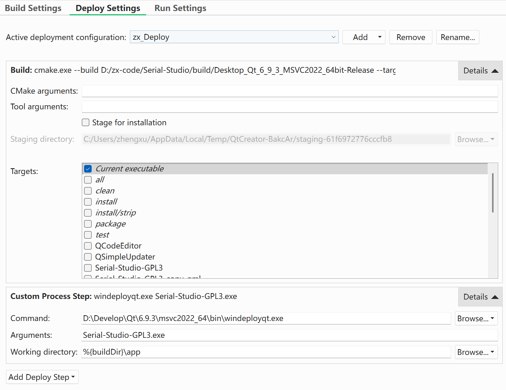

# 安装

需要先注册一个Qt账号。

- Creator的安装包镜像：[ustc official_releases](https://mirrors.ustc.edu.cn/qtproject/official_releases/qtcreator/)
## mac

```bash
brew install qt

# qt-creator 不是必要的
# brew install --cask qt-creator
```

## windows

- [ustc qt mirrors](https://mirrors.ustc.edu.cn/help/qtproject.html)

1. 安装国内源下载器
```powershell
# 上文网址下载qt-online-installer-windows-x64-online.exe，然后terminal执行
.\qt-online-installer-windows-x64-online.exe --mirror https://mirrors.ustc.edu.cn/qtproject
```

2. 选择 `Qt 6.x` + `MSVC 2022 64bit` + `MinGW 64bit` + `Qt-Creator`

3. 微软官网安装
	- Microsoft Visual Studio 2022 Build Tools 或者 community
	- 勾选“使用C++的桌面开发”工作负载（含 MSVC 编译器、Windows SDK、CMake、Ninja 可选）

## Ubuntu


# 编译


## 所需工具概览

> codex resume 019a5c56-6ac9-7162-9d45-80ed614f50c2

Qt的编译选项有两套：MSVC 和 MinGW；默认是MinGW64，在安装了MSVC版本的Qt后，软件中其实有两套独立的Qt二进制程序，具体可以见下文编译示例。

- [MSVC 和 MinGW的区别](https://www.cnblogs.com/linuxAndMcu/p/19050227)


### 工具链选择要点

- **ABI 兼容性**：MSVC 生成的二进制需要和 Visual Studio/WinSDK 配套，方便和第三方 Windows 原生库联动；MinGW 采用 GCC ABI，与 Linux 交叉编译经验更接近，但与 MSVC 产物不能混用。
- **调试体验**：MSVC 可以直接使用 Visual Studio 调试器、WinDbg，并有 PDB 符号；MinGW 主要依赖 gdb，调试 UI 稍弱，但与开源工具链生态一致。
- **运行时依赖**：MSVC 附带 `vcruntime`/`msvcp` 系列 DLL（需打包 redistributable），MinGW 则需要一并分发 libstdc++、libgcc 等 DLL。
- **性能差异**：一般差距不大，但 MSVC 对 Windows API、最新指令集支持更及时，而 MinGW 社区更新包则稍慢；如果目标是跨平台 CLI 工具，MinGW 更通用，桌面 GUI 则推荐 MSVC。

### Qt-cmake & MinGW cmake & MSVC cmake

- 配置阶段建议用 `qt-cmake`，因为它是 Qt 官方提供的 CMake 包装器，会在调用真正的 `cmake` 之前自动加上 Qt 安装目录的 `CMAKE_PREFIX_PATH`、`QT_HOST_PATH`、`Qt6_DIR` 等变量。这样即使系统 PATH 里没有 Qt，也能正确找到 `Qt6Config.cmake`、QML 模块等。
- 一旦配置完成，这些路径已经写进 `build-xxx/CMakeCache.txt`，后续的编译/打包只需 `cmake --build`：它会读取缓存并调用生成器（Ninja、Make、MSBuild 等）。用 `qt-cmake --build` 也行，只是它又转手调用 `cmake --build`，效果完全一样。
- 如果从头到尾都用 `cmake`，那配置时你得手动加上类似 `-DCMAKE_PREFIX_PATH=C:\Qt\6.6.3\msvc2019_64` 的参数，否则 CMake 会找不到 Qt；用 `qt-cmake` 就不用自己管理这些变量。
- **MSVC/MinGW CMake 区别**：MSVC 套件附带 `cmake.exe`、`ninja.exe`、`nmake.exe` 等，路径通常在 VS 的 `CommonExtensions/Microsoft/CMake/CMake/bin`；MinGW/MSYS2 提供 GNU 版本的 `cmake`、`mingw32-make`，两者可以共存但注意 PATH 优先级（见下文示例）。

### 常见构建组合

- **Qt Creator + kit**：GUI 里选择 kit（例：`Desktop Qt 6.6.3 MSVC2019 64bit`），Creator 会自动选择 `qt-cmake` 和合适的生成器。
- **命令行 + MSVC**：在 `x64 Native Tools Command Prompt` 或手动执行 `vcvars64.bat` 之后调用 `qt-cmake -G Ninja`，再 `cmake --build`。
- **命令行 + MinGW**：在 MSYS2/MinGW64 shell 中调用 `qt-cmake -G "MinGW Makefiles"` 或 `-G Ninja`，构建产物完全独立于 MSVC。
- **交叉编译**：`qt-cmake` 会根据 kit 自动下发 `-DQT_HOST_PATH`，适合为嵌入式 Linux、Android、iOS 构建；若直接 `cmake` 则需要在 toolchain file 里手动维护这些变量。

### ninja & make & nmake

- `ninja`：推荐的跨平台生成器，专注增量构建；Qt Creator 默认在 MSVC 和 MinGW kit 上都使用 Ninja。命令行参数 `-G Ninja`。
- `nmake`：MSVC 自带的 make，适合老项目或 VS 解决方案；想用 `nmake` 需要搭配 `-G "NMake Makefiles"`, 但缺点是并发能力一般。
- `mingw32-make`：MinGW 的 `make` 变体。若你在 MSYS2/MinGW shell 里执行 `cmake -G "MinGW Makefiles"`，`cmake --build` 会自动调用它。
- `jom`：Qt 提供的多线程 `nmake` 替代品（Windows-only），对于 Qt Widgets 大项目速度接近 Ninja。
- 选择策略：优先 `ninja` → `jom` → `nmake/mingw32-make`。无论哪种，保持“配置阶段和构建阶段使用同一生成器”这一原则，否则需要删掉 build 目录后重新配置。

## mac 编译实战

- [Serial-Studio](https://github.com/Serial-Studio/Serial-Studio)

brew安装好Qt和cmake ，然后执行接下来 两个指令就可以了，
```bash
qt-cmake -S . -B build-release -DCMAKE_BUILD_TYPE=Release -DPRODUCTION_OPTIMIZATION=ON
cmake --build build-release --parallel 8
```


### check qt-cmake
```
## Command: Locate qt-cmake

```bash
$ which qt-cmake || true
  /opt/homebrew/bin/qt-cmake
```

### Query logical CPU count via sysctl

```bash
$ sysctl -n hw.logicalcpu
  sysctl: sysctl fmt -1 1024 1: Operation not permitted
```

###  Query logical CPU count via getconf

```bash
$ getconf _NPROCESSORS_ONLN
  11
```

### Configure Release build with qt-cmake

```bash
$ qt-cmake -S . -B build-release -DCMAKE_BUILD_TYPE=Release -DPRODUCTION_OPTIMIZATION=ON
  CMake Warning at /opt/homebrew/opt/cmake/share/cmake/Modules/Platform/Darwin-Initialize.cmake:262
  (message):
    Ignoring CMAKE_OSX_SYSROOT value:

     /Applications/Xcode.app/Contents/Developer/Platforms/MacOSX.platform/Developer/SDKs/
  MacOSX26.sdk

    because the directory does not exist.
  Call Stack (most recent call first):
    /opt/homebrew/opt/cmake/share/cmake/Modules/CMakeSystemSpecificInitialize.cmake:35 (include)
    CMakeLists.txt:28 (project)


  -- The CXX compiler identification is AppleClang 17.0.0.17000404
  -- Detecting CXX compiler ABI info
  -- Detecting CXX compiler ABI info - done
  -- Check for working CXX compiler: /usr/bin/c++ - skipped
  -- Detecting CXX compile features
  -- Detecting CXX compile features - done
  -- Performing Test CMAKE_HAVE_LIBC_PTHREAD
  -- Performing Test CMAKE_HAVE_LIBC_PTHREAD - Success
  -- Found Threads: TRUE
  -- Performing Test HAVE_STDATOMIC
  -- Performing Test HAVE_STDATOMIC - Success
  -- Found WrapAtomic: TRUE
  -- BUILD_GPL3=ON — enforcing BUILD_COMMERCIAL=OFF for license compliance
  -- CMAKE_SYSTEM_PROCESSOR: arm64
  Enabling production optimization flags...
  CMake Deprecation Warning at lib/KissFFT/CMakeLists.txt:35 (cmake_minimum_required):
    Compatibility with CMake < 3.10 will be removed from a future version of
    CMake.

    Update the VERSION argument <min> value.  Or, use the <min>...<max> syntax
    to tell CMake that the project requires at least <min> but has been updated
    to work with policies introduced by <max> or earlier.


  -- The C compiler identification is AppleClang 17.0.0.17000404
  -- Detecting C compiler ABI info
  -- Detecting C compiler ABI info - done
  -- Check for working C compiler: /usr/bin/cc - skipped
  -- Detecting C compile features
  -- Detecting C compile features - done
  -- Building KissFFT with datatype: float
  -- Building static library
  -- PKGINCLUDEDIR is include/kissfft
  -- Found OpenGL: /Library/Developer/CommandLineTools/SDKs/MacOSX.sdk/System/Library/Frameworks/
  OpenGL.framework
  -- Found WrapOpenGL: TRUE
  -- Could NOT find WrapVulkanHeaders (missing: Vulkan_INCLUDE_DIR)
  -- Could NOT find WrapVulkanHeaders (missing: Vulkan_INCLUDE_DIR)
  -- Could NOT find WrapVulkanHeaders (missing: Vulkan_INCLUDE_DIR)
  -- Could NOT find WrapVulkanHeaders (missing: Vulkan_INCLUDE_DIR)
  -- Could NOT find WrapVulkanHeaders (missing: Vulkan_INCLUDE_DIR)
  -- LIB Compile Options: -Wall;-Wextra;-Wno-unused-function;-Wno-cast-align;-O2;-ftree-
  vectorize;-funroll-loops;-fomit-frame-pointer;-fno-fast-math;-fno-unsafe-math-
  optimizations;-flto;-finline-functions;-ffunction-sections;-fdata-sections
  -- APP Compile Options: -Wall;-Wextra;-Wno-unused-function;-Wno-cast-align;-O2;-ftree-
  vectorize;-funroll-loops;-fomit-frame-pointer;-fno-fast-math;-fno-unsafe-math-
  optimizations;-flto;-finline-functions;-ffunction-sections;-fdata-sections
  -- Configuring done (8.3s)
  -- Generating done (1.7s)
  -- Build files have been written to: /Users/zhengxu/Desktop/some_code/Local-Serial-Studio/build-
  release
```

### Build Release target 
```bash
$ cmake --build build-release --parallel 11
  [  0%] Building C object lib/KissFFT/CMakeFiles/kissfft.dir/kiss_fft.c.o
  [  0%] Built target QSimpleUpdater_autogen_timestamp_deps
  [  2%] Building C object lib/KissFFT/CMakeFiles/kissfft.dir/kiss_fftr.c.o
  [  2%] Copying Serial-Studio-GPL3 qml resources into build dir
  [  2%] Copying Serial-Studio-GPL3 qml sources into build dir
  [  2%] Building C object lib/KissFFT/CMakeFiles/kissfft.dir/kfc.c.o
  [  3%] Building C object lib/KissFFT/CMakeFiles/kissfft.dir/kiss_fftnd.c.o
  [  3%] Built target QCodeEditor_autogen_timestamp_deps
  [  3%] Building C object lib/KissFFT/CMakeFiles/kissfft.dir/kiss_fftndr.c.o
  [  3%] Running qmlimportscanner for Serial-Studio-GPL3
  [  3%] Automatic MOC and UIC for target QSimpleUpdater
  [  3%] Built target Serial-Studio-GPL3_copy_res
  [  4%] Automatic MOC for target QCodeEditor
  [  4%] Built target Serial-Studio-GPL3_copy_qml
  /Users/zhengxu/Desktop/some_code/Local-Serial-Studio/lib/KissFFT/kiss_fftr.c:49:18: warning: cast
  from 'char *' to 'kiss_fft_cpx *' increases required alignment from 1 to 4 [-Wcast-align]
     49 |     st->tmpbuf = (kiss_fft_cpx /Users/zhengxu/Desktop/some_code/Local-Serial-Studio/
  lib/KissFFT/kiss_fftnd.c:50:10: warning: cast from 'char *' to 'kiss_fftnd_cfg' (aka 'struct
  kiss_fftnd_state *') increases required alignment from 1 to 8 [-Wcast-align]
  *) (   50 |     st = (ki(s(sc_har *) stfftnd_cfg)- pt>subsr;tate) + subsiz
  e      |          ^~~~~~~~~~~~~~~~~~~~
  );
  /Users/zhengxu/Desktop/some_code/Local-Serial-Studio/lib/KissFFT/kiss_fftnd.c:55:18: warning: cast
  from 'char *' to 'kiss_fft_cfg *' (aka 'struct kiss_fft_state **') increases required alignment
  from 1 to 8 [-Wcast-align]
     55 |     st->states = (kiss_fft_cfg *)ptr;
        |                  ^~~~~~~~~~~~~~~~~~~
  /Users/zhengxu/Desktop/some_code/Local-Serial-Studio/lib/KissFFT/kiss_fftnd.c:58:16: warning: cast
  from 'char *' to 'int *' increases required alignment from 1 to 4 [-Wcast-align]
     58 |     st->dims = (int*)ptr;
        |                ^~~~~~~~~
  /Users/zhengxu/Desktop/some_code/Local-Serial-Studio/lib/KissFFT/kiss_fftnd.c:61:18: warning: cast
  from 'char *' to 'kiss_fft_cpx *' increases required alignment from 1 to 4 [-Wcast-align]
     61 |     st->tmpbuf = (kiss_fft_cpx*)ptr;
        |                  ^~~~~~~~~~~~~~~~~~
  /Users/zhengxu/Desktop/some_code/Local-Serial-Studio/lib/KissFFT/kiss_fftndr.c:59:10: warning:
  cast from 'char *' to 'kiss_fftndr_cfg' (aka 'struct kiss_fftndr_state *') increases required
  alignment from 1 to 8 [-Wcast-align]
     59 |     st = (kiss_fftndr_cfg) ptr;
        |          ^~~~~~~~~~~~~~~~~~~~~
  4 warnings generated.
  1 warning generated.
  1 warning generated.
  [  4%] Linking C static library libkissfft-float.a
  [  4%] Built target Serial-Studio-GPL3_qmlimportscan
  [  4%] Built target kissfft
  [  4%] Built target QSimpleUpdater_autogen
  [  4%] Generating qrc_qsimpleupdater.cpp
  [  4%] Building CXX object lib/QSimpleUpdater/CMakeFiles/QSimpleUpdater.dir/
  qrc_qsimpleupdater.cpp.o
  [  5%] Building CXX object lib/QSimpleUpdater/CMakeFiles/QSimpleUpdater.dir/
  QSimpleUpdater_autogen/mocs_compilation.cpp.o
  [  5%] Building CXX object lib/QSimpleUpdater/CMakeFiles/QSimpleUpdater.dir/src/Updater.cpp.o
  [  6%] Building CXX object lib/QSimpleUpdater/CMakeFiles/QSimpleUpdater.dir/src/Downloader.cpp.o
  [  6%] Building CXX object lib/QSimpleUpdater/CMakeFiles/QSimpleUpdater.dir/src/
  QSimpleUpdater.cpp.o
  [  7%] Linking CXX static library libQSimpleUpdater.a
  ...

  (Output truncated after the portion returned by the tooling.)
```

### Inspect Release app bundle directory
```bash
$ ls build-release/app
  cmake_install.cmake
  CMakeFiles
  gui
  Makefile
  meta_types
  qmltypes
  qrc_rcc.cpp
  qrc_translations.cpp
  rcc
  Serial-Studio-GPL3_autogen
  serial-studio-gpl3_qmltyperegistrations.cpp
  Serial-Studio-GPL3.app
  translations
```

## windows 编译实战


### 安装准备

- 安装好Qt（最好MSVC和MinGW的都有），具体见上文；
- 安装好Visual Studio（c++桌面开发和Linux开发中的cmake都选上） 或者 MinGW（可以用msys2安装），注意版本要跟安装Qt时显示的一致。
- 安装好Qt-Creator，具体安装步骤见上。

### 环境变量

加入环境变量是为了方便Qt-Creator发现各种工具，具体地址参考自己安装的地址。

```bash
- msys2 cmake & make & ninja 地址（加入环境变量低优先级）     `D:\Develop\msys2\usr\bin`

- mingw64 编译器 & mingw32-make 地址（加入环境变量低优先级）   `D:\Develop\msys2\mingw64\bin`

- msvc编译器地址（加入环境变量高优先级）   `D:\Develop\Qt\6.9.3\msvc2022_64\bin`

- msvc cmake 地址（加入环境变量高优先级） `D:\Develop\Microsoft Visual Studio\VS2022Community\Common7\IDE\CommonExtensions\Microsoft\CMake\CMake\bin`

- msvc-Qt 地址（加入环境变量高优先级）     `D:\Develop\Qt\6.9.3\msvc2022_64\bin`

- mingw_64-Qt 地址（不加入环境变量）      `D:\Develop\Qt\6.9.3\mingw_64\bin
```

### 设置Qt-Creator


#### 设置编译工具链

Edit -> Preference -> Kits -> Auto-detected ：

一般就会有 Desktop Qt MSVC 或者 Desktop Qt MinGW；如果没有就是环境变量设置的有问题，可以选择Manual模式的Desktop，所有工具的exe地址手动指定。**但是！自动检测往往有问题**，所以，需要检查。尤其是CMake Tool的地址 和 CMake generator的类型。

比如对于 MSVC的编译链：

CMake Tool 要 Visual Studio 相关的安装地址才对；CMake generator 最好选择 NMake Makefiles。

#### 设置Deploy

打开项目或者CMakeList.txt，然后选择刚刚设置的Kits，然后在Projects设置中的Deploy Settings，需要在Build基础上加一个 windeployqt 指令，具体见下图：



然后完事大吉。


## 基础设计

- [随笔分类 - Qt](https://www.cnblogs.com/linuxAndMcu/category/2426921.html?page=8)


## 性能优化

### cpu占用率高

- [Qt 性能优化之一 CPU占用率高的原因](https://www.cnblogs.com/linuxAndMcu/p/17145325.html "发布于 2023-02-22 17:47")
