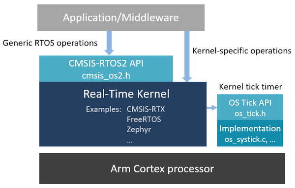

# Reference
- [Free RTOS github](https://github.com/FreeRTOS/FreeRTOS)
- [free RTOS doc](https://wwww.freertos.org/Documentation/01-FreeRTOS-quick-start/01-Beginners-guide/01-RTOS-fundamentals)
- [freeRTOS doc zh](https://wwww.freertos.org/zh-cn-cmn-s/Documentation/01-FreeRTOS-quick-start/01-Beginners-guide/01-RTOS-fundamentals)

- [CMSIS-RTOS2](https://arm-software.github.io/CMSIS_6/latest/RTOS2/index.html)

# RTOS 基本概念

## Free RTOS 和 CMSIS-RTOS2
- [FreeRTOS与CMSIS标准](https://doc.embedfire.com/linux/stm32mp1/freertos/zh/latest/application/freertos%26cmsis.html)
- [CMSIS-RTOS 和 freertos 论坛](https://forum.anfulai.cn/forum.php?mod=viewthread&tid=27356&amp;fpage=2)
市面上RTOS的种类很多，除了FreeRTOS还有uCOS、RTX、RT-thread等等，每个RTOS操作系统都有自己的API接口， 它们的内核组件功能都是类似的，ARM公司为了统一操作系统、降低嵌入式开发的门槛提供了CMSIS-RTOS， CMSIS-RTOS将各个RTOS的接口统一起来，提供CMSIS-RTOS的接口供使用者使用，从而提高代码的移植性以及开发效率。

### CMSIS 架构简介
CMSIS标准中最主要的为CMSIS核心层，它包括了：
- 内核函数层：其中包含用于访问内核寄存器的名称、地址定义，主要由ARM公司提供。
- 设备外设访问层：提供了片上的核外外设的地址和中断定义，主要由芯片生产商提供。
- CMSIS实时系统API层: 封装并统一了各个实时操作系统的内核操作接口，主要由ARM公司提供。
CMSIS层位于硬件层与操作系统或用户层之间，提供了与芯片生产商无关的硬件抽象层， 可以为接口外设、实时操作系统提供简单的处理器软件接口，屏蔽了硬件差异，这对软件的移植是有极大的好处的。

#### CMSIS-RTOS架构

Many popular RTOS kernels include support for CMSIS-RTOS2 API:

**CMSIS-RTX** (or Keil RTX5): provides most complete support for CMSIS-RTOS2 API and uses it as native interface. For more information see:
- [CMSIS-RTX GitHub repository](https://github.com/ARM-software/CMSIS-RTX)
- [CMSIS-RTX documentation](https://arm-software.github.io/CMSIS-RTX/)
- [CMSIS-RTX pack](https://www.keil.arm.com/packs/cmsis-rtx-arm/versions/)

**FreeRTOS** : this popular RTOS kernel is enabled with CMSIS-RTOS2 API in the _CMSIS-FreeRTOS_ variant. To learn more see:
- [CMSIS-FreeRTOS GitHub repository](https://github.com/ARM-software/CMSIS-FreeRTOS)
- [CMSIS-FreeRTOS documentation](https://arm-software.github.io/CMSIS-FreeRTOS/)
- [CMSIS-FreeRTOS pack](https://www.keil.arm.com/packs/cmsis-freertos-arm/versions/)

**Zephyr RTOS**: is developed under governance of Linux Foundation and includes CMSIS-RTOS2 API support. See more at:
- [Zephyr GitHub repository](https://github.com/zephyrproject-rtos/zephyr), see folder _subsys/portability/cmsis_rtos_v2/_
- [Zephyr documentation about CMSIS-RTOS2 support](https://docs.zephyrproject.org/latest/services/portability/cmsis_rtos_v2.html)

**embOS**: is a preemptive RTOS designed by Segger, and provides support for CMSIS-RTOS2 API.
- [Using embOS in CMSIS-Pack projects](https://wiki.segger.com/Using_embOS_in_CMSIS-Pack_projects)
- [CMSIS-embOS pack](https://www.keil.arm.com/packs/cmsis-embos-segger/versions/)

**Azure ThreadX RTOS for STM32**: is an integration of Azure RTOS into STM32 middleware provided by STMicroelectronics.
- [CMSIS-RTOS API support in ThreadX for STM32](https://wiki.st.com/stm32mcu/wiki/Introduction_to_THREADX#CMSIS-RTOS_API_Support)

**Micrium OS** is developed and maintained by Silicon Labs.
- [Micrium OS overview and comparison](https://www.silabs.com/developers/rtos)

