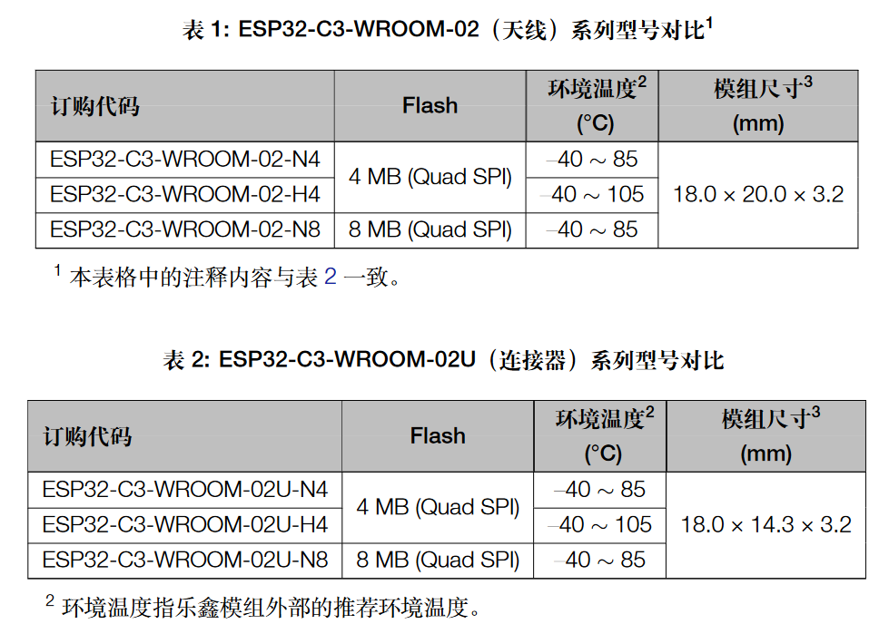
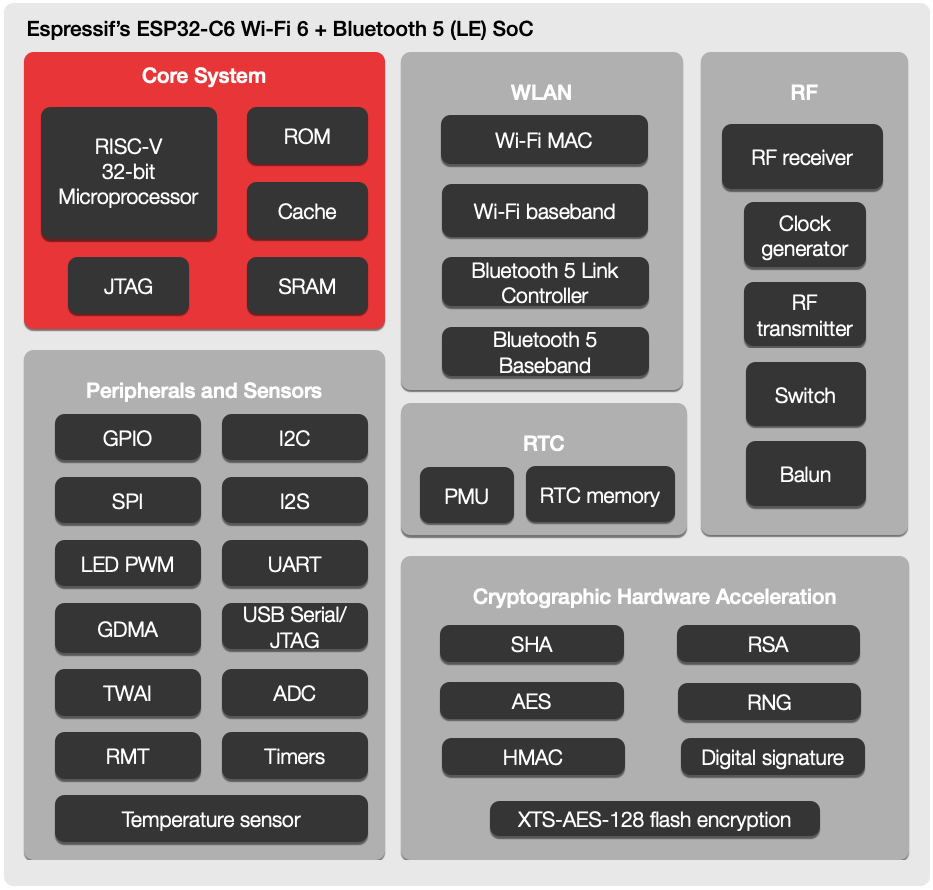
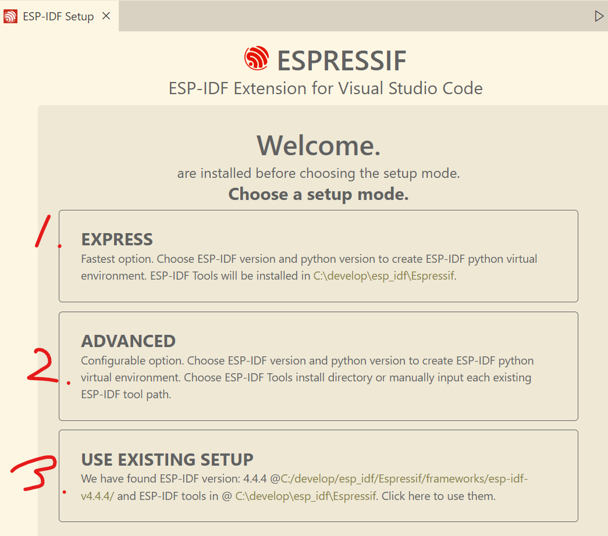
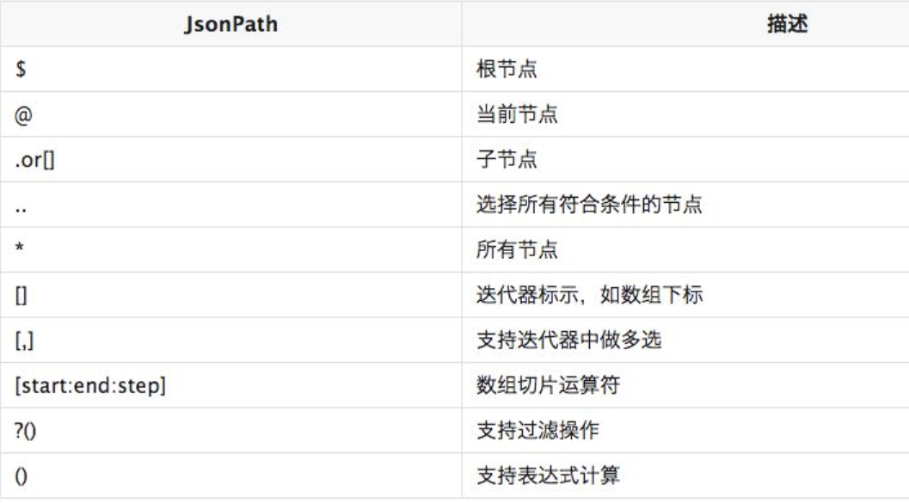
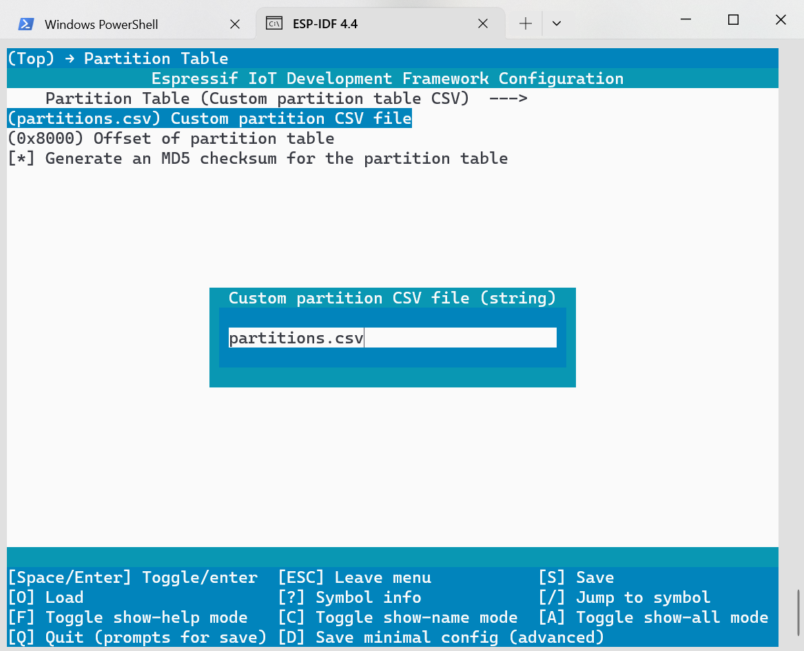
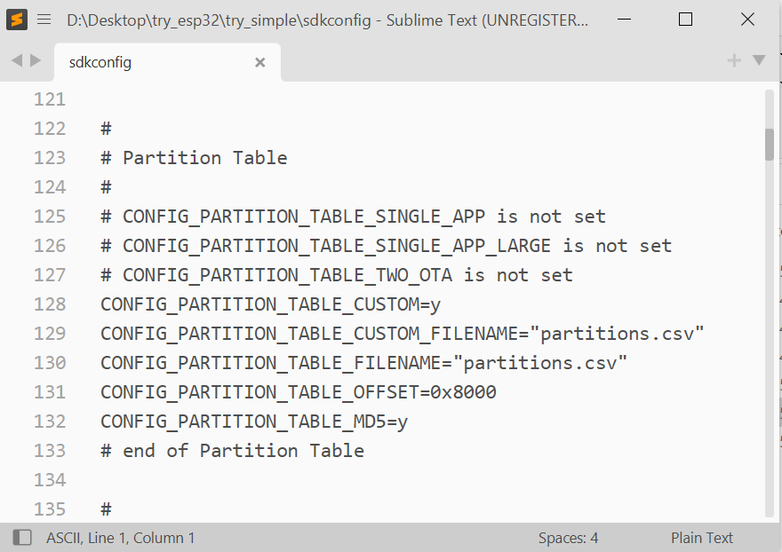
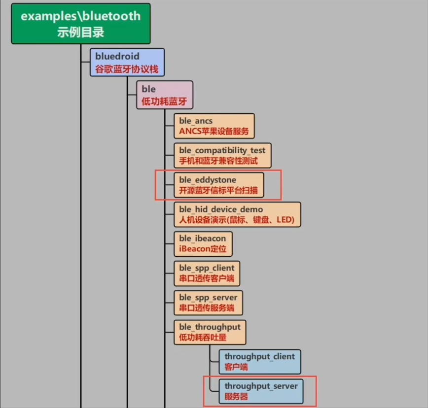
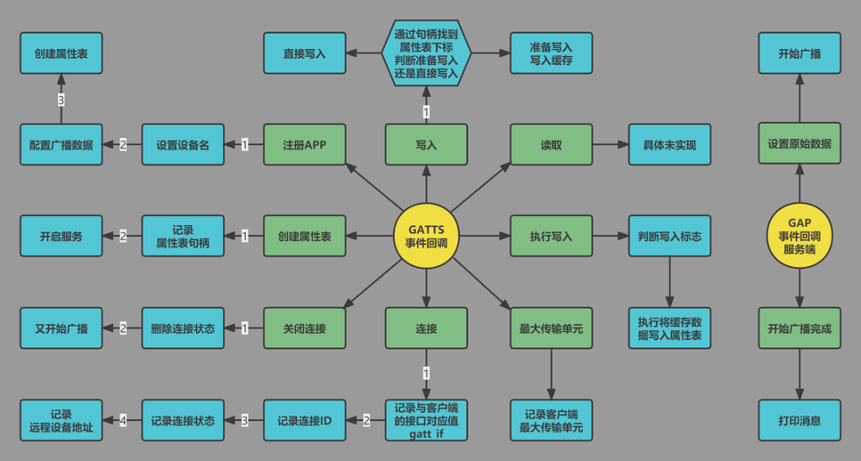
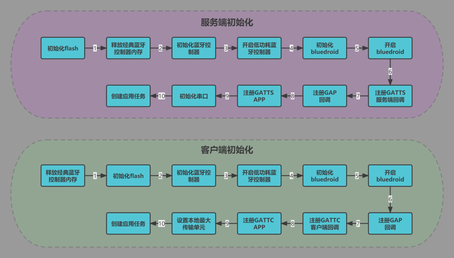

# learn_ESP32

[toc]

## 1. ESP32硬件

* [esp32-c6-devkitc-1说明书](https://espressif-docs.readthedocs-hosted.com/projects/espressif-esp-dev-kits/zh_CN/latest/esp32c6/esp32-c6-devkitc-1/user_guide.html)

* [ESP32蓝牙开发视频教程](https://www.bilibili.com/video/BV1wd4y1A7eq)

* [ESP32-arduinoIDE开发配置](https://docs.espressif.com/projects/arduino-esp32/en/latest/installing.html)

* [ESP32-BLE教程](https://docs.wireless-tech.cn/project/2/)

* [基于Docker、WSL、VScode的ESP32开发环境搭建](https://docs.wireless-tech.cn/doc/82/)

* [ESP32不同开发板的区别](https://www.espressif.com.cn/zh-hans/products/devkits)

### 1.1 ESP32的定位及分类


#### 1.1.1 [ESP模块](https://www.espressif.com/zh-hans/products/modules)

下图几个系列，主要就是支持蓝牙和WiFi版本不同，芯片计算能力不同（主频、内存）。其实具体支持的I/O外设也有所不同，之后用到再具体讲解。大体上来说：

* S是性能系列
* c是低功耗系列
* 啥也不带的（ESP32）是老版本的，各种硬件配置都有，未来可能只有H、C、S三个系列，算力由低到高。


#### 1.1.2 芯片的封装类型

像下图：

* **U：**带U的是外置天线，不带U的是PCB封装了天线，
* **WROOM / mini：** 封装方式不同，
* **N / H:**环境温度不同，H是高温
* 




### 1.2 ESP32的硬件架构


#### 1.2.1 指令集

处理器架构主要依据指令集划分，不同指令集之前硬件&操作系统适配度往往不同。而指令集按照多少主要分为CISC和RISC，也就是复杂和精简指令集。注意这种划分其实意义不大，多少算多，多少算少？所以主要还得看疗效，也就是功耗与性能的综合能力。

CISC几乎被x86一统江山，而RICS几乎被ARM一统江山，但这两个前者技术被AMD和Intel把控，后者ARM公司授权费比天高。高性能处理器已经无从追赶，但是嵌入式由于对成本敏感而对性能要求不高，迫切需要低成本的硬件架构，而其（嵌入式）有天生对功耗敏感，自然而然就是RISC架构，所以开源的RISC-V来了，乐鑫的ESP32也渐渐由XTensa架构转为RISC-V架构，希望能进一步推动开源硬件发展起来吧。而[XTensa架构](https://theembeddedsystem.readthedocs.io/en/latest/c2_ec_structure/mcu_other.html)可以理解为”其他“架构吧，还是强调下，RISC和CISC的划分意义不大，主要看具体的实现方式。


#### 1.2.2 datasheet 

芯片的datasheet见文件夹：`..\..\Resource_Files\chip_data_sheet\`




### 1.3 [ESP32启动流程详解](https://docs.wireless-tech.cn/doc/9/)


### 1.4 ESP32c3 开发板

> [ESP32-C3-DevKitC-02](https://docs.espressif.com/projects/esp-idf/zh_CN/latest/esp32c3/hw-reference/esp32c3/user-guide-devkitc-02.html)
>
> 
>
> ESP32-C3-DevKitC-02 - 正面[](https://docs.espressif.com/projects/esp-idf/zh_CN/latest/esp32c3/hw-reference/esp32c3/user-guide-devkitc-02.html#id29)
>
> 以下按照逆时针的顺序依次介绍开发板上的主要组件。
>
> | 主要组件                                 | 介绍                                                         |
> | ---------------------------------------- | ------------------------------------------------------------ |
> | ESP32-C3-WROOM-02                        | ESP32-C3-WROOM-02 是乐鑫推出的一款通用型 Wi-Fi 和低功耗蓝牙双模模组，功能强大。该模组采用 PCB 板载天线，配置了 4 MB SPI flash。 |
> | 5 V to 3.3 V LDO（5 V 转 3.3 V LDO）     | 电源转换器，输入 5 V，输出 3.3 V。                           |
> | 5 V Power On LED（5 V 电源指示灯）       | 开发板连接 USB 电源后，该指示灯亮起。                        |
> | Pin Headers（排针）                      | 所有可用 GPIO 管脚（除 Flash 的 SPI 总线）均已引出至开发板的排针。请查看 [排针](https://docs.espressif.com/projects/esp-idf/zh_CN/latest/esp32c3/hw-reference/esp32c3/user-guide-devkitc-02.html#user-guide-c3-devkitc-02-v1-header-blocks) 获取更多信息。 |
> | Boot Button（Boot 键）                   | 下载按键。按住 **Boot** 键的同时按一下 **Reset** 键进入“固件下载”模式，通过串口下载固件。 |
> | Micro-USB Port（Micro-USB 接口）         | USB 接口。可用作开发板的供电电源或 PC 和 ESP32-C3 芯片的通信接口。 |
> | Reset Button（Reset 键）                 | 复位按键。                                                   |
> | USB-to-UART Bridge（USB 至 UART 桥接器） | 单芯片 USB 至 UART 桥接器，可提供高达 3 Mbps 的传输速率。    |
> | RGB LED                                  | 可寻址 RGB 发光二极管，由 GPIO8 驱动。                       |

## 2.[SDK(开发环境)](https://www.espressif.com/zh-hans/products/software/esp-sdk/overview)

* [ESP32-SDK源码](https://github.com/espressif/esp-idf)
* [ESP-IDF官方教程](https://docs.espressif.com/projects/esp-idf/zh_CN/latest/esp32/)
* [官网下载地址](https://dl.espressif.com/dl/esp-idf/)
SDK（ESP-IDF）版本：目前（2023年）5.0是一个大版本，有一些适配问题，还需谨慎，更新日志简要版：[乐鑫发布 ESP-IDF v5.0](https://zhuanlan.zhihu.com/p/597164094)
* [usb转串口芯片cp2102的驱动](https://www.silabs.com/developers/usb-to-uart-bridge-vcp-drivers?tab=downloads)

### 2.1 安装SDK（ESP-IDF）

```bash
# 当然可以在上文下载链接中下载安装，git clone也不错，比如4.4版本，则
git clone -b v4.4 --recursive https://github.com/espressif/esp-idf.git
```
安装后并没有加入环境变量，需要自己加入。


### 2.2 vscode 环境

首先要安装vscode的插件：`Espressif IDF`。然后：

如果离线包安装的选3（都自动装好了，比如选择就行，比如python就在`C:\develop\esp_idf\Espressif\python_env\idf4.4_py3.8_env`）否则，若没有python等环境选1，自己有python、git等环境可以选2（2就是自己指定python等编译ESP32的工具目录）

python环境经常出问题，因为不是系统版本（系统是自己安装并加入环境变量的），另一方面也是由于pip不翻墙没网就会下载失败。


### 2.3 Arduino-ESP32库文件安装

* [官网教程](https://docs.espressif.com/projects/arduino-esp32/en/latest/installing.html)
但是Arduino走不了代理，所以可能需要手动下载需要的库，到Arduino指定的文件夹`~\AppData\Local\Arduino15\staging\packages`里。

* 看下官网这个json文件`\drivers_develop_code\ESP32Exps\package_esp32_index.json`就很清晰了：比如要下载esp32-2.0.6版本
```json
"name": "esp32",
"architecture": "esp32",
"version": "2.0.6",
```
看看下面写着它的依赖：
```json
          "toolsDependencies": [
            {
              "packager": "esp32",
              "name": "riscv32-esp-elf-gcc",
              "version": "gcc8_4_0-esp-2021r2-patch5"
            },
            {
              "packager": "esp32",
              "name": "xtensa-esp32-elf-gcc",
              "version": "gcc8_4_0-esp-2021r2-patch5"
            },
            {
              "packager": "esp32",
              "name": "xtensa-esp32s2-elf-gcc",
              "version": "gcc8_4_0-esp-2021r2-patch5"
            },
            {
              "packager": "esp32",
              "name": "xtensa-esp32s3-elf-gcc",
              "version": "gcc8_4_0-esp-2021r2-patch5"
            },
            {
              "packager": "esp32",
              "name": "esptool_py",
              "version": "4.2.1"
            },
            {
              "packager": "esp32",
              "name": "openocd-esp32",
              "version": "v0.11.0-esp32-20220706"
            },
            {
              "packager": "esp32",
              "name": "mkspiffs",
              "version": "0.2.3"
            },
            {
              "packager": "esp32",
              "name": "mklittlefs",
              "version": "3.0.0-gnu12-dc7f933"
            }
```
该文件最后一部分（`tools`）是根据这个名字和环境（操作系统和编译器）选择每个依赖库具体的安装地址：
```json
# 比如name是 riscv32-esp-elf-gcc version 是gcc8_4_0-esp-2021r2-patch5：
          "name": "riscv32-esp-elf-gcc",
          "version": "gcc8_4_0-esp-2021r2-patch5",
          "systems": [
            {
              "host": "x86_64-pc-linux-gnu",
              "url": "https://github.com/espressif/crosstool-NG/releases/download/esp-2021r2-patch5/riscv32-esp-elf-gcc8_4_0-esp-2021r2-patch5-linux-amd64.tar.gz",
              "archiveFileName": "riscv32-esp-elf-gcc8_4_0-esp-2021r2-patch5-linux-amd64.tar.gz",
              "checksum": "SHA-256:f7d73e5f9e2df3ea6ca8e2c95d6ca6d23d6b38fd101ea5d3012f3cb3cd59f39f",
              "size": "192388486"
            },
            {
              "host": "x86_64-mingw32",
              "url": "https://github.com/espressif/crosstool-NG/releases/download/esp-2021r2-patch5/riscv32-esp-elf-gcc8_4_0-esp-2021r2-patch5-win64.zip",
              "archiveFileName": "riscv32-esp-elf-gcc8_4_0-esp-2021r2-patch5-win64.zip",
              "checksum": "SHA-256:b08f568e8fe5069dd521b87da21b8e56117e5c2c3b492f73a51966a46d3379a4",
              "size": "259712666"
            }
# 比如windows64位系统一般就是选host为x86_64-mingw32的，也就是说下载地址为：https://github.com/espressif/crosstool-NG/releases/download/esp-2021r2-patch5/riscv32-esp-elf-gcc8_4_0-esp-2021r2-patch5-win64.zip
# 用浏览器走代理下载。
```
[python json解析](https://jishuin.proginn.com/p/763bfbd54285)，自动抓取需要的URL：

orjson是比较好的库，json官方很难用，jsonpath好久不更新了， 但是可以用[jsonpath-python](https://pypi.org/project/jsonpath-python/#examples)
[举个例子](https://www.cnblogs.com/wynjauu/articles/9556396.html)：文件见：`D:\Desktop\EmbeddedProgramming\drivers_develop_code\ESP32Exps\example.json`
| JsonPath (点击链接测试)                  | 结果                                                         |
| ---------------------------------------- | ------------------------------------------------------------ |
| `$.store.book[*\].author`                | 获取json中store下book下的所有author值                        |
| `$..author`                              | 获取所有json中所有author的值                                 |
| `$.store.*`                              | 所有的东西，书籍和自行车                                     |
| `$.store..price`                         | 获取json中store下所有price的值                               |
| `$..book[2\]`                            | 获取json中book数组的第3个值                                  |
| `$..book[-2\]`                           | 倒数的第二本书                                               |
| `$..book[0,1\]`                          | 前两本书                                                     |
| `$..book[:2\]`                           | 从索引0（包括）到索引2（排除）的所有图书                     |
| `$..book[1:2\]`                          | 从索引1（包括）到索引2（排除）的所有图书                     |
| `$..book[-2:\]`                          | 获取json中book数组的最后两个值                               |
| `$..book[2:\]`                           | 获取json中book数组的第3个到最后一个的区间值                  |
| `$..book[?(@.isbn)\]`                    | 获取json中book数组中包含isbn的所有值                         |
| `$.store.book[?(@.price < 10)\]`         | 获取json中book数组中price<10的所有值                         |
| `$..book[?(@.price <= $['expensive'\])]` | 获取json中book数组中price<=expensive的所有值                 |
| `$..book[?(@.author =~ /.*REES/i)\]`     | 获取json中book数组中的作者以REES结尾的所有值（REES不区分大小写） |
| `$..*`                                   | 逐层列出json中的所有值，层级由外到内                         |
| `$..book.length()`                       | 获取json中book数组的长度                                     |

这个文件结构不复杂，最终决定自己用笨方法解析，然后生成下载脚本文件，自动代理。具体见文件：``

(其中下载命令用的是[curl](https://www.ruanyifeng.com/blog/2019/09/curl-reference.html))

### 2.4 更新SDK（ESP-IDF）

[更新至一个稳定发布版本](https://docs.espressif.com/projects/esp-idf/zh_CN/latest/esp32/versions.html#id9)
对于量产用户，推荐更新至一个新的 ESP-IDF 发布版本，请参考以下步骤：
- 请定期查看 [发布说明页面](https://github.com/espressif/esp-idf/releases) ，了解最新发布情况。
- 如有新发布的 Bugfix 版本（例 `v3.0.1` 或 `v3.0.2`）时，请将新的 Bugfix 版本更新至您的 ESP-IDF 目录。
- 在 Linux 或 macOS 系统中，请运行如下命令将分支更新至 vX.Y.Z：
```bash
cd $IDF_PATH
git fetch
git checkout vX.Y.Z
git submodule update --init --recursive
```
在 Windows 系统中，需要将 `cd $IDF_PATH` 替换为 `cd %IDF_PATH%`。

### 2.5 项目架构

#### 2.5.1 ESP32 IDF项目架构

> [构建系统](https://docs.espressif.com/projects/esp-idf/zh_CN/latest/esp32s2/api-guides/build-system.html)
>
> ```bash
> # 创建项目
> idf.py create-project ProjectName
> ```
>

示例项目的目录树结构可能如下所示:

```bash
- myProject/
             - CMakeLists.txt
             - sdkconfig
             - components/ - component1/ - CMakeLists.txt
                                         - Kconfig
                                         - src1.c
                           - component2/ - CMakeLists.txt
                                         - Kconfig
                                         - src1.c
                                         - include/ - component2.h
             - main/       - CMakeLists.txt
                           - src1.c
                           - src2.c

             - build/
```

#### 2.5.2 工程项目中添加新的工程文件

* 简单添加文件夹

> [添加文件夹](https://blog.csdn.net/qq_36016038/article/details/124334142)
>
> ```bash
> # 添加component文件夹
> idf.py -C components create-component my_component
> ```
>
> 

* 添加文件夹、源文件及头文件

> [向IDF工程中添加新的组件（包含文件夹、源文件与头文件）](https://blog.csdn.net/RuiyaoNi/article/details/124804251)
>
> ### 实现过程
> 
> 要为“blink”工程添加用户自己的"button"组件需要以下几个步骤：
> 
> * 将组件"button"的文件夹及其源文件添加到工程目录中
> * 将"led_strip"组件复制到工程中
> * 向"blink/CMakeLists.txt"文件中写入组件路径
> * 创建并编写组件的"button/CMakeLists.txt"文件
>* 将组件"button"的文件夹及其源文件添加到工程目录中、将"led_strip"组件复制到工程中
> * 为工程添加"user_components"文件夹（该文件夹名可以为自己定义的任何名字，并在该文件夹下存放自己要添加的组件），
> * 在"user_components"文件夹下再添加"button"文件夹，"button"文件夹中包含"button.c"和"button.h"，
> * 还需要在工程"button"文件夹下新建一个名为"CMakeLists.txt"的空文件，
> * 再将"led_strip"组件复制到"user_components"文件夹下完成后的目录树结构为（其他与“添加组件”无关的文件未展示）：
> 
> ```c
> - blink/
>              - CMakeLists.txt
>              - sdkconfig
>              - esp_idf_components/		#此文件夹下为官方组件，不展开
>              - user_components/		- button/		- button.c
>              										- button.h
>              										- CMakeLists.txt
>              						- led_strip/   #无需修改，不展开
>              - main/       - CMakeLists.txt
>                            - blink_example_main.c
>             - build/
> ```
> 向"blink/CMakeLists.txt"文件中写入组件路径
> "blink/CMakeLists.txt"的原始内容为：
> ```c
> # The following five lines of boilerplate have to be in your project's
># CMakeLists in this exact order for cmake to work correctly
> cmake_minimum_required(VERSION 3.5)
>
> set(EXTRA_COMPONENT_DIRS $ENV{IDF_PATH}/examples/common_components/led_strip)
>
> include($ENV{IDF_PATH}/tools/cmake/project.cmake)
>get_filename_component(ProjectId ${CMAKE_CURRENT_LIST_DIR} NAME)
> string(REPLACE " " "_" ProjectId ${ProjectId})
> project(${ProjectId})
> ```
> 
> 向文件中添加set(EXTRA_COMPONENT_DIRS "./user_components")并删除原来的set(...)，修改后：
> ```c
> # The following five lines of boilerplate have to be in your project's
> # CMakeLists in this exact order for cmake to work correctly
>cmake_minimum_required(VERSION 3.5)
> 
> set(EXTRA_COMPONENT_DIRS "./user_components")
> include($ENV{IDF_PATH}/tools/cmake/project.cmake)
> get_filename_component(ProjectId ${CMAKE_CURRENT_LIST_DIR} NAME)
> string(REPLACE " " "_" ProjectId ${ProjectId})
> project(${ProjectId})
> ```
> 注："led_strip"组件的路径为ENV{IDF_PATH}/examples/common_components/led_strip，其中ENV{IDF_PATH}为IDF的安装路径编写组件的"button/CMakeLists.txt"文件
> 在"button/CMakeLists.txt"中写入下面的脚本：idf_component_register(SRCS "button.c" INCLUDE_DIRS* ".")
> 
> 
> 
> 至此添加用户组件已完成。


## 3. API实践


### 3.1 log

```c
#include "esp_log.h"

static const char *LPG_TAG = "MAIN APP";
    
ESP_LOGI(LPG_TAG, "system init");
```


### 3.2 GPIO

`\examples_donot_compile\peripherals\gpio\generic_gpio\main\gpio_example_main.c`

> [GPIO-ESP32官方文档](https://docs.espressif.com/projects/esp-idf/zh_CN/latest/esp32/api-reference/peripherals/gpio.html#_CPPv420GPIO_PULLUP_PULLDOWN)
>
> 备注（不是所有GPIO端口都随便用，这个要看芯片手册）
>
> - Strapping 管脚：GPIO0、GPIO2、GPIO5、GPIO12 (MTDI) 和 GPIO15 (MTDO) 是 Strapping 管脚。更多信息请参考 [ESP32 技术规格书](https://www.espressif.com/sites/default/files/documentation/esp32_datasheet_cn.pdf)。
> - SPI0/1：GPIO6-11 和 GPIO16-17 通常连接到模组内集成的 SPI flash 和 PSRAM，因此不能用于其他用途。
> - JTAG：GPIO12-15 通常用于在线调试。
> - GPI：GPIO34-39 只能设置为输入模式，不具备软件使能的上拉或下拉功能。
> - TXD & RXD 通常用于烧录和调试。
> - ADC2：使用 Wi-Fi 时不能使用 ADC2 管脚。因此，如果您在使用 Wi-Fi 时无法从 ADC2 GPIO 获取值，可以考虑使用 ADC1 GPIO 来解决该问题。更多详情请参考 [ADC 连续转换模式下的硬件限制](https://docs.espressif.com/projects/esp-idf/zh_CN/latest/esp32/api-reference/peripherals/adc_continuous.html#hardware-limitations-adc-continuous) 以及 [ADC 单次转换模式下的硬件限制](https://docs.espressif.com/projects/esp-idf/zh_CN/latest/esp32/api-reference/peripherals/adc_oneshot.html#hardware-limitations-adc-oneshot)。
> - 使用 ADC 或睡眠模式下使用 Wi-Fi 和蓝牙时，请不要使用 GPIO36 和 GPIO39 的中断。有关问题的详细描述，请参考 [ESP32 ECO 和 Bug 解决方法](https://espressif.com/sites/default/files/documentation/eco_and_workarounds_for_bugs_in_esp32_cn.pdf) > 中的第 3.11 节。

#### 3.2.1 GPIO初始化

```c
#include <stdio.h>
#include "driver/gpio.h"
#include "freertos/FreeRTOS.h"
#include "freertos/task.h"
// 单个GPIO设置
gpio_pad_select_gpio(18);
gpio_set_direction(18, GPIO_MODE_OUTPUT);
//...


// 多个GPIO一起配置
#define GPIO_OUTPUT_IO_0    18
#define GPIO_OUTPUT_IO_1    19
#define GPIO_OUTPUT_PIN_SEL  ((1ULL<<GPIO_OUTPUT_IO_0) | (1ULL<<GPIO_OUTPUT_IO_1))

#define GPIO_INPUT_IO_0     4
#define GPIO_INPUT_IO_1     5
#define GPIO_INPUT_PIN_SEL  ((1ULL<<GPIO_INPUT_IO_0) | (1ULL<<GPIO_INPUT_IO_1))

//zero-initialize the config structure.
gpio_config_t io_conf = {};

// 两个输出IO一起设置
//disable interrupt
io_conf.intr_type = GPIO_INTR_DISABLE;
//set as output mode
io_conf.mode = GPIO_MODE_OUTPUT;
//bit mask of the pins that you want to set,e.g.GPIO18/19
io_conf.pin_bit_mask = GPIO_OUTPUT_PIN_SEL;
//disable pull-down mode
io_conf.pull_down_en = 0;
//disable pull-up mode
io_conf.pull_up_en = 0;
//configure GPIO with the given settings
gpio_config(&io_conf);

// 两个输入IO一起设置
//interrupt of rising edge
io_conf.intr_type = GPIO_INTR_POSEDGE;
//bit mask of the pins, use GPIO4/5 here
io_conf.pin_bit_mask = GPIO_INPUT_PIN_SEL;
//set as input mode
io_conf.mode = GPIO_MODE_INPUT;
//enable pull-up mode
io_conf.pull_up_en = 1;
gpio_config(&io_conf);
```


#### 3.2.2 GPIO操作

```c
// 读取、输出电平
gpio_set_level(1);
gpio_get_level();

//
gpio_set_intr_type(GPIO_INPUT_IO_0, GPIO_INTR_ANYEDGE);
```


### 3.3 MultiTask

* [xTask用法解析](https://blog.csdn.net/weixin_45652444/article/details/118867092)
* [FreeRTOS多任务分析--基于ESP32](https://suda-morris.github.io/2018/05/30/freertos/)
* [ESP-IDF FreeRTOS 任务创建深度分析](https://www.cnblogs.com/SexyBoyHub/articles/11526356.html)

> 下文来自：[xTask用法解析](https://blog.csdn.net/weixin_45652444/article/details/118867092)


#### 3.3.1 xTaskCreat & vTaskDelete

> ```c
> static BaseType_t xTaskCreate(TaskFunction_t pvTaskCode, 
>                   const char *const pcName, 
>                   const uint32_t usStackDepth, 
>                   void *const pvParameters, 
>                   UBaseType_t uxPriority, 
>                   TaskHandle_t *const pvCreatedTask)
> ```
> 创建一个新任务，并将其添加到准备运行的任务列表中。
> 在内部，在FreeRTOS实现中，任务使用两个内存块。第一个块用于保存任务的数据结构。第二个块被任务用作其堆栈。如果使用xTaskCreate()创建任务，则在xTaskCreate()函数中自动动态分配两个内存块。 (see http://www.freertos.org/a00111.html).如果使用xTaskCreateStatic()创建任务，则应用程序编写器必须提供所需的内存。因此，xTaskCreateStatic()允许在不使用任何动态内存分配的情况下创建任务。
> 有关不使用任何动态内存分配的版本，请参见xTaskCreateStatic()。
> xTaskCreate()只能用于创建能够无限制地访问整个微控制器内存映射的任务。包含MPU支持的系统也可以使用xTaskCreateRestricted()创建MPU受限的任务。
>
> Return pdPASS 如果任务成功创建并添加到就绪列表，否则在文件projdefs.h中定义错误代码
> Note 如果程序使用线程局部变量（用“__thread”关键字指定的局部变量），则将在任务的堆栈上为它们分配存储空间。
>
> 
>
> Parameters
>
> * pvTaskCode：指向任务输入函数的指针。任务必须被实现为永不Return（如：死循环），或者应该使用vtTaskDelete函数终止。
>
> * pcName：该任务的描述性名称。这主要用于方便调试。通过设置 **MAX_TASK_NAME_LEN** 定义最大长度-默认值为16。
>
> * usStackDepth：指定为字节数的任务堆栈的大小。请注意，这不同于vanilla FreeRTOS。
>
> * pvParameters：将用作所创建的任务的参数的指针。
> * uxPriority：任务运行的优先级。包含MPU支持的系统可以通过设置优先级参数的位portPRIVILEGE_BIT来选择在特权（系统）模式下创建任务。
>   例如，要在优先级2处创建特权任务，应将uxPriority参数设置为(2|portPRIVILEGE_BIT)。
> * pvCreatedTask：用于传递回可引用所创建任务的句柄。NULL为当前任务？
>
> 示例用法：
> ```c
>     // 要创建的任务
>     void vTaskCode( void * pvParameters )
>     {
>         for( ;; )
>         { 
>             //任务代码就在这里了。
>         }
>     }
> 
>     // 创建任务的函数。
>     void vOtherFunction( void )
>     {
>         static uint8_t ucParameterToPass;
>         TaskHandle_t xHandle = NULL; // xHandle = NULL 表示当前任务
>         // 创建任务，保存句柄。
>         // 注意被传递的参数ucParameterToPass，在任务的生命周期内必须存在，所以这里声明static。
>         // 如果它只是一个自动堆栈变量，那么当新任务试图访问它时，它可能已经不复存在了，或者至少已经被损坏了。
>         xTaskCreate( vTaskCode, 
>                      "NAME", 
>                      STACK_SIZE, 
>                      &ucParameterToPass, 
>                      tskIDLE_PRIORITY, 
>                      &xHandle );
> 
>         configASSERT( xHandle );
> 
>         // 使用该句柄可以删除该任务。
>         if( xHandle != NULL )
>         {
>             vTaskDelete( xHandle );
>         } 
>     }
> ```
>
> ```c
> void vTaskDelete(TaskHandle_t xTaskToDelete)
> ```
>
> 从RTOS实时内核管理中删除任务。要删除的任务将从所有已就绪、阻止、挂起和事件列表中删除。
> INCLUDE_vTaskDelete必须定义为1，这样此函数才可用。有关详细信息，请参见配置部分。
> 注意：空闲任务负责从已删除的任务中释放内核分配的内存。因此重要的是，如果您的应用程序调用了vTaskDelete()，空闲的任务并不缺少微控制器的处理时间。
> 任务代码分配的内存不会自动释放，应该在删除任务之前释放。
> 有关使用vTaskdelete()的示例代码，请参见演示应用程序文件dere.c。
>
> Parameters
> * xTaskToDelete：要删除的任务的句柄。传递NULL将导致删除调用任务。


#### 3.3.2 vTaskSuspend & vTaskResume

> [vTaskSuspend & vTaskResume讲的特好！](https://www.bilibili.com/video/BV1gb4y1v7PR)

```c
void vTaskSuspend(TaskHandle_t xTaskToSuspend)

INCLUDE_vTaskSuspend必须定义为1，这样此函数才可用。有关详细信息，请参见配置部分。
挂起任何任务。当挂起时，任务的任何微控制器处理时间都永远不会得到，无论其优先级是什么。
对vTaskSuspend的调用不是累积的。例如：在同一任务上调用两次vTaskSuspend()仍然只需要调用一次vTaskResume()即可准备好挂起的任务。

Parameters
* xTaskToSuspend：正在挂起任务的句柄。传递NULL句柄将导致调用任务挂起。

示例用法：
void vAFunction( void )
{
TaskHandle_t xHandle;
// 创建一个任务，并存储该句柄。
xTaskCreate( vTaskCode, 
"NAME", 
STACK_SIZE, 
NULL, 
tskIDLE_PRIORITY, 
&xHandle);
 
// ... 

// 使用该句柄可以挂起已创建的任务。
vTaskSuspend( xHandle );

// ... 

// 已创建的任务将不会在此期间运行，除非另一个任务调用vtaskResume(xHandle)。

//... 

// 挂起自己。
vTaskSuspend( NULL );

// 除非另一个任务调用以我们的句柄作为参数的vtaskResume，否则我们无法到达这里。
    
// ...
    
// 我们自己恢复已挂起的任务。
vTaskResume( xHandle );

// 所创建的任务将再次根据其在系统内的优先级获得微控制器的处理时间。
}
```


#### 3.3.3 队列


### 3.4 Timer

> [Timer-ESP32官方文档](https://docs.espressif.com/projects/esp-idf/zh_CN/v4.4.4/esp32/api-reference/peripherals/timer.html)

```c
```


### 3.5 File Storage

> ### ESP32文件系统[¶](https://espressif-docs.readthedocs-hosted.com/projects/espressif-esp-iot-solution/zh_CN/latest/storage/file_system.html#id1)
>
> [[English\]](https://espressif-docs.readthedocs-hosted.com/projects/espressif-esp-iot-solution/en/latest/storage/file_system.html)
>
> 已支持的文件系统列表：
>
> | 关键特性 | NVS 库               | FAT 文件系统           | SPIFFS 文件系统            |
> | -------- | -------------------- | ---------------------- | -------------------------- |
> | 特点     | 键值对保存，接口安全 | 操作系统支持，兼容性强 | 针对嵌入式开发，资源占用低 |
> | 应用场景 | 参数保存             | 音视频、文件保存       | 音视频、文件保存           |
> | 容量     | KB-MB                | GB                     | < 128 MB                   |
> | 目录支持 | X                    | √                      | X                          |
> | 磨损均衡 | √                    | 可选                   | √                          |
> | 读写效率 | 0                    | 0                      | 0                          |
> | 资源占用 | 0                    | 0                      | *1                         |
> | 掉电保护 | √                    | X                      | X                          |
> | 加密     | √                    | √                      | X                          |

#### 3.5.1 文件分区表


* [spiffs 文件系统在esp32中的应用-知乎](https://zhuanlan.zhihu.com/p/115869248)
* [spiffs文件系统-ESP](https://docs.espressif.com/projects/esp-idf/zh_CN/latest/esp32/api-reference/storage/spiffs.html)


[ESP32的文件分区表](https://docs.espressif.com/projects/esp-idf/zh_CN/latest/esp32/api-guides/partition-tables.html)：`idf.py menuconfig`指令可以配置分区表（每个项目单独配置，所以只能在项目文件夹运行才可以）。

* 分区表字段含义：

> ### Name 字段[](https://docs.espressif.com/projects/esp-idf/zh_CN/latest/esp32/api-guides/partition-tables.html#name)
>
> Name 字段可以是任何有意义的名称，但不能超过 16 个字节，其中包括一个空字节（之后的内容将被截断）。该字段对 ESP32 并不是特别重要。
>
> ### Type 字段[](https://docs.espressif.com/projects/esp-idf/zh_CN/latest/esp32/api-guides/partition-tables.html#type)
>
> Type 字段可以指定为 app (0x00) 或者 data (0x01)，也可以直接使用数字 0-254（或者十六进制 0x00-0xFE）。注意，0x00-0x3F 不得使用（预留给 esp-idf 的核心功能）。
>
> 如果您的应用程序需要以 ESP-IDF 尚未支持的格式存储数据，请在 0x40-0xFE 内添加一个自定义分区类型。
>
> 参考 [`esp_partition_type_t`](https://docs.espressif.com/projects/esp-idf/zh_CN/latest/esp32/api-reference/storage/partition.html#_CPPv420esp_partition_type_t) 关于 `app``和 ``data` 分区的枚举定义。
>
> 如果用 C++ 编写，那么指定一个应用程序定义的分区类型，需要在 [`esp_partition_type_t`](https://docs.espressif.com/projects/esp-idf/zh_CN/latest/esp32/api-reference/storage/partition.html#_CPPv420esp_partition_type_t) 中使用整数，从而与 [分区 API](https://docs.espressif.com/projects/esp-idf/zh_CN/latest/esp32/api-reference/storage/partition.html#api-reference-partition-table) 一起使用。例如:
>
> ```
> static const esp_partition_type_t APP_PARTITION_TYPE_A = (esp_partition_type_t)0x40;
> ```
>
> 注意，启动加载器将忽略 `app` (0x00) 和 `data` (0x01) 以外的其他分区类型。
>
> ### SubType 字段[](https://docs.espressif.com/projects/esp-idf/zh_CN/latest/esp32/api-guides/partition-tables.html#subtype)
>
> SubType 字段长度为 8 bit，内容与具体分区 Type 有关。目前，esp-idf 仅仅规定了 “app” 和 “data” 两种分区类型的子类型含义。
>
> 参考 [`esp_partition_subtype_t`](https://docs.espressif.com/projects/esp-idf/zh_CN/latest/esp32/api-reference/storage/partition.html#_CPPv423esp_partition_subtype_t)，以了解 ESP-IDF 定义的全部子类型列表，包括：
>
> - 当 Type 定义为 `app` 时，SubType 字段可以指定为 `factory` (0x00)、 `ota_0` (0x10) … `ota_15` (0x1F) 或者 `test` (0x20)。
>
>   > - `factory` (0x00) 是默认的 app 分区。启动加载器将默认加载该应用程序。但如果存在类型为 data/ota 分区，则启动加载器将加载 data/ota 分区中的数据，进而判断启动哪个 OTA 镜像文件。
>   >   - OTA 升级永远都不会更新 factory 分区中的内容。
>   >   - 如果您希望在 OTA 项目中预留更多 flash，可以删除 factory 分区，转而使用 ota_0 分区。
>   > - ota_0 (0x10) … ota_15 (0x1F) 为 OTA 应用程序分区，启动加载器将根据 OTA 数据分区中的数据来决定加载哪个 OTA 应用程序分区中的程序。在使用 OTA 功能时，应用程序应至少拥有 2 个 OTA 应用程序分区（`ota_0` 和 `ota_1`）。更多详细信息，请参考 [OTA 文档](https://docs.espressif.com/projects/esp-idf/zh_CN/latest/esp32/api-reference/system/ota.html) 。
>   > - `test` (0x20) 为预留的子类型，用于工厂测试流程。如果没有其他有效 app 分区，test 将作为备选启动分区使用。也可以配置启动加载器在每次启动时读取 GPIO，如果 GPIO 被拉低则启动该分区。详细信息请查阅 [从测试固件启动](https://docs.espressif.com/projects/esp-idf/zh_CN/latest/esp32/api-guides/bootloader.html#bootloader-boot-from-test-firmware)。
>
> - 当 Type 定义为 `data` 时，SubType 字段可以指定为 `ota` (0x00)、`phy` (0x01)、`nvs` (0x02)、`nvs_keys` (0x04) 或者其他组件特定的子类型（请参考 [`子类型枚举`](https://docs.espressif.com/projects/esp-idf/zh_CN/latest/esp32/api-reference/storage/partition.html#_CPPv423esp_partition_subtype_t)).
>
>   > - `ota` (0) 即 [OTA 数据分区](https://docs.espressif.com/projects/esp-idf/zh_CN/latest/esp32/api-reference/system/ota.html#ota-data-partition) ，用于存储当前所选的 OTA 应用程序的信息。这个分区的大小需要设定为 0x2000。更多详细信息，请参考 [OTA 文档](https://docs.espressif.com/projects/esp-idf/zh_CN/latest/esp32/api-reference/system/ota.html) 。
>   > - `phy` (1) 分区用于存放 PHY 初始化数据，从而保证可以为每个设备单独配置 PHY，而非必须采用固件中的统一 PHY 初始化数据。
>   >   - 默认配置下，phy 分区并不启用，而是直接将 phy 初始化数据编译至应用程序中，从而节省分区表空间（直接将此分区删掉）。
>   >   - 如果需要从此分区加载 phy 初始化数据，请打开项目配置菜单（`idf.py menuconfig`），并且使能 [CONFIG_ESP_PHY_INIT_DATA_IN_PARTITION](https://docs.espressif.com/projects/esp-idf/zh_CN/latest/esp32/api-reference/kconfig.html#config-esp-phy-init-data-in-partition) 选项。此时，您还需要手动将 phy 初始化数据烧至设备 flash（esp-idf 编译系统并不会自动完成该操作）。
>   > - `nvs` (2) 是专门给 [非易失性存储 (NVS) API](https://docs.espressif.com/projects/esp-idf/zh_CN/latest/esp32/api-reference/storage/nvs_flash.html) 使用的分区。
>   >   - 用于存储每台设备的 PHY 校准数据（注意，并不是 PHY 初始化数据）。
>   >   - 用于存储 Wi-Fi 数据（如果使用了 [esp_wifi_set_storage(WIFI_STORAGE_FLASH)](https://docs.espressif.com/projects/esp-idf/zh_CN/latest/esp32/api-reference/network/esp_wifi.html) 初始化函数）。
>   >   - NVS API 还可以用于其他应用程序数据。
>   >   - 强烈建议您应为 NVS 分区分配至少 0x3000 字节空间。
>   >   - 如果使用 NVS API 存储大量数据，请增加 NVS 分区的大小（默认是 0x6000 字节）。
>   > - `nvs_keys` (4) 是 NVS 秘钥分区。详细信息，请参考 [非易失性存储 (NVS) API](https://docs.espressif.com/projects/esp-idf/zh_CN/latest/esp32/api-reference/storage/nvs_flash.html) 文档。
>   >   - 用于存储加密密钥（如果启用了 NVS 加密 功能）。
>   >   - 此分区应至少设定为 4096 字节。
>
>   - ESP-IDF 还支持其它预定义的子类型用于数据存储，包括 [FAT 文件系统](https://docs.espressif.com/projects/esp-idf/zh_CN/latest/esp32/api-reference/storage/fatfs.html) ([`ESP_PARTITION_SUBTYPE_DATA_FAT`](https://docs.espressif.com/projects/esp-idf/zh_CN/latest/esp32/api-reference/storage/partition.html#_CPPv4N23esp_partition_subtype_t30ESP_PARTITION_SUBTYPE_DATA_FATE)), [SPIFFS](https://docs.espressif.com/projects/esp-idf/zh_CN/latest/esp32/api-reference/storage/spiffs.html) ([`ESP_PARTITION_SUBTYPE_DATA_SPIFFS`](https://docs.espressif.com/projects/esp-idf/zh_CN/latest/esp32/api-reference/storage/partition.html#_CPPv4N23esp_partition_subtype_t33ESP_PARTITION_SUBTYPE_DATA_SPIFFSE)) 等。
>
>   其它数据子类型已预留给 esp-idf 未来使用。
>
> - 如果分区类型是由应用程序定义的任意值（0x40-0xFE），那么 `subtype` 字段可以是由应用程序选择的任何值（0x00-0xFE）。
>
> 请注意如果用 C++ 编写，应用程序定义的子类型值需要转换为 [`esp_partition_type_t`](https://docs.espressif.com/projects/esp-idf/zh_CN/latest/esp32/api-reference/storage/partition.html#_CPPv420esp_partition_type_t)，从而与 [分区 API](https://docs.espressif.com/projects/esp-idf/zh_CN/latest/esp32/api-reference/storage/partition.html#api-reference-partition-table) 一起使用。


```bash
以下是 “Single factory app, no OTA” 选项的分区表信息摘要:

# ESP-IDF Partition Table
# Name,   Type, SubType, Offset,  Size,   Flags
nvs,      data, nvs,     0x9000,  0x6000,
phy_init, data, phy,     0xf000,  0x1000,
factory,  app,  factory, 0x10000, 1M,

    flash 的 0x10000 (64 KB) 偏移地址处存放一个标记为 “factory” 的二进制应用程序，且启动加载器将默认加载这个应用程序。

    分区表中还定义了两个数据区域，分别用于存储 NVS 库专用分区和 PHY 初始化数据。

以下是 “Factory app, two OTA definitions” 选项的分区表信息摘要:

# ESP-IDF Partition Table
# Name,   Type, SubType, Offset,  Size, Flags
nvs,      data, nvs,     0x9000,  0x4000,
otadata,  data, ota,     0xd000,  0x2000,
phy_init, data, phy,     0xf000,  0x1000,
factory,  app,  factory, 0x10000,  1M,
ota_0,    app,  ota_0,   0x110000, 1M,
ota_1,    app,  ota_1,   0x210000, 1M,

    分区表中定义了三个应用程序分区，这三个分区的类型都被设置为 “app”，但具体 app 类型不同。其中，位于 0x10000 偏移地址处的为出厂应用程序 (factory)，其余两个为 OTA 应用程序（ota_0，ota_1）。

    新增了一个名为 “otadata” 的数据分区，用于保存 OTA 升级时需要的数据。启动加载器会查询该分区的数据，以判断该从哪个 OTA 应用程序分区加载程序。如果 “otadata” 分区为空，则会执行出厂程序。
```


#### 3.5.2 新建用户分区

`\examples_donot_compile\storage\spiffs\`该示例文件包括：

* init spiff文件系统
* UNIX接口函数访问、修改等文件操作
* 注销spiff文件系统

`idf.py menuconfig`指令本质就是更改项目文件夹中的`sdkconfig`文件，比如若是在menuconfig界面设置了自定义分区表，也就是下图：



其实就是在`sdkconfig`文件中更改了下面几行：




> [该部分引用自ESP官方文档](https://docs.espressif.com/projects/esp-idf/zh_CN/latest/esp32/api-guides/partition-tables.html)

如果在 `menuconfig` 中选择了 “Custom partition table CSV”，则还需要输入该分区表的 CSV 文件在项目中的路径。CSV 文件可以根据需要，描述任意数量的分区信息。

CSV 文件的格式与上面摘要中打印的格式相同，但是在 CSV 文件中并非所有字段都是必需的。例如下面是一个自定义的 OTA 分区表的 CSV 文件:

```
# Name,   Type, SubType,  Offset,   Size,  Flags
nvs,      data, nvs,      0x9000,  0x4000
otadata,  data, ota,      0xd000,  0x2000
phy_init, data, phy,      0xf000,  0x1000
factory,  app,  factory,  0x10000,  1M
ota_0,    app,  ota_0,    ,         1M
ota_1,    app,  ota_1,    ,         1M
nvs_key,  data, nvs_keys, ,        0x1000
```

- 字段之间的空格会被忽略，任何以 `#` 开头的行（注释）也会被忽略。
- CSV 文件中的每个非注释行均为一个分区定义。
- 每个分区的 `Offset` 字段可以为空，`gen_esp32part.py` 工具会从分区表位置的后面开始自动计算并填充该分区的偏移地址，同时确保每个分区的偏移地址正确对齐。

**具体代码：**

```c
esp_vfs_spiffs_conf_t conf = {
    .base_path = "/spiffs",
    .partition_label = NULL,
    .max_files = 5,
    .format_if_mount_failed = true
};

// Use settings defined above to initialize and mount SPIFFS filesystem.
// Note: esp_vfs_spiffs_register is an all-in-one convenience function.
esp_err_t ret = esp_vfs_spiffs_register(&conf);
```

#### 3.5.3 NVS分区

`\examples_donot_compile\storage\nvs_rw_value\main\nvs_value_example_main.c`

> [NVS官网文档](https://docs.espressif.com/projects/esp-idf/zh_CN/latest/esp32/api-reference/storage/nvs_flash.html#id1)
>
> ## 简介[](https://docs.espressif.com/projects/esp-idf/zh_CN/latest/esp32/api-reference/storage/nvs_flash.html#id2)
>
> 非易失性存储 (NVS) 库主要用于在 flash 中存储键值格式的数据。本文档将详细介绍 NVS 常用的一些概念。
>
> ### 底层存储[](https://docs.espressif.com/projects/esp-idf/zh_CN/latest/esp32/api-reference/storage/nvs_flash.html#id3)
>
> NVS 库通过调用 [esp_partition](https://docs.espressif.com/projects/esp-idf/zh_CN/latest/esp32/api-reference/storage/partition.html#flash-partition-apis) API 使用主 flash 的部分空间，即类型为 `data` 且子类型为 `nvs` 的所有分区。应用程序可调用 [`nvs_open()`](https://docs.espressif.com/projects/esp-idf/zh_CN/latest/esp32/api-reference/storage/nvs_flash.html#_CPPv48nvs_openPKc15nvs_open_mode_tP12nvs_handle_t) API 选择使用带有 `nvs` 标签的分区，也可以通过调用 [`nvs_open_from_partition()`](https://docs.espressif.com/projects/esp-idf/zh_CN/latest/esp32/api-reference/storage/nvs_flash.html#_CPPv423nvs_open_from_partitionPKcPKc15nvs_open_mode_tP12nvs_handle_t) API 选择使用指定名称的任意分区。
>
> NVS 库后续版本可能会增加其他存储器后端，来将数据保存至其他 flash 芯片（SPI 或 I2C 接口）、RTC 或 FRAM 中。


#### 3.5.4 文件分区空间大小的Warning

> W (244) spi_flash: Detected size(4096k) larger than the size in the binary image header(2048k). Using the size in the binary image header.

[解释](https://esp32.com/viewtopic.php?t=11511)：

> It means that your software setup assumes you have a 2MiB chip (as  indicated under make menuconfig, serial flasher settings, iirc), but  your actual board is lucky enough to have a 4MiB one. The warning is  just that, a warning to show you your software won't be able to use the  other 2MiB that exists on your board.

在menuconfig界面可以设置，取消2M的限制。

### 3.6 WIFI

AP模式即自己作为热点，其他设备连接自己；station模式即自己去连接路由器。

#### 3.6.1 wifi ap

> [wifi ap设置](https://docs.espressif.com/projects/esp-idf/zh_CN/latest/esp32c3/api-guides/wifi.html#id40)
>
> API [`esp_wifi_set_config()`](https://docs.espressif.com/projects/esp-idf/zh_CN/latest/esp32c3/api-reference/network/esp_wifi.html#_CPPv419esp_wifi_set_config16wifi_interface_tP13wifi_config_t) 可用于配置 AP。配置的参数信息会保存到 NVS 中。下表详细介绍了各个字段。
>
> | 字段            | 描述                                                         |
> | --------------- | ------------------------------------------------------------ |
> | ssid            | 指 AP 的 SSID。如果 ssid[0] 和 ssid[1] 均为 0xFF，AP 默认 SSID 为 ESP_aabbcc，”aabbcc” 是 AP MAC 的最后三个字节。 |
> | password        | AP 的密码。如果身份验证模式为 WIFI_AUTH_OPEN，此字段将被忽略。 |
> | ssid_len        | SSID 的长度。如果 ssid_len 为 0，则检查 SSID 直至出现终止字符。如果 ssid_len 大于 32，请更改为 32，或者根据 ssid_len 设置 SSID 长度。 |
> | channel         | AP 的信道。如果信道超出范围，Wi-Fi 驱动程序将默认为信道 1。所以，请确保信道在要求的范围内。有关详细信息，请参阅 [Wi-Fi 国家/地区代码](https://docs.espressif.com/projects/esp-idf/zh_CN/latest/esp32c3/api-guides/wifi.html#id46)。 |
> | authmode        | ESP AP 的身份验证模式。目前，ESP AP 不支持 AUTH_WEP。如果 authmode 是一个无效值，AP 默认该值为 WIFI_AUTH_OPEN。 |
> | ssid_hidden     | 如果 ssid_hidden 为 1，AP 不广播 SSID。若为其他值，则广播。  |
> | max_connection  | 允许连接 station 的最大数目，默认值是 10。ESP Wi-Fi 支持 10  (ESP_WIFI_MAX_CONN_NUM) 个 Wi-Fi 连接。请注意， ESP AP 和 ESP-NOW 共享同一块加密硬件  keys，因此 max_connection 参数将受到 [CONFIG_ESP_WIFI_ESPNOW_MAX_ENCRYPT_NUM](https://docs.espressif.com/projects/esp-idf/zh_CN/latest/esp32c3/api-reference/kconfig.html#config-esp-wifi-espnow-max-encrypt-num) 的影响。加密硬件 keys 的总数是 17，如果 [CONFIG_ESP_WIFI_ESPNOW_MAX_ENCRYPT_NUM](https://docs.espressif.com/projects/esp-idf/zh_CN/latest/esp32c3/api-reference/kconfig.html#config-esp-wifi-espnow-max-encrypt-num) 小于等于 7，那么 max_connection 最大可以设置为 10，否则 max_connection 最大可以设置为 (17 - [CONFIG_ESP_WIFI_ESPNOW_MAX_ENCRYPT_NUM](https://docs.espressif.com/projects/esp-idf/zh_CN/latest/esp32c3/api-reference/kconfig.html#config-esp-wifi-espnow-max-encrypt-num))。 |
> | beacon_interval | beacon 间隔。值为 100 ~ 60000 ms，默认值为 100 ms。如果该值不在上述范围，AP 默认取 100 ms。 |


#### 3.6.2 wifi station

> [ESP32-C3 Wi-Fi station](https://docs.espressif.com/projects/esp-idf/zh_CN/latest/esp32c3/api-guides/wifi.html#esp32-c3-wi-fi-station)
>
> 


### 3.7 HTTP server

`\examples_donot_compile\protocols\http_server\file_serving`

> 


### 3.8 BLE(低功耗蓝牙)

`\examples_donot_compile\bluetooth\bluedroid\ble`



#### 3.8.1 蓝牙协议简介

具体见另一个git仓库---`EmbeddedProgramming`的markdown文件。

> * [Esp32蓝牙视频教程](https://www.bilibili.com/video/BV1cT411c7Hz)
>
>   上面链接教程都是基于官方文档和示例来的。所以最主要的还是结合官方示例。
>
> * [一个写的不错的博客](https://xie.infoq.cn/article/efbe5651b35c9d54c69bc0ab2)
>
> * [ESP32 蓝牙开发：开发指南](https://zhuanlan.zhihu.com/p/391682369)
>
> 上面连接完全是参考[ESP蓝牙架构官方文档](https://www.espressif.com/sites/default/files/documentation/esp32_bluetooth_architecture_cn.pdf)，已下载至`\other_scripts&docs\`
>

简单的来讲，就是**先用GAP协议广播或者扫描，再用GATT协议进行连接**。其余的细分协议都在其基础上，而底层的协议暂时也不用太了解。


#### 3.8.2 GATT服务器


* 事件回调




#### 3.8.3 SPP服务器

`\examples_donot_compile\bluetooth\bluedroid\ble\ble_spp_server`

ble-spp（串口）的示例代码流程图如下：



要注意，SPP服务器是建立在GATT服务器的基础上的，后者也是在谷歌的Bluedroid框架的基础上的。


#### 3.8.4 iBeacon广播协议应用

`\examples_donot_compile\bluetooth\bluedroid\ble\ble_ibeacon`

> [例程ble_ibeacon 讲解](https://zhuanlan.zhihu.com/p/393265355)


## 4 制作外壳


### 4.1 设计与画图


#### 4.1.1 设计外壳


#### 4.1.2 画图(freeCAD)

freeCAD是一个开源的建模设计软件，所以选用它来画图。

> [freeCAD官方教程](https://wiki.freecad.org/Basic_Part_Design_Tutorial)
>
> 

### 4.2 3D打印
