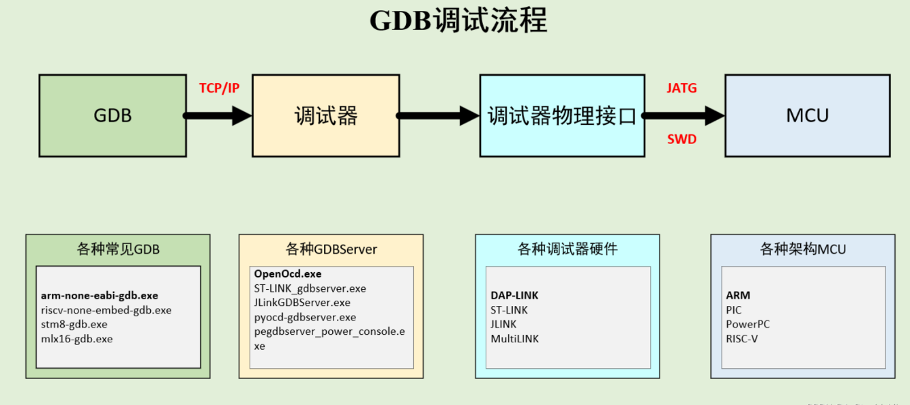
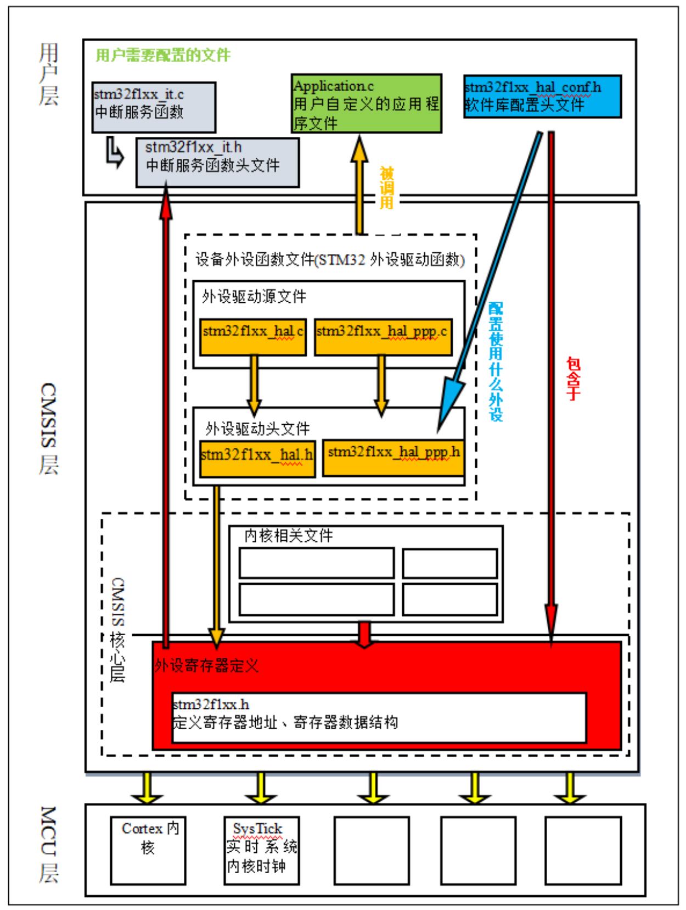
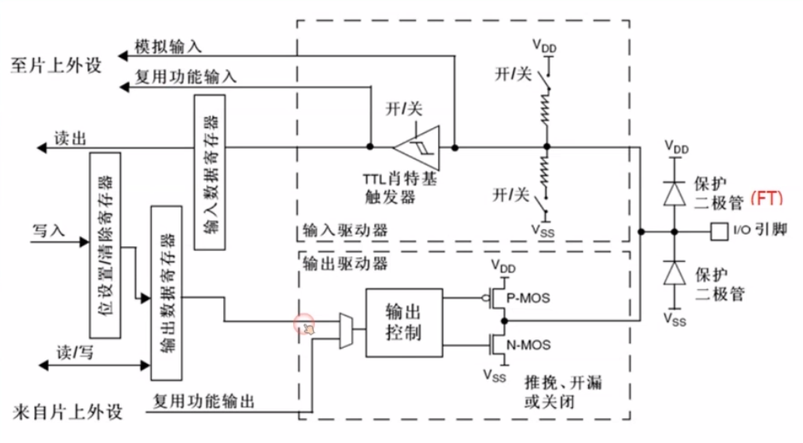

# 开发环境
## Reference

### 开源库
- [libopencm3](https://github.com/libopencm3/libopencm3)
- [STMems_Standard_C_drivers](https://github.com/STMicroelectronics/STMems_Standard_C_drivers)
- 
###  网址/博客
- [STM32开发环境搭建(ARM-GCC)](https://microdynamics.github.io/1.%20Breeze%20Mini四轴飞行器/2.2%20STM32开发环境搭建(ARM-GCC)/)
- [windows开源STM32开发环境](https://blog.csdn.net/zhangfan2256/article/details/132196426)
- [Windows 下构建 STM32 开发环境](https://wangyuyang.me/posts/windows下构建stm32开发环境/)
- [VsCode+OpenOCD 开发stm32系列](https://blog.csdn.net/pyt1234567890/article/details/122522700)
- [在Mac OS X中搭建STM32开发环境](https://www.cnblogs.com/humaoxiao/p/3576732.html "发布于 2014-03-02 13:52")
- [STM32CubeMX](https://www.stmcu.com.cn/ecosystem/Cube/STM32cubemx)
- [ STM32 下载器调试器——DAPLink](https://sspai.com/post/88682)
- [VSCode STM32_development](https://stm32world.com/wiki/STM32_development_and_debugging_using_VSCode#google_vignette)
### 视频教程
- [keysking-stm32-全面](https://www.bilibili.com/video/BV1do4y1F7wt)
- [铁头山羊-stm32-详细](https://www.bilibili.com/video/BV13vpSekEmA)
- [宅sir带你飞-stm32-理论为主](https://www.bilibili.com/video/BV12Q4y1K74V/)
- [遥想星空-stm32-MX应用为主](https://www.bilibili.com/video/BV1Wv411Y7KX)

## 开发环境配置
不使用 IDE，而是通过命令行工具和其他独立工具进行 STM32开发，优点就是开源免费且无需担心法律风险，官网或者github下载无需担心安装包风险，有利于深入了解开发工具，缺点就是更费时。
整个开发过程可以按照以下步骤进行：安装工具、开发、编译、烧录和调试。在这个流程中，完全依赖命令行工具和文本编辑器进行开发。STM32CubeMX 用于生成初始化代码，vscode用来写代码，armGNU 工具链用于编译代码，OpenOCD 用于烧录和调试。
当然，如果使用STM32CubeIDE，这些工具都无需配置，下文讲一讲STM32Cube包的关系。
### STM32Cube包的关系
本来是vscode-stm32插件，结果stm插件有问题，多了很多依赖，就研究了一下这几个依赖的关系---[STM32CubeCLT](https://www.st.com/en/development-tools/stm32cubeclt.html)、[STM32CubeMX](https://www.st.com/en/development-tools/stm32cubemx.html)和[STM32CubeIDE](https://www.st.com.cn/zh/development-tools/stm32cubeide.html)的关系。BTW，也没必要整太多插件，手动写写配置文件比较好，能熟悉一下每个工具。
#### STM32CubeMX
[STM32CubeMX](https://www.st.com.cn/zh/development-tools/stm32cubemx.html)生成适用于stm32具体机型的初始化c代码（还有一些初始化硬件如时钟、端口等功能），它的目的是让用其他平台的开发者快速形成可用的stm32的C语言代码，所以它没有代码编辑器、交叉编译器、下载器、调试器等很多工具。

- 直观的STM32微控制器和微处理器选择 
- 丰富易用的图形用户界面，允许配置： 
    - 支持自动冲突解决的引脚分配 
    - 支持面向Arm® Cortex®-M内核带参数约束动态验证的外设和中间件功能模式 
    - 支持动态验证时钟树配置 
    - 带功耗结果估算的功耗序列 
- 生成与面向Arm® Cortex®-M内核的IAR Embedded Workbench®、MDK-ARM和STM32CubeIDE（GCC编译器）兼容的初始化C代码 
- 生成面向Arm® Cortex®-A内核（STM32微处理器）的部分Linux®设备树 
- 借助STM32PackCreator开发增强型STM32Cube扩展包 
- 将STM32Cube扩展包集成到项目中 
- 作为可在Windows®、Linux®和macOS®（macOS®是苹果公司在美国和其他国家与地区的商标）操作系统和64位Java运行环境上运行的独立软件提供 and other countries.) operating systems and 64-bit Java Runtime environment
#### STM32CubeCLT
集成了交叉编译器、下载器、调试器等很多工具，因为是命令行工具，所以需要加入环境变量，不过若使用命令行开发，交叉编译器、下载器、调试器都无需下载stm的，而是下载开源通用的，这样有利于开发其他平台。
- Distribution of command-line tools and system view descriptors (SVD) extracted from STM32CubeIDE 
- STM32Cube MCU Packages support for STM32 microcontrollers (MCU) at the following development steps: 
    - Compile and link 
    - Target board programming 
    - Application run 
    - Application debugging 
- The STM32CubeCLT toolset includes: 
    - GNU C/C++ for Arm® toolchain executables such as arm-none-abi-gcc (compiler), arm-none-abi-nm (symbol viewer), and many more 
    - GDB debugger client and server 
    - STM32CubeProgrammer (STM32CubeProg) utility 
    - System view descriptor files (.SVD) for the entire STM32 MCU portfolio 
    - Map file associating STM32 MCUs and MCU development boards to the appropriate SVD

#### STM32CubeIDE
[STM32CubeIDE](https://www.st.com.cn/zh/development-tools/stm32cubeide.html)是一个“集大成”软件，其集成了STM32CubeMX的功能，同时也集成了STM32CubeCLT的功能，还继承了代码编辑器(代码高亮跳转等功能)的功能，也就是类似apple平台开发下的Xcode，或者windows下的Visual Studio。

- 通过STM32CubeMX来集成服务：STM32微控制器、微处理器、开发平台和示例项目选择引脚排列、时钟、外设和中间件配置项目创建和初始化代码生成具有增强型STM32Cube扩展包的软件和中间件
- 基于Eclipse®/CDT™，支持Eclipse®插件、GNU C/C++ for Arm®工具链和GDB调试器 
- STM32MP1 系列：支持OpenSTLinux项目：Linux支持Linux
- 其他高级调试功能包括：CPU内核、外设寄存器和内存视图实时变量查看视图系统分析与实时跟踪(SWV)CPU故障分析工具支持RTOS感知调试，包括Azure
- 支持ST-LINK（意法半导体）和J-Link (SEGGER)调试探头 
- 从Atollic® TrueSTUDIO®和AC6 System Workbench for STM32 (SW4STM32)导入项目
### 1. 安装必要的工具
首先，需要安装以下工具：（别忘了检查是否加入环境变量）
- [STM32CubeMX](https://www.st.com/en/development-tools/stm32cubemx.html)：用于生成初始化代码。
- [GNU Arm Embedded Toolchain Downloads](https://developer.arm.com/downloads/-/gnu-rm)：用于交叉编译编译代码。
- [OpenOCD](https://openocd.org/pages/getting-openocd.html)：用于烧录和调试。或者[pyocd](https://pyocd.io/docs/)
- [STlink驱动](https://www.st.com.cn/zh/development-tools/stsw-link009.html)：用于烧录。或者[cmsis-DAP-v2](https://arm-software.github.io/CMSIS_5/DAP/html/dap_install.html)（不需要驱动）
- **GCC & Make & git**：用于管理构建过程（可选，如果使用 `Makefile`）。不同操作系统的开发机器有所不同，windows安装msys2安装mingw64，mac就是xcode command line tools，linux则是build-essential。
- vscode或者sublime用于写代码：更推荐vscode用来写一些有一定体量的工程化代码，sublime更轻量功能也更少一些。

### gcc-arm-embedded 和 arm-none-eabi-gcc 区别

`gcc-arm-embedded` 和 `arm-none-eabi-gcc` 都是用于编译ARM架构嵌入式系统代码的编译器工具链，它们之间的主要区别如下：

1. **维护者和发布渠道**:
   - `gcc-arm-embedded`: 由Arm（原ARM公司）官方发布和维护，通常会在[Arm Developer网站](https://developer.arm.com/tools-and-software/open-source-software/developer-tools/gnu-toolchain/gnu-rm)上发布。它通常被视为官方推荐的工具链版本。
   - `arm-none-eabi-gcc`: 这是一个通用的名称，通常指的是GNU Arm Embedded Toolchain。它可以通过多种渠道获取，比如通过Linux的包管理器（如APT）安装，也可以通过其他工具链发行版本获取，如通过ARM的官网下载或者直接通过GNU的官方工具链仓库获取。

2. **发行版本和更新频率**:
   - `gcc-arm-embedded`: Arm官方发布的版本通常经过特定的测试，并且针对特定的硬件架构进行优化和稳定性验证。更新频率可能与 `arm-none-eabi-gcc` 略有不同，通常会提供一些针对性优化。
   - `arm-none-eabi-gcc`: 这个版本通常跟随GCC的官方发布节奏更新，可能会更频繁地获得更新和新特性，但也可能包含一些实验性功能。

3. **安装方式**:
   - `gcc-arm-embedded`: 通常通过下载预构建的二进制文件安装，或者通过一些IDE（如STM32CubeIDE）集成的工具链安装。
   - `arm-none-eabi-gcc`: 可以通过Linux发行版的包管理器直接安装（如通过 `apt-get install gcc-arm-none-eabi`），也可以通过其他方式获取。

4. **支持的功能和优化**:
   - `gcc-arm-embedded`: 可能包含一些ARM官方特有的优化和补丁，专门用于特定的ARM芯片。
   - `arm-none-eabi-gcc`: 作为GCC的一部分，提供了更广泛的GCC特性，适用于更广泛的使用场景，但某些特定优化可能不如`gcc-arm-embedded`专注。

总体来说，`gcc-arm-embedded` 更加偏向于官方提供的ARM嵌入式开发工具链，经过ARM官方的优化和测试。`arm-none-eabi-gcc` 则是一个通用的工具链版本，可能包含更多GCC的特性和最新的更新，但优化上未必专注于某些ARM芯片。

对于大多数嵌入式开发项目，尤其是针对ARM Cortex-M系列开发时，选择 `gcc-arm-embedded` 会更为稳妥，因为这是经过官方认证的工具链。

#### 查看内存&flash占用
```bash
arm-none-eabi-size ***.elf

text    data     bss     dec     hex filename
39628    164    4748   44540    4127 test-beta.elf
```
- `text`：Flash 中的代码大小: 39.6KB
- `data`：已初始化的全局变量（占用 Flash + RAM）: 164B
- `bss`：未初始化的全局变量（仅占用 RAM）: 4.7KB
- `dec`: 总大小，无直接意义。

#### mac & linux 编译工具安装
```c
// mac
(xcode command line tools)
brew install --cask gcc-arm-embedded
brew install stlink

//ubuntu
sudo apt install build-essentials
sudo apt install stlink-tools
```

问题：
[no "stdint.h" in arm-none-eabi-gcc(mac)](https://stackoverflow.com/questions/77249021/no-stdint-h-in-arm-none-eabi-gccmac)

I found this to solve my issue.
TLDR:
Uninstall `arm-none-eabi-gcc` from brew and install the toolchain with:

```c
brew install --cask gcc-arm-embedded
```
### vscode config
可以设置个`.vscode`文件夹，然后设置上`settings.json`、`c_cpp_properties.json`、`tasks.json`和`launch.json`。不用整这些（`c_cpp_properties.json`还是要的，不然vscode找不到函数/变量的引用），直接打开vscode中的terminal然后make就行（make和交叉编译的exe文件夹都要加入环境变量）。 
```json

{
    "configurations": [
        {
            "cwd": "${workspaceRoot}",
            "executable": "${workspaceFolder}/build/zx_pacemaker_beta0.4.elf",
            "name": "Debug STM32",
            "request": "launch",
            "type": "cortex-debug",
            "runToEntryPoint": "main",
            "servertype": "openocd",
            "armToolchainPath": "/usr/share/gcc-arm-none-eabi-10.3-2021.10/bin",
            "configFiles":[
                "stlink-v2.cfg",
                "stm32g4x.cfg"
            ],
        },
    ]
}
// stlink-v2-1.cfg (在此使用stlink-v2，如果使用jlink将配置文件换成jlink的即可)
// stm32f1x.cfg (在此我使用平台是基于GD32F103系列，与STM32F103系列相同操作)

// c_cpp_properties.json
{
    "configurations": [
        {
            "name": "STM32",
            // 注意下面这个指定好 gcc-arm 编译器后，c/c++ 插件会智能分析，不会按照桌面平台进行语义分析，一定要指明
            "compilerPath": "/usr/share/gcc-arm-none-eabi-10.3-2021.10/bin/arm-none-eabi-gcc",
            //编译参数可以从 makefile 里抄
            "defines": [
                // makefile中的C_DEFS，去掉D
                "USE_HAL_DRIVER",
                "STM32G431xx"
            ],
            "includePath": [
                // 工程代码的头文件
                "${workspaceFolder}/**"
            ],
            "compilerArgs": [
                // makefile中的CFLAGS
                "-mcpu=cortex-m4",
                "-mfpu=fpv4-sp-d16",
                "-mfloat-abi=hard",
                "-mthumb"
            ]
        }
    ],
    "version": 4
}
```
### 2. 使用 STM32CubeMX 配置项目
1. **打开 STM32CubeMX - file**。
2. **创建新项目**：
   - 选择微控制器型号（如 STM32L010）。
   - 配置外设、时钟、引脚和中断等设置。
3. **生成代码**：
   - 选择生成的项目类型为 Makefile 项目（如果使用 Makefile），或直接生成 C 代码。
   - STM32CubeMX 会生成初始化代码，包括启动文件和 HAL 库。

### 3. 编写和配置代码
1. **编辑生成的代码**：
   - 使用文本编辑器（如 VSCode、Sublime Text 等）编辑代码。
   - 添加应用逻辑代码，修改或扩展 STM32CubeMX 生成的初始化代码。

2. **版本管理**：git
这个就不介绍了，不用操作系统的开发机器有所不同，去官网看doc怎么用就ok

3. **创建 Makefile**：
   - 如果 STM32CubeMX 没有生成 Makefile，需要自己编写一个 Makefile。
   - Makefile 应该指定编译器路径、编译选项、链接选项和输出文件路径。

### 4. 编译代码
   - 打开命令行，导航到项目目录。
   - 使用 Makefile 进行编译：`make`
   - 如果没有使用 Makefile，可以手动使用 `arm-none-eabi-gcc` 命令进行编译和链接。例如：
     ```bash
     arm-none-eabi-gcc -o main.o -c main.c -mcpu=cortex-m0 -mthumb
     arm-none-eabi-gcc -o main.elf main.o -TSTM32L010.ld -mcpu=cortex-m0 -mthumb -nostartfiles
     arm-none-eabi-objcopy -O binary main.elf main.bin
     ```
   - 编译得到一个二进制文件（如 `.elf` 或 `.bin`）。
#### makefile添加新的代码文件
在makefile里面修改两处地方：`C_SOURCES`和`C_INCLUDES`。
在`C_SOURCES`里面添加你`.c`文件的相对路径，在`C_INCLUDES`中添加`.h`文件的所在目录的相对路径（需要加`-I`前缀）。
 

### 5. 烧录代码
1. **连接开发板**：
   - 通过 USB 将 ST-LINK 或 CMSIS-DAP 适配器连接到开发板和电脑。
   - 安装[ST-link驱动](https://www.st.com.cn/zh/development-tools/stsw-link009.html)。
   
2. **配置 OpenOCD**：
   - 确保 OpenOCD 已安装并配置好。还需要一个 OpenOCD 配置文件（`*.cfg`），它指定目标芯片和调试适配器。
   - copy `your_openocd_dir/openocd/scripts/interface/stlink.cfg`and `your_openocd_dir/openocd/scripts/target/stm32l0.cfg` to your project folder.
   - 使用以下命令启动 OpenOCD：
     ```sh
     # windows
     openocd -f stlink.cfg -f stm32l0.cfg -c init -c halt -c "flash write_image erase build/yourfile.bin 0x08000000" -c reset -c shutdown
     ```
或者，写到makefile里，然后用make download命令运行。
```bash
#######################################
# make download
#######################################
OPENOCD_INTERFACE = stlink-v2-1.cfg
OPENOCD_TARGET = stm32l4x.cfg
OPENOCD_FLASH_START = 0x08000000

download:
 openocd -f $(OPENOCD_INTERFACE) -f $(OPENOCD_TARGET) -c init -c halt -c "flash write_image erase $(BUILD_DIR)/$(TARGET).bin $(OPENOCD_FLASH_START)" -c reset -c shutdown
```

3. **烧录代码**：
   - 在命令行中使用以下命令进行烧录：
     ```sh
     # linux
     openocd -f stlink.cfg -f stm32g4x.cfg -c init -c "reset halt" -c "wait_halt" -c "flash write_image erase build/zx_pacemaker_beta0.4.elf" -c reset -c shutdown
     ```
   - 这将把 `zx_pacemaker_beta0.4.elf` 文件烧录到 STM32 微控制器中，并复位芯片。

### 6. 调试
#### vscode插件调试
Cortex-debug插件，然后在 `.vscode`文件夹 写一个上文的  `launch.json`
#### Cortex-debug设置（openocd & arm-gcc）

[问题](https://github.com/Marus/cortex-debug/issues/650)：Failed to launch OpenOCD GDB Server: Error: spawn /usr/local/bin EACCES
your OpenOCDPath is incomplete...pointing to a directory rather than an executable
```bash
# 错误的
"cortex-debug.openocdPath": "/usr/local/bin",
```

Which resulted in this a bad launch
```bash
Launching gdb-server: /usr/local/bin -c "gdb_port 50000" -c "tcl_port 50001" -c "telnet_port 50002" -s ~/pico/openocd/tcl -f /home/myself/.vscode/extensions/marus25.cortex-debug-1.4.4/support/openocd-helpers.tcl -f interface/picoprobe.cfg -f target/rp2040.cfg
```

Change it to
```bash
# 正确的
"cortex-debug.openocdPath": "/usr/local/bin/openocd",
```
#### 命令行调试

- [gdb 调试利器](https://linuxtools-rst.readthedocs.io/zh-cn/latest/tool/gdb.html)
- [opocd+GDB调试stm32](http://116.205.174.47/2023/04/04/linux/arm/stm32-openocd-gdb/095427/)
- [stm32 vscode配置](https://zhuanlan.zhihu.com/p/468568448)

1. **启动调试会话**：
   - 使用 GDB（GNU 调试器）来连接 OpenOCD 进行调试。首先启动 OpenOCD：
     ```sh
     openocd -f interface/stlink.cfg -f target/stm32l0.cfg
     ```
   
2. **使用 GDB 连接**：
   - 在另一个终端窗口中，启动 GDB 并连接到 OpenOCD：
     ```sh
     arm-none-eabi-gdb main.elf
     target remote localhost:3333
     ```
   - 可以在 GDB 中设置断点、单步执行代码、检查寄存器和内存等。

### 7. 上位机串口工具
#### [Serial Studio](https://github.com/Serial-Studio/Serial-Studio)
linux、mac、windows平台可用
```bash
# mac 可以brew安装，有网络问题也可以下载github release
brew install --cask serial-studio
```

```c
# 单片机的串口发送数据要与serial-studio的设置对应上，
# 比如波特率，设置帧头$帧尾\n，多通道数据间隔符号","

# 单通道数据示例，serial-studio选multiplots---plot
static char message[10] = "";
sprintf(message, "$%d\n", adc_v_int);
HAL_UART_Transmit_DMA(huart_addr, (uint8_t*)message, strlen(message));

# 多通道数据示例（三轴加速度传感器）,serial-studio选加速度传感器数据
static char accel_message[32] = "";
int16_t accel_raw[3];
LIS3DH_ReadRawData(accel_raw);
sprintf(accel_message, "$%d,%d,%d\n", 
                        accel_raw[0]/16, // X轴
                        accel_raw[1]/16, // Y轴
                        accel_raw[2]/16  // Z轴
        );
 HAL_UART_Transmit_DMA(huart_addr, (uint8_t*)accel_message,
									 strlen(accel_message))
```
#### [Serial Test](https://github.com/wh201906/SerialTest)

安卓串口问题：
```bash
SerialTest supports hardware serial port in /dev/. You need to run chmod 777 <serial port device> with root permission to make the serial port accessible to SerialTest.
SerialTest does not support USB to serial adapters like FT232, CH340, CP2102 and other USB-CDC devices natively. However, you can still use them with SerialTest, if you have a UART to TCP app to convert the serial connection to TCP connection. I got this idea from this webpage and it does work.

You can use this app for converting UART connection to TCP connection.
com.hardcodedjoy.tcpuart
https://play.google.com/store/apps/details?id=com.hardcodedjoy.tcpuart

SerialTest支持/dev/目录下的的硬件串口。但需要运行chmod 777 <串口设备地址>(需要root权限)来让SerialTest能够访问它。
SerialTest本身不支持各类USB串口设备(FT232、CH340、CP2102等，以及USB-CDC设备)。但是，你可以通过UART转TCP的APP来把串口转为TCP连接，从而通过SerialTest来访问。这一方法源于Proxmark3的文档，经测试能够正常工作。
```

# HAL库
## stm不同库的关系
现在stm主推的就是LL&HAL库，LL是更底层的，HAL是抽象程度更高的，也都是开源的，你下载的就有源码。相比之下，标准库（何为标准，ARM牵头定义的[CMSIS](https://arm-software.github.io/CMSIS_6/latest/General/index.html)标准，符合这个标准的库就叫标准库）stm已不经常更新。
都是开源，都可以学习，只能说，用stm的话那就还是HAL&LL库。标准库也会在下面章节简单介绍。


- [野火STM32 HAL库开发](https://doc.embedfire.com/mcu/stm32/f103/hal_general/zh/latest/index.html)（有对应的PDF在apple books）但是最好先看手册（官网有中文版比如M0的PDF在apple books）查资料，这个野火的教程不适合入门，一个是对基本原理不讲或讲的太杂太细，二是有大量的宏定义，反而让初学者缕不清HAL库的函数调用。


## C 语言对寄存器的封装
这部分就是浅尝辄止的了解一下HAL库的工作，就不深入了解重复造轮子了。（有时间还是要造一遍）
### 宏定义封装地址
这当然不是最终的封装，因为还是有大量位操作。
```c
// 外设基地址
define PERIPH_BASE ((unsigned int)0x40000000)

// 总线基地址
define APB1PERIPH_BASE PERIPH_BASE
define APB2PERIPH_BASE (PERIPH_BASE + 0x00010000)
define AHBPERIPH_BASE (PERIPH_BASE + 0x00020000)

// GPIO 外设基地址
define GPIOA_BASE (APB2PERIPH_BASE + 0x0800)
define GPIOB_BASE (APB2PERIPH_BASE + 0x0C00)
define GPIOC_BASE (APB2PERIPH_BASE + 0x1000)
define GPIOD_BASE (APB2PERIPH_BASE + 0x1400)
define GPIOE_BASE (APB2PERIPH_BASE + 0x1800)
define GPIOF_BASE (APB2PERIPH_BASE + 0x1C00)
define GPIOG_BASE (APB2PERIPH_BASE + 0x2000)

// 寄存器基地址，以GPIOB 为例
define GPIOB_CRL (GPIOB_BASE+0x00)

/* 控制GPIOB 引脚0 输出低电平(BSRR 寄存器的BR0 置1) */
*(unsigned int *)GPIOB_BSRR = (0x01<<(16+0));

/* 控制GPIOB 引脚0 输出高电平(BSRR 寄存器的BS0 置1) */
*(unsigned int *)GPIOB_BSRR = 0x01<<0;
unsigned int temp;

/* 读取GPIOB 端口所有引脚的电平(读IDR 寄存器) */
temp = *(unsigned int *)GPIOB_IDR;
```

### 结构体封装寄存器组
```c
typedef unsigned int uint16_t; /* 无符号16 位变量*/
typedef unsigned short int uint32_t; /* 无符号32 位变量*/

/* GPIO 寄存器列表“封装”为一个结构体 */
typedef struct {
uint32_t CRL; /*GPIO 端口配置低寄存器 地址偏移: 0x00 */
uint32_t CRH; /*GPIO 端口配置高寄存器 地址偏移: 0x04 */
uint32_t IDR; /*GPIO 数据输入寄存器 地址偏移: 0x08 */
uint32_t ODR; /*GPIO 数据输出寄存器 地址偏移: 0x0C */
uint32_t BSRR; /*GPIO 位设置/清除寄存器 地址偏移: 0x10 */
uint32_t BRR; /*GPIO 端口位清除寄存器 地址偏移: 0x14 */
uint16_t LCKR; /*GPIO 端口配置锁定寄存器 地址偏移: 0x18 */
} GPIO_TypeDef;

GPIO_TypeDef * GPIOx; //定义一个GPIO_TypeDef 型结构体指针GPIOx
GPIOx = GPIOB_BASE; //把指针地址设置为宏GPIOB_BASE 地址
GPIOx->IDR = 0xFFFF;
GPIOx->ODR = 0xFFFF;

uint32_t temp;
temp = GPIOx->IDR; //读取GPIOB_IDR 寄存器的值到变量temp 中
```
### 封装寄存器的位操作方法
。。。

## 一 时钟
- [# STM32CubeMX使用 之“吃透RCC”](https://www.bilibili.com/video/BV1Qe411W7rv/)
内部时钟，外部高速/低速时钟的设置。设置外部时钟首先需要开发版或者电路板按照芯片datasheet正确连接了外部晶振。然后在CubeMX中(Pinout&config---sys中)开启，然后在Clock config页面中选择设置等，具体看视频链接。

## 二 中断
- [STM32 CubeMX外部中断EXTI](https://www.bilibili.com/video/BV12Q4y1K74V/)
上述链接视频讲解得不错，比如讲到了函数`void HAL_GPIO_EXIT_Callback(uint16_t GPIO_Pin)`是HAL库的一个弱函数(__weak)，我们是重写。还有在STM32CubeMX中如何设置实现GPIO的外部中断。

## 三 定时器
定时器一定要与中断配合才有意义。stm32有几类不同的定时器，
- [stm32定时器原理](https://www.bilibili.com/video/BV16w4m1e7X7)
- [stm32定时器使用](https://www.bilibili.com/video/BV1f54y1Y7Ls)

```c
#define TIM_IT_Update                      ((uint16_t)0x0001)
#define TIM_IT_CC1                         ((uint16_t)0x0002)
#define TIM_IT_CC2                         ((uint16_t)0x0004)
#define TIM_IT_CC3                         ((uint16_t)0x0008)
#define TIM_IT_CC4                         ((uint16_t)0x0010)
#define TIM_IT_COM                         ((uint16_t)0x0020)
#define TIM_IT_Trigger                     ((uint16_t)0x0040)
#define TIM_IT_Break                       ((uint16_t)0x0080)  
```


　　没有头绪，还是去查看stm32数据手册吧。

TIM_IT_Update:更新中断，计数器向上溢出/向下溢出，计数器初始化(通过软件或者内部/外部触发) 

TIM_IT_CC1~4：都是捕获/比较中断，貌似都是平等的，即输入捕获，输出比较

TIM_IT_Trigger：触发事件(计数器启动、停止、初始化或者由内部/外部触发计数)

使用的时候都是调用函数TIM_ITConfig()来使能指定的中断类型，调用TIM_GetITStatus()函数来查看是否有中断发生，入口参数都是平等的。

可能就是不同的事件导致中断的发生略有不同

### 基本定时器操作
#### 1. CubeMX
1. tim2(其中一个通用定时器)，
2. Clock Source选择internal clock 
3. Counter Settings 

#### 2. 代码


### 输入捕获

- Polarity Selection用于配置极性选择，这里配置上升沿；
- IC Selection 配置为Direct，为直连模式，即配置IC1直接映射在TI1上；
- Prescaler Division Ratio用于配置配置输入分频，这里选择为No division，即不分频。要注意的是，如果设置了分频比，例如设置为2，表示捕获到2个上升沿才产生一次中断；
- Input Filter (4 bits value) 配置输入滤波器参数，这里配置为0，即不滤波。  
    **Input Capture Channel 2参数配置如下：**
- Polarity Selection这里配置下降沿；
- IC Selection 配置为Direct，为直连模式，即配置IC2直接映射在TI1上；
- Prescaler Division Ratio用于配置配置输入分频，这里选择为No division，即不分频

#### Input Filter

从0到f，如下：

| **ICxF 值** | **输入滤波采样频率**                    | **采样次数**      |
| ---------- | ------------------------------- | ------------- |
| 0000       | 无滤波，直接响应                        | —             |
| 0001       | fSAMPLING = fCK_INT, N=2        | 2个连续采样一致才有效   |
| 0010       | fSAMPLING = fCK_INT, N=4        | 4×T_DTS       |
| 0011       | fSAMPLING = fCK_INT, N=8        | 8×T_DTS       |
| 0100       | fSAMPLING = fCK_INT/2, N=6      | 12×T_DTS      |
| 0101       | fSAMPLING = fCK_INT/2, N=8      | 16×T_DTS      |
| 0110       | fSAMPLING = fCK_INT/4, N=6      | 24×T_DTS      |
| 0111       | fSAMPLING = fCK_INT/4, N=8      | 32×T_DTS      |
| 1000       | fSAMPLING = fCK_INT/8, N=6      | 48×T_DTS      |
| 1001       | fSAMPLING = fCK_INT/8, N=8      | 64×T_DTS      |
| 1010       | fSAMPLING = fCK_INT/16, N=5     | 80×T_DTS      |
| 1011       | fSAMPLING = fCK_INT/16, N=6     | 96×T_DTS      |
| 1100       | fSAMPLING = fCK_INT/16, N=8     | 128×T_DTS     |
| 1101       | fSAMPLING = fCK_INT/32, N=5     | 160×T_DTS     |
| 1110       | fSAMPLING = fCK_INT/32, N=6     | 192×T_DTS     |
| **1111**   | **fSAMPLING = fCK_INT/32, N=8** | **256×T_DTS** |
比如timer分频之后的频率是：fDTS = 16MHz，那么
  
您发现了一个很好的问题！让我重新核对STM32官方手册中TIM_ICFilter的定义。

## 问题分析

我之前给出的表格存在错误。让我查阅STM32官方参考手册后，给出**正确的TIM_ICFilter编码表**。

## STM32官方TIM_ICFilter定义

根据STM32参考手册（RM0090），**正确的编码表**如下：

### 完整的TIM_ICFilter映射表

|ICF[3:0]|采样时钟|连续采样次数N|滤波时间计算|
|---|---|---|---|
|0000 (0x0)|无滤波|-|0|
|0001 (0x1)|fCK_INT|N=2|2/fCK_INT|
|0010 (0x2)|fCK_INT|N=4|4/fCK_INT|
|0011 (0x3)|fCK_INT|N=8|8/fCK_INT|
|0100 (0x4)|fDTS/2|N=6|12/fDTS|
|0101 (0x5)|fDTS/2|N=8|16/fDTS|
|0110 (0x6)|fDTS/4|N=6|24/fDTS|
|0111 (0x7)|fDTS/4|N=8|32/fDTS|
|1000 (0x8)|fDTS/8|N=6|48/fDTS|
|1001 (0x9)|fDTS/8|N=8|64/fDTS|
|1010 (0xA)|fDTS/16|N=5|80/fDTS|
|1011 (0xB)|fDTS/16|N=6|96/fDTS|
|1100 (0xC)|fDTS/16|N=8|128/fDTS|
|1101 (0xD)|fDTS/32|N=5|160/fDTS|
|1110 (0xE)|fDTS/32|N=6|192/fDTS|
|1111 (0xF)|fDTS/32|N=8|256/fDTS|

**注意**：您提供的简化表格似乎是另一种表述方式，但与官方手册存在差异。

## 根据您的代码配置重新计算

### 当前配置参数

- 
- 
- 
- 

### 0x0F 的实际效果（官方定义）

- 
- 
- 
- 

## 您提供的表格分析

您的表格显示的滤波时间与我之前计算的**不一致**。让我核对：

如果按照您的表格（假设基于不同的参考或芯片系列）：

- 
- 
- 
- 

但这与STM32F4系列官方手册不符。

## 针对您的需求重新推荐

### 目标：10μs左右的滤波时间

基于**正确的官方定义**和您的配置：

- 
- 
- 
- 

|Filter|采样时钟|N|滤波时间|评价|
|---|---|---|---|---|
|0x06|fDTS/4 = 1.25MHz|6|4.8μs|偏小|
|0x07|fDTS/4 = 1.25MHz|8|6.4μs|较合适|
|0x08|fDTS/8 = 625kHz|6|9.6μs|**推荐** ✓|
|0x09|fDTS/8 = 625kHz|8|12.8μs|略大|
|0x0A|fDTS/16 = 312.5kHz|5|16μs|较大|

### 如果timer 16MHz

假设改为16MHz计数频率 + TIM_CKD_DIV1：

fDTS = 16MHz

| Filter | 采样时钟             | N   | 滤波时间    |
| ------ | ---------------- | --- | ------- |
| 0x01   | fDTS = 16MHz     | 2   | 0.125μs |
| 0x02   | fDTS = 16MHz     | 4   | 0.25μs  |
| 0x03   | fDTS = 16MHz     | 8   | 0.5μs   |
| 0x04   | fDTS/2 = 8MHz    | 6   | 0.75μs  |
| 0x05   | fDTS/2 = 8MHz    | 8   | 1μs     |
| 0x06   | fDTS/4 = 4MHz    | 6   | 1.5μs   |
| 0x07   | fDTS/4 = 4MHz    | 8   | 2μs     |
| 0x08   | fDTS/8 = 2MHz    | 6   | 3μs     |
| 0x09   | fDTS/8 = 2MHz    | 8   | 4μs     |
| 0x0A   | fDTS/16 = 1MHz   | 5   | 5μs     |
| 0x0B   | fDTS/16 = 1MHz   | 6   | 6μs     |
| 0x0C   | fDTS/16 = 1MHz   | 8   | 8μs     |
| 0x0D   | fDTS/32 = 500kHz | 5   | 10μs    |
| 0x0E   | fDTS/32 = 500kHz | 6   | 12μs    |
| 0x0F   | fDTS/32 = 500kHz | 8   | 16μs    |


### 定时器问题
#### 定时器中断无法使用HAL_Delay
- [定时器中断无法使用HAL_Delay](https://blog.csdn.net/m0_57147943/article/details/123518122)

## 四 GPIO

### IO的硬件原理
[STM32CubeMX使用-吃透IO口](https://b23.tv/hyxZ4tR)
上述链接的视频比较简单清楚的讲解了io的硬件原理，可以简单的理解上下拉电阻的优缺点（优点抗干扰能力强，缺点被上拉/下拉电阻分压导致高低电平分压而），如何复用IN/OUT、推挽与开漏的区别等问题，结构图如下：


### 共阳极控制
- [共阳极和共阴极接法的对比](https://blog.csdn.net/The_bad/article/details/130704983)
简单来讲就是stm32（数据手册 I/O port characteristics）**STM32的驱动电流最大为20mA，其==负载电流==有限**。其他单片机的负载电流也同样是有限的。如果采用共阴极接法，如果LED的驱动电流大于20mA，STM32的驱动效果就会很差，LED不亮或者很微弱。

### 如何配置GPIO功耗低
- [GPIO模式选择对低功耗的影响](https://www.wpgdadatong.com.cn/blog/detail/71252)
- [STM32低功耗模式下GPIO如何配置最节能？](https://bbs.huaweicloud.com/blogs/234482)
简单来讲就是尽量不要GPIO配置成悬空模式，不用做通信的引脚尽量设置低速等。


## 五 ADC
- [ADC教学视频-很好](https://www.bilibili.com/video/BV13vpSekEmA)
- [ADC设置](https://blog.csdn.net/qq_36347513/article/details/112850329)
- [ADC模式](https://mcu.eetrend.com/blog/2021/100113230.html)
- [ADC单次中断模式设置](https://www.cnblogs.com/lc-guo/p/17958496)
要在STM32平台上使用内部ADC对外部引脚的模拟电压信号进行读入，并与特定阈值 `Sense_Threshold` 进行比对，可以按照以下步骤进行操作。


### 1. CubeMX 配置

1. **选择 MCU**：在 STM32CubeMX 中，选择你使用的 STM32 MCU，例如 STM32F4 系列。

2. **配置外部引脚**：
   - 打开**Pinout & Configuration**。
   - 选择用于输入模拟信号的引脚，设置为 **Analog** 模式。例如，PA0 引脚可以设置为模拟输入。

3. **启用 ADC 外设**：
   - 打开**Peripherals**，在 **Analog** 下选择 **ADC** 并启用。
   - 在 **Configuration** 中设置 **Resolution** 为你需要的分辨率（12-bit 通常够用），并选择采样时间。采样时间要根据应用需求和外部电路的特性来设置。
   - 设置 **Regular Channel**，选择你配置为模拟输入的引脚作为 ADC 输入通道。

4. **设置 ADC 的采样率**：
   - 采样率的设置与心电信号中的 R 波脉宽有关。R 波的典型脉宽大约在 80 ms 左右，1/5 的采样周期为 16 ms，即你需要的采样率为大约 62.5 Hz。
   - 在 CubeMX 中的 **ADC Regular Conversion Mode** 中，选择 **Continuous Conversion Mode** 以保持连续采样，并设置采样频率。

5. **生成初始化代码**：完成配置后，点击 **Project** -> **Generate Code**，生成初始化代码。

### 2. 代码实现

在 CubeMX 生成的代码基础上进行修改，下面是 ADC 采样并与 `Sense_Threshold` 比较的主要逻辑：

```c
#include "main.h"

#define SENSE_THRESHOLD 2000  // 根据你的实际应用设置合适的阈值

// ADC Handle 定义
extern ADC_HandleTypeDef hadc1;

// 比对通过后调用的函数
void Sensed_Handler(void) {
    // 你的处理逻辑
}

// ADC 转换完成的回调函数
void HAL_ADC_ConvCpltCallback(ADC_HandleTypeDef* hadc) {
    if (hadc->Instance == ADC1) {
        // 读取 ADC 值
        uint32_t adc_value = HAL_ADC_GetValue(&hadc1);

        // 与阈值比对
        if (adc_value > SENSE_THRESHOLD) {
            // 调用 Sensed_Handler 函数
            Sensed_Handler();
        }
    }
}

int main(void) {
    // 初始化代码
    HAL_Init();
    SystemClock_Config();
    MX_GPIO_Init();
    MX_ADC1_Init();  // CubeMX 生成的初始化代码

    // 启动 ADC 连续转换
    HAL_ADC_Start_IT(&hadc1);

    // 主循环
    while (1) {
        // 其他处理逻辑
    }
}
```

### 3. 代码解释
- `HAL_ADC_Start_IT()` 用于启动 ADC 并在转换完成时触发中断。
- `HAL_ADC_ConvCpltCallback()` 是 ADC 转换完成的回调函数，读取 ADC 值，并将其与 `Sense_Threshold` 比较。如果超过阈值，则调用 `Sensed_Handler()` 函数进行处理。

### 4. 采样率的确定
假设心电图中 R 波的典型脉宽大约为 80 毫秒。根据 Nyquist 定理，信号采样率应至少是信号频率的两倍以上，考虑到脉宽细节，我们选择采样率为脉宽的 1/5，即约 62.5 Hz。

在实际应用中，你可以根据具体的心电信号情况调整采样率，同时确保 ADC 的采样频率满足所需的时间分辨率。

### 5. 调整采样时间
如果需要更快的采样时间，可以调整 CubeMX 中 ADC 的**采样时间**设置，选择较短的采样周期。根据 MCU 的时钟频率，采样时间影响整体的转换时间，确保总采样时间低于 16 ms。

通过这些步骤，你可以实现 STM32 平台上的 ADC 信号采集和阈值检测功能。

## 六 DAC
在 STM32 平台上使用 MCU 内部 DAC 对外部引脚输出指定范围的电压信号（0.1V - 1.5V），可以按照以下步骤进行操作。

### 1. CubeMX 配置

1. **选择 MCU**：打开 STM32CubeMX，选择你使用的 STM32 芯片型号。

2. **配置 DAC 输出引脚**：
   - 打开 **Pinout & Configuration**。
   - 选择用于输出 DAC 信号的引脚（例如 PA4 或 PA5，具体引脚视你所选的 MCU 而定），并将其设置为 **DAC_OUT** 模式。

3. **启用 DAC 外设**：
   - 在 **Peripherals** 中找到 **DAC**，并启用它。
   - 在 **Parameter Settings** 中设置 **Trigger** 为 **Software Trigger**，以便你可以在代码中手动控制 DAC 输出。
   - 确保选择了 **Buffer Enable** 以使 DAC 输出稳定。

4. **生成代码**：
   - 完成配置后，点击 **Project** -> **Generate Code**，生成初始化代码。

### 2. 代码实现

生成代码后，你可以通过 HAL 库控制 DAC 输出指定范围的电压。假设你要输出 0.1V 到 1.5V 范围内的电压，下面是代码示例：

```c
#include "main.h"

extern DAC_HandleTypeDef hdac;

#define VREF 3.3  // 假设 Vref 为 3.3V
#define DAC_RESOLUTION 4096  // 12位 DAC 分辨率

// 计算 DAC 输出数据
uint32_t VoltageToDACValue(float voltage) {
    if (voltage < 0.0f) voltage = 0.0f;
    if (voltage > VREF) voltage = VREF;
    return (uint32_t)((voltage / VREF) * (DAC_RESOLUTION - 1));
}

// 设置 DAC 输出电压
void SetDACOutput(float voltage) {
    uint32_t dac_value = VoltageToDACValue(voltage);
    HAL_DAC_SetValue(&hdac, DAC_CHANNEL_1, DAC_ALIGN_12B_R, dac_value);
    HAL_DAC_Start(&hdac, DAC_CHANNEL_1);
}

int main(void) {
    // 初始化代码
    HAL_Init();
    SystemClock_Config();
    MX_GPIO_Init();
    MX_DAC_Init();  // CubeMX 生成的 DAC 初始化代码

    // 设置 DAC 输出 0.1V 到 1.5V
    SetDACOutput(0.1f);  // 输出 0.1V
    HAL_Delay(1000);     // 延时 1 秒
    SetDACOutput(1.5f);  // 输出 1.5V

    // 主循环
    while (1) {
        // 其他逻辑
    }
}
```

### 3. 代码解释

- **VoltageToDACValue** 函数将输入的电压值转换为 DAC 数字值。DAC 是基于参考电压 `VREF`（通常为 3.3V），并且有 12 位分辨率（0-4095）。因此，电压和 DAC 数值之间的转换公式为：
  \[
  DAC\_Value = \left( \frac{Voltage}{VREF} \right) \times (DAC\_Resolution - 1)
  \]
  其中 `DAC_Resolution` 为 4096，表示 12 位精度。

- **SetDACOutput** 函数设置 DAC 的输出电压。该函数首先将电压转换为 DAC 的数值，然后通过 `HAL_DAC_SetValue()` 设置 DAC 输出。

### 4. 详细步骤

1. **使用 HAL_DAC_SetValue()** 控制 DAC 的输出电压，`DAC_ALIGN_12B_R` 表示右对齐的 12 位分辨率。

2. **电压范围的设定**：
   - 在此例中，你可以输出的最小电压为 0V，最大电压为参考电压（VREF），例如 3.3V。
   - 你希望输出的电压范围是 0.1V 到 1.5V，通过代码中调用 `SetDACOutput()` 来控制。

3. **延时与稳定**：
   - 每次设置 DAC 输出时，通常需要加入延时（如 `HAL_Delay()`），以确保 DAC 输出的电压信号在物理引脚上稳定输出。

### 5. 注意事项

- **参考电压**：确保你的 MCU 使用的 VREF 为准确的 3.3V 或其他已知值，以便正确映射输出电压。
- **DAC 精度**：根据你选择的 DAC 分辨率（通常为 12 位），输出的电压精度将受到限制。每个 DAC 数字值对应的最小电压变化为：
  $$ \Delta V = \frac{VREF}{DAC\_Resolution} = \frac{3.3V}{4096} \approx 0.8mV $$ 

- **电压范围限制**：你需要确保 DAC 输出的电压不超过硬件的电压范围，否则可能会导致误差或不稳定。

通过这些步骤，你可以实现 STM32 平台上的 DAC 输出指定电压范围的功能。


## 七 通信
嵌入式通信跟计算机网络比起来要简单的多，但由于底层需要自己定义所以应用起来显得复杂（网络）。通信跟任何计算机框架一样，肯定都要分层的，而最底层的是物理层，规定了基本的接口类型（哪跟线是输入/输出，哪跟线是GND等），还规定了基本的数据规范，比如串口的比特率，或者数据帧格式。
数据帧格式在各层都有封装，但是物理层在“解包时”并不是用“软件”，而是用定时器，比较器等硬件来判断。
其中串口（USART、RS485等）、网口（以太网）、USB（type c、type A等）、HDMI，都是硬件接口，其实它们也不都是物理层，因为比如USB C物理接口形式）可能会对应不同的物理层协议，但可以基本理解为物理层；而TCP/IP、modbus就属于应用层，它们对物理硬件甚至没有要求（TCP/IP可以通过以太网口，也可以通过wifi无线通信；modbus既可以用以太网口sg），只是对物理层的数据包进一步细分定义（封装），目的当然是适配多设备通信、方便应用、增加鲁棒性等。

### 串口

[modbus-stm32-485](https://blog.csdn.net/qq_37281984/article/details/122739968)
#### 485

什么是485硬件流控？
#### modbus
- [GitHub库Modbus-STM32-HAL-FreeRTOS](https://github.com/alejoseb/Modbus-STM32-HAL-FreeRTOS)

### 以太网口

### USB接口

### 无线通信


## 八 Flash
- [环境参数持久化存储的应用开发](https://blog.csdn.net/tysonchiu/article/details/125788461)
- [stm32永久保存参数](https://www.cnblogs.com/Bingley-Z/p/17463058.html)

# 标准库
[标准库](https://www.st.com.cn/zh/embedded-software/stm32-standard-peripheral-libraries/documentation.html)，即符合ARM牵头制定的ARM架构软件标准[CMSIS](https://arm-software.github.io/CMSIS_6/latest/General/index.html)的库。


# 软件测试
- [STM32 | 分享几个开源的测试框架](https://news.eeworld.com.cn/mcu/ic544312.html)
- [googletest（C/C++）](https://github.com/google/googletest)

## 单元测试
### Unity
- [Unity](https://github.com/ThrowTheSwitch/Unity)

## 集成测试
- [集成测试概念讲解](https://www.cnblogs.com/hebendexiaomao/p/17548929.html)
### stm32cubemonitor
- [stm32cubemonitor](https://www.st.com.cn/zh/development-tools/stm32cubemonitor.html)

## 软硬件联调(功能测试)
依据法规

# 具体项目示例

## ADC&中断
- [使用STM32 HAL库驱动烟雾传感器的设计和优化](https://blog.csdn.net/weixin_66608063/article/details/134702311)


# C语言的一些问题

## memcpy会导致volatile失效
memcpy或者memset会导致volatile声明失效。
### 解决方案
```c
	volatile float Pace_Interval = 1000.0;
    float temp_float_param = Pace_Interval;  // 定义一个通用的 float 变量
    memcpy(&params_to_send[index], &temp_float_param, sizeof(temp_float_param));  // 使用 memcpy 复制
```

### 原因
为什么对volatile修饰的变量调用memset函数，编译的时候会报错。当然，我是不知道为什么啦。之前没有遇到过嘛。不过我还是做了一点分析，我认为问题出在memset函数的实现上。一般情况下volatile关键字修饰的变量在编译的时候会取消编译优化，即每次使用变量时都会访问变量对应的地址，而不是将变量读入寄存器中连续使用。
[引用自](https://www.cnblogs.com/wormarz/p/16554597.html)
我写了个简单的代码测试了一下。大致如下

```c
#include <stdio.h>
int main(void)
{
        volatile int a;
        memset(&a,0,sizeof(int));
}
```

编译出现了一个警告

```csharp
warning: passing argument 1 of ‘memset’ discards ‘volatile’ qualifier from pointer target type 
```

我的理解是这个volatile变量传入函数后volatile的特性会被丢掉。  
为了研究为什么会这样，接下来我阅读了linux内核中memset的源码。

```cpp
void *memset(void *pdst, int c, unsigned int plen)
{
  /* Now we want the parameters in special registers.  Make sure the
     compiler does something usable with this.  */

  register char *return_dst __asm__ ("r10") = pdst;
  register int n __asm__ ("r12") = plen;
  register int lc __asm__ ("r11") = c;

  .....
}
```

上面这部分源码解答了我的疑惑，原来memset在执行过程中，强制把传入的地址放入了r10寄存器，之后也会直接通过连续操作寄存器来访问变量，这里就和volatile每次都要读取物理地址而不能连续使用寄存器内容的特性冲突了。


# stm32的一些问题


## stm32cubeMX网络问题
Help-设置上代理应该就好了。


## [LOAD segment with RWX permissions 警告](https://www.cnblogs.com/milton/p/16756523.html)
使用GCC Arm工具链开发的项目, 在升级到 arm-gnu-toolchain-12.2 之后, 编译出现警告

```sql
arm-gnu-toolchain-12.2.mpacbti-bet1-x86_64-arm-none-eabi/bin/../lib/gcc/arm-none-eabi/12.2.0/../../../../arm-none-eabi/bin/ld: warning: Build/app.elf has a LOAD segment with RWX permissions
```

这是 Binutils 2.39 引入的一个新的安全类型的警告, GCC在升级版本时会带着新版本的 Binutils 一起发布. 如果要消除这个警告, 要么修改ld文件, 要么屏蔽掉它.

### 说明
这篇文章里有比较详细的说明  
[https://www.redhat.com/en/blog/linkers-warnings-about-executable-stacks-and-segments](https://www.redhat.com/en/blog/linkers-warnings-about-executable-stacks-and-segments)

**The executable segment warnings**

当程序载入内存时会分段载入, 一些属于可执行的代码，一些属于数据, 可读或者可读可写, 可能还有一些用于其它特殊用途. 每一段内存都会区分可读、可写和可执行这三个属性, 如果一个内存段同时具有这三种属性, 则存在受到攻击的可能性, 因此在这种情况下链接器将产生以下警告

```vhdl
warning: <file> has a LOAD segment with RWX permissions
```

这个警告表示elf文件中存在一个或多个存在安全问题的段, 可以通过运行readelf程序进行查看

```bash
readelf -lW <file>
```

注意: 在readelf的输出中, 段的可执行标志被标记为E而不是X, 三个属性的标识为RWE而不是RWX. 警告出现的常见原因是使用自定义连接脚本进行链接, 该脚本未将代码和数据分成不同的段, 所以最好的解决办法是更新连接脚本. readelf命令将显示每个段包含哪些部分, 可以通过这些信息计算出连接器映射需要如何更新, 才能将代码部分和可写的数据部分分开.

### 解决方案

#### 1. 使用 --no-warn-rwx-segments 屏蔽
-   如果连接使用的是ld, 可以用`--no-warn-rwx-segments`选项
-   如果连接使用的是gcc, 直接用会提示无法识别的选项, 需要用`-Wl,--no-warn-rwx-segments`这样的方式

#### 选项二: 修改连接描述
对于存在问题的elf, 可以通过这个命令查看文件结构, 注意后面的**Flg**部分, RWE分别表示Read,Write,Execute.

```x86asm
$ readelf -lW app.elf
Elf file type is EXEC (Executable file)
Entry point 0x15e1
There are 3 program headers, starting at offset 52
Program Headers:
Type Offset VirtAddr PhysAddr FileSiz MemSiz Flg Align
LOAD 0x010000 0x00000000 0x00000000 0x026f4 0x026f4 RWE 0x10000
LOAD 0x020000 0x20000000 0x000026f4 0x00088 0x00334 RW 0x10000
LOAD 0x000334 0x20000334 0x0000277c 0x00000 0x00004 RW 0x10000
Section to Segment mapping:
Segment Sections...
00 .isr_vector .text .rodata .init_array .fini_array
01 .data .bss
02 ._user_heap_stack
```

其中`LOAD 0x010000 0x08000000 0x08000000 0x03ffc 0x03ffc RWE 0x10000`就是存在问题的segment, 如果要消除这个警告, 可以将ld文件中的 .init\_array 和 .fini\_array 这部分注释掉, 代码如下. 这部分是 startup 文件中 `__libc_init_array`使用的, 如果不需要可以直接删除, 对应的编译参数也可以加上`-nostartfiles`.

```scss
.preinit_array :
{
PROVIDE_HIDDEN (__preinit_array_start = .);
KEEP (*(.preinit_array*))
PROVIDE_HIDDEN (__preinit_array_end = .);
} >FLASH
.init_array :
{
PROVIDE_HIDDEN (__init_array_start = .);
KEEP (*(SORT(.init_array.*)))
KEEP (*(.init_array*))
PROVIDE_HIDDEN (__init_array_end = .);
} >FLASH
.fini_array :
{
PROVIDE_HIDDEN (__fini_array_start = .);
KEEP (*(SORT(.fini_array.*)))
KEEP (*(.fini_array*))
PROVIDE_HIDDEN (__fini_array_end = .);
} >FLASH
```

这样编译完之后的结果如下, 第一个segment中, Flg变成了R E就没问题了.

```delphi
$ readelf -lW app.elf
Elf file type is EXEC (Executable file)
Entry point 0x1549
There are 3 program headers, starting at offset 52
Program Headers:
Type Offset VirtAddr PhysAddr FileSiz MemSiz Flg Align
LOAD 0x010000 0x00000000 0x00000000 0x02654 0x02654 R E 0x10000
LOAD 0x020000 0x20000000 0x00002654 0x00088 0x00318 RW 0x10000
LOAD 0x000318 0x20000318 0x000026dc 0x00000 0x00300 RW 0x10000
Section to Segment mapping:
Segment Sections...
00 .isr_vector .text .rodata
01 .data .bss
02 ._user_heap_stack
```

上面这种修改并不是通用的, 对于需要使用libc的应用而言并不可行.

实际上, 对于Cortex M系列的MCU而言, elf中第一个segment对应的实际上是烧录到flash中的部分(可执行), 第二个segment对应的才是运行时可读写的内存部分(数据), 第一个segment在通过flash启动正常运行时并不存在修改的可能性.

因此结论是可以通过选项一, 简单地将警告屏蔽掉。

### 参考

-   [https://github.com/raspberrypi/pico-sdk/issues/1029](https://github.com/raspberrypi/pico-sdk/issues/1029)
-   [https://stackoverflow.com/questions/73429929/gnu-linker-elf-has-a-load-segment-with-rwx-permissions-embedded-arm-project](https://stackoverflow.com/questions/73429929/gnu-linker-elf-has-a-load-segment-with-rwx-permissions-embedded-arm-project)
-   [https://github.com/OP-TEE/optee\_os/issues/5471](https://github.com/OP-TEE/optee_os/issues/5471)

## 发送大端序、存储小端序
这就导致发送的数据都是反着的，并不是整个数据帧都是反着，也不是每位都是反着，而是具体的数据（存储的变量）以字节为单位的反过来。举例如下：

```c
uint8_t frame_head = 0xEF;
uint32_t data = 0x12345678;
uint8_t send_buffer[5];

// 放置帧头和数据
send_buffer[0] = frame_head;  // 帧头在最开始
memcpy(&send_buffer[1], &data, sizeof(data));

// 发送
HAL_UART_Transmit(&huart2, send_buffer, sizeof(send_buffer), HAL_MAX_DELAY);
```
接收到的数据为：
```c
0xEF 0x78 0x56 0x34 0x12
```

## 关于通信

### 一定要注意清空缓冲区的时机
- 早了就没数据或者数据不完整，完了数据不干净，即使有帧头帧尾也不好判断。
- 注意递归调用的开端函数最后代码后执行（我就是在这里处理缓冲区发现没用）


## 关于ADC

### HAL_ADC_ConvCpltCallback
这个中断回调只能把值读出来，然后设置一个标志位，然后其他模块去轮询检查这个标志位和值。调试很难确定，还是用逻辑分析仪来测量

## 管理多个串口：优化代码重复的方法

**问题描述**

您在使用 STM32 时，有两个串口：
• **串口1（如** huart2**）**：用于无线通信。
• **串口2（如** huart3**）**：用于普通串口通信。

您定义了一个枚举类型来区分通信接口：
```c
typedef enum {
    SERIAL_PORT = 0,
    WIRELESS
} Com_Port_Type;
```

在多个函数中，您需要根据 Com_Port_Type 类型来确定使用哪个串口（huart2 或 huart3）。由于这部分代码在多个地方重复，您希望找到一种更好的方法来优化代码，提高可读性和可维护性。
  
**解决方案概述**
为了解决代码重复的问题，提高代码的可读性和可维护性，您可以考虑以下几种方法：
1. **使用映射数组**：使用数组或结构体，将 Com_Port_Type 与对应的 UART_HandleTypeDef 指针关联起来。
2. **使用内联函数（inline function）**：定义一个内联函数，根据 Com_Port_Type 返回对应的 UART 句柄。
3. **使用宏定义**：使用宏来映射 Com_Port_Type 与 UART 句柄。
4. **使用函数指针或回调机制**：封装 UART 操作，使用函数指针实现动态调用。
  

下面将详细介绍每种方法的实现，并讨论它们的优缺点，帮助您选择最适合的方案。


### 方法一：使用映射数组

**实现思路**
使用一个数组，将 Com_Port_Type 的值作为索引，映射到对应的 UART_HandleTypeDef 指针。这种方法简单直观，易于扩展。

**实现步骤**

1. **定义 UART 句柄数组**
```c
UART_HandleTypeDef *huart_array[] = {
    &huart2, // SERIAL_PORT 对应 huart2
    &huart3  // WIRELESS 对应 huart3
};
```

2. **在函数中使用**
```c
void SendData(Com_Port_Type port, uint8_t *pData, uint16_t Size)
{
    UART_HandleTypeDef *huart = huart_array[port];
    HAL_UART_Transmit(huart, pData, Size, HAL_MAX_DELAY);
}
```


**优点**
• **代码简洁**：避免了多次使用 if-else 或 switch-case 结构。
• **易于扩展**：添加新的通信接口时，只需在数组中增加对应的 UART 句柄。
• **效率高**：数组索引操作开销小。
  
**注意事项**
• **确保枚举值与数组索引一致**：枚举类型的值应从 0 开始，并连续递增，与数组索引对应。
• **防止数组越界**：在访问数组前，最好检查 port 的取值范围，防止非法访问。

### 方法二：使用内联函数
**实现思路**
定义一个内联函数，根据 Com_Port_Type 返回对应的 UART_HandleTypeDef 指针。

**实现步骤**
1. **定义内联函数**
```c
static inline UART_HandleTypeDef* Get_UART_Handle(Com_Port_Type port)
{
    switch (port)
    {
        case SERIAL_PORT:
            return &huart2;
        case WIRELESS:
            return &huart3;
        default:
            return NULL; // 或者处理错误情况
    }
}
```

2. **在函数中使用**
```c
void SendData(Com_Port_Type port, uint8_t *pData, uint16_t Size)
{
    UART_HandleTypeDef *huart = Get_UART_Handle(port);
    if (huart != NULL)
    {
        HAL_UART_Transmit(huart, pData, Size, HAL_MAX_DELAY);
    }
    else
    {
        // 处理错误情况
    }
}
```

**优点**
• **可读性高**：函数名清晰，代码逻辑明确。
• **易于维护**：修改映射关系时，只需更改内联函数内部。

**缺点**
• **略有开销**：尽管是内联函数，但 switch-case 结构可能带来微小的性能开销（通常可以忽略不计）。

### 方法三：使用宏定义

**实现思路**
使用宏定义，根据 Com_Port_Type 返回对应的 UART 句柄。

**实现步骤**
1. **定义宏**

```c
#define GET_UART_HANDLE(port) ((port) == SERIAL_PORT ? &huart2 : &huart3)
```

2. **在函数中使用**
```c
void SendData(Com_Port_Type port, uint8_t *pData, uint16_t Size)
{
    UART_HandleTypeDef *huart = GET_UART_HANDLE(port);
    HAL_UART_Transmit(huart, pData, Size, HAL_MAX_DELAY);
}
```

**优点**
• **效率高**：宏在预处理阶段替换，无运行时开销。
• **代码简洁**：一行代码实现映射。

**缺点**
• **可读性差**：宏的使用可能降低代码的可读性，调试困难。
• **类型安全性差**：宏没有类型检查，可能导致意外的错误。

### 方法四：使用结构体封装通信接口
**实现思路**
定义一个通信接口结构体，包含 UART 句柄和其他相关信息。使用该结构体数组管理多个通信接口。

**实现步骤**
1. **定义通信接口结构体**
```c
typedef struct {
    Com_Port_Type portType;
    UART_HandleTypeDef *huart;
    // 可以添加其他成员，例如端口名称、配置参数等
} Com_Port_t;
```

2. **定义通信接口数组**
```c
Com_Port_t comPorts[] = {
    { SERIAL_PORT, &huart2 },
    { WIRELESS,    &huart3 }
};
```

3. **实现查找函数**
```c
UART_HandleTypeDef* Get_UART_Handle(Com_Port_Type port)
{
    for (size_t i = 0; i < sizeof(comPorts)/sizeof(comPorts[0]); i++)
    {
        if (comPorts[i].portType == port)
        {
            return comPorts[i].huart;
        }
    }
    return NULL; // 未找到匹配的端口
}
```

  
4. **在函数中使用**

  
```c
void SendData(Com_Port_Type port, uint8_t *pData, uint16_t Size)
{
    UART_HandleTypeDef *huart = Get_UART_Handle(port);
    if (huart != NULL)
    {
        HAL_UART_Transmit(huart, pData, Size, HAL_MAX_DELAY);
    }
    else
    {
        // 处理错误情况_
    }
}
```

**优点**
• **结构清晰**：封装了通信接口的信息，便于管理。
• **扩展性好**：可以轻松添加新的通信接口和属性。

**缺点**
• **查找开销**：每次调用需要遍历数组，查找对应的 UART 句柄。但对于接口数量较少的情况，开销可以忽略不计。

### **方法五：使用函数指针或回调机制**

**实现思路**
封装 UART 操作函数，根据 Com_Port_Type 调用对应的操作函数。

**实现步骤**

1. **定义操作函数**
  
```c
void UART_Send_SerialPort(uint8_t *pData, uint16_t Size)

{

    HAL_UART_Transmit(&huart2, pData, Size, HAL_MAX_DELAY);

}

  

void UART_Send_Wireless(uint8_t *pData, uint16_t Size)

{

    HAL_UART_Transmit(&huart3, pData, Size, HAL_MAX_DELAY);

}

```

  

2. **定义函数指针数组**

  
```c

typedef void (*UART_Send_Func)(uint8_t *, uint16_t);

  

UART_Send_Func uartSendFuncs[] = {

    UART_Send_SerialPort, _// SERIAL_PORT_

    UART_Send_Wireless    _// WIRELESS_

};
```
  

3. **在函数中使用**
  
```c
void SendData(Com_Port_Type port, uint8_t *pData, uint16_t Size)

{

    if (port < sizeof(uartSendFuncs)/sizeof(uartSendFuncs[0]))

    {

        uartSendFuncs[port](pData, Size);

    }

    else

    {

        _// 处理错误情况_

    }

}
```
  
**优点**
• **高扩展性**：可以针对不同的通信接口实现不同的操作逻辑。
• **封装性好**：将具体的 UART 操作封装在函数内部。

**缺点**
• **复杂度增加**：对于简单的映射关系，可能有些过度设计。
• **维护成本**：需要维护函数指针数组，增加了代码量。

### 选择最佳方案

综合以上方法，**方法一（使用映射数组）** 和 **方法二（使用内联函数）** 最为简单实用，适合您的需求。

• **方法一** 优点在于代码简洁，效率高，易于理解。

• **方法二** 提供了更高的可读性，便于维护和调试。

如果您更关注代码的简洁性和效率，建议选择 **方法一**。

如果您希望代码具有更好的可读性和可维护性，建议选择 **方法二**。

**代码示例**
**使用方法一：映射数组**
```c
#include "main.h"
UART_HandleTypeDef huart2; // 假设已初始化_

UART_HandleTypeDef huart3; // 假设已初始化_

typedef enum {
    SERIAL_PORT = 0,
    WIRELESS
} Com_Port_Type;

UART_HandleTypeDef *huart_array[] = {
    &huart2, // SERIAL_PORT_
    &huart3  // WIRELESS_
};


void SendData(Com_Port_Type port, uint8_t *pData, uint16_t Size)
{
    if (port >= 0 && port < sizeof(huart_array)/sizeof(huart_array[0]))
    {
        UART_HandleTypeDef *huart = huart_array[port];
        HAL_UART_Transmit(huart, pData, Size, HAL_MAX_DELAY);
    }
    else
    {
        // 处理错误情况_
    }
}
```


**使用方法二：内联函数**
  ```c
#include "main.h"
UART_HandleTypeDef huart2;// 假设已初始化_
UART_HandleTypeDef huart3; // 假设已初始化_

typedef enum {
    SERIAL_PORT = 0,
    WIRELESS
} Com_Port_Type;

static inline UART_HandleTypeDef* Get_UART_Handle(Com_Port_Type port)
{
    switch (port)
    {
        case SERIAL_PORT:
            return &huart2;
        case WIRELESS:
            return &huart3;
        default:
            return NULL; // 处理错误情况
    }
}

void SendData(Com_Port_Type port, uint8_t *pData, uint16_t Size)
{
    UART_HandleTypeDef *huart = Get_UART_Handle(port);
    if (huart != NULL)
    {
        HAL_UART_Transmit(huart, pData, Size, HAL_MAX_DELAY);
    }
    else
    {
        // 处理错误情况
    }
}
```
  

**额外建议**
• **错误处理**：在获取 UART 句柄时，务必检查返回值是否为 NULL，以防止访问非法地址导致程序崩溃。
• **类型安全**：如果可能，使用更严格的类型检查机制，防止错误的类型转换。

• **代码注释**：添加必要的注释，说明函数的用途和参数，提升代码可读性。

• **扩展性**：如果将来需要支持更多的通信接口，可以直接在数组或内联函数中添加新的映射关系。

**结论**

为了减少代码重复，提高代码的可读性和可维护性，建议您使用 **映射数组** 或 **内联函数** 来管理多个 UART 句柄。这两种方法都可以有效地根据 Com_Port_Type 返回对应的 UART_HandleTypeDef 指针，避免在多个函数中重复编写相同的 if-else 或 switch-case 代码。

根据您的具体需求和个人偏好，选择最适合您的方法。希望以上内容对您有所帮助！


## 系统调用warning

- [_write system func](https://stackoverflow.com/questions/73742774/gcc-arm-none-eabi-11-3-is-not-implemented-and-will-always-fail)


###  一、错误来源的本质

这些警告来自 **newlib C 标准库**，它假设你的系统有一套“类似操作系统”的底层系统调用（syscall），例如：

|**函数**|**功能**|**对应系统调用**|
|---|---|---|
|_write|向文件描述符写入数据|write()|
|_read|从文件描述符读取数据|read()|
|_close|关闭文件|close()|
|_lseek|文件偏移操作|lseek()|
|_fstat|文件状态信息|fstat()|
|_isatty|判断是否是终端设备|isatty()|
在Linux系统中，这些调用是由**内核实现**的；

但在 **裸机（bare-metal）MCU** 上，你没有操作系统，也就没有文件系统或标准I/O设备，因此这些函数默认“没有定义”。

然而，printf()、scanf() 等函数需要依赖 _write()、_read()，否则它们无法正常工作（因为需要“往哪写”、“从哪读”）。

所以编译器会发出这样的警告：
> _write is not implemented and will always fail

### 二、为什么警告而不是错误？

因为 newlib 库里默认**提供了这些函数的空壳版本**，返回 -1（表示失败），并设置 errno = ENOSYS（not implemented）。

> 链接不会失败，但如果你的代码调用 printf()、fopen() 之类的函数，就会运行时失败或无输出。

### 三、解决方案

生成的STM32CubeMX 工程**中，syscalls.c 和 sysmem.c 文件中已经实现了。Makefile 中 .c 文件添加这两个文件就ok！下面的方案是对于没有实现的来讲的。

#### 方案 1：忽略警告（如果你不使用 printf / 文件 I/O）

如果你的固件只是裸机逻辑，不用标准 I/O，就可以完全忽略。这些警告**不会影响程序运行**。若想干净一点，可加一行 suppress 掩盖掉：

```
-Wno-unused-function -Wno-format
```

或者更干净的方式是在 syscalls.c 里定义一个空的 _write 等函数（见下）。

#### 方案 2：添加最小 syscalls 支持（常用）

如果你希望 printf() 输出到串口（UART），你需要自己定义 _write()：

在 syscalls.c 中加入：

```c
#include <sys/stat.h>
#include "usart.h"  // 或你自己的UART驱动

// 写函数：将printf输出重定向到串口
int _write(int file, char *ptr, int len)
{
    for (int i = 0; i < len; i++)
    {
        if (ptr[i] == '\n')  // 自动换行处理
            usart_send_char('\r');
        usart_send_char(ptr[i]);
    }
    return len;
}

// 可选：定义必要的空壳函数避免警告
int _read(int file, char *ptr, int len) { return 0; }
int _close(int file) { return -1; }
int _lseek(int file, int ptr, int dir) { return 0; }
int _fstat(int file, struct stat *st) { st->st_mode = S_IFCHR; return 0; }
int _isatty(int file) { return 1; }
```

然后在 Makefile 的 C_SOURCES 中加入 syscalls.c。

注意：
- usart_send_char() 是你自己写的 UART 发送函数；
- 如果你用 HAL_UART_Transmit()，也可以直接用；
- 这样 printf("hello"); 就能输出到串口。

#### 方案 3：不使用 newlib，改用 minimal I/O（如 nosys.specs）

如果你不需要标准库支持，可在 Makefile 链接时使用：
```
LDFLAGS += -specs=nosys.specs
```

或者 nano 版本（内存更小）：
```
LDFLAGS += -specs=nano.specs -u _printf_float
```

nosys.specs 表示链接一个空的 syscalls 实现库，直接吞掉 _write/_read。

### 四、总结

|**情况**|**是否影响运行**|**是否需要修改**|**推荐方案**|
|---|---|---|---|
|不使用 printf() 等 I/O|否|否|忽略警告|
|需要 UART 输出 printf()|否（但无输出）|需要自定义 _write()|✅ 定义 syscalls.c|
|想要干净编译|否|可加 -specs=nosys.specs|✅ 或使用 nosys.specs|


**libc_nano.a  与普通libc.a区别**

- libc_nano.a 是 **newlib-nano** 精简版标准库；
- 优点：体积小；
- 缺点：浮点 printf 默认不支持，需要加 -u _printf_float；
- 如果你想支持浮点输出：

```
LDFLAGS += -u _printf_float
```

### 五、解决流程

生成的STM32CubeMX 工程**中：
syscalls.c 和 sysmem.c 文件中已经实现了。


**1.** Makefile 中 .c 文件添加这两个文件就ok：
```

```


这样：
- 编译警告消失；
- printf() 可以直接输出；
- 🧠依赖操作系统；
- 💡 同时兼容 STM32 HAL 或 GD32 外设库。


## LOAD segment with RWX permissions

- [rwx-permissions](https://stackoverflow.com/questions/73429929/gnu-linker-elf-has-a-load-segment-with-rwx-permissions-embedded-arm-project)
### 一、该warning是什么意思

上文链接帖子的主要内容有 **三层意思**：
1. **GCC 13.1.0 以前对** **const volatile** **的行为不同**。
2. **为什么** **.flashcrc** **类似这样的自定义段会出现 RWX 标志**。
3. **为什么这个警告其实对裸机（MCU）没有实质影响**。

### 二、逐条解释

#### 1. const volatile行为的变化

> “Prior to version 13.1.0, GCC would place const volatile objects in a writeable section (.data) instead of read-only section (.rodata).”


意思是，在 **GCC 13.1.0 之前**，如果你写了：
```
const volatile uint32_t flag = 0x1234;
```

编译器会把它放到 **.data 段（可写区）**，而不是像普通 const 一样放到 **.rodata（只读区）**。

原因是：
- volatile 表示**可能被外设修改**，编译器必须允许它被“写”；
- const 表示**程序不能写它**；
- 两者冲突，旧版本 GCC 选择妥协：放到 .data（可写）。

从 GCC 13.1.0 开始，行为改变：
- 现在 **仍然放到** **.rodata****（只读）**；
- 但是对编译器优化行为做了更细的控制。

这导致新旧 GCC 版本在段属性上略有差异。


#### 2. flashcrc段与“RWX警告”

> “The linker sets the attributes of the output .flashcrc section automatically based on the input sections that make it up…”


这里在讲一个常见场景：

有些工程会定义：（但是默认的stm是没有的，下文《实践过程》会提到哪些字段）
```
.flashcrc :
{
    KEEP(*(.flashcrc))
} >FLASH
```

.flashcrc 是一个开发者自定义段（可能放校验数据或CRC）。

但是：
链接器（ld）在生成 **段属性（section attributes）** 时，
是根据其中“源输入段”的属性自动推断的，
而不是根据 MEMORY 块里 (rx) (rw) 等来推断的。


所以如果 .flashcrc 段里混入了 .data、.rodata、.text 等不同属性的内容，
链接器就可能合并出一个“**RWX**”标志的 segment。


#### ELF 文件段属性 ≠ 实际硬件访问权限

> “The flags in the elf file have no bearing on whether memory is actually writable or executable on typical embedded platforms.”

关键点：
**在 MCU 上，ELF 文件的段权限标志没有实际效果。**
- PC 上操作系统（Linux、Windows）用 ELF 段权限控制内存访问（比如 NX bit）。
- MCU 是裸机运行，没有 MMU（内存管理单元），也没有执行保护机制。
- 所以即使 ELF 里显示 “RWX”，也不会让 Flash 突然变成可写。

也就是说：
> “这只是一个警告，不是功能错误。”

###  三、关于 MEMORY 的误区

帖子中特别指出：
> “The attributes you specified for the different regions within the MEMORY command don’t impact this.”

这非常重要：
```
MEMORY
{
  FLASH (rx) : ...
  RAM   (rw) : ...
}
```

这些 (rx) (rw) **只是告诉链接器默认把哪些段放在哪个区域**，
不会真正控制 ELF 段权限，也不会决定最终的 RWX 标志。

段属性的来源是：
- 各个 .section 的定义（编译器/汇编器产生）；
- 链接脚本中的合并逻辑。

### 四、总结

|**主题**|**含义**|**实际影响**|
|---|---|---|
|const volatile 行为变更|GCC 13.1.0 后会放 .rodata 而非 .data|导致一些段属性改变|
|.flashcrc 段 RWX|段属性由输入段决定，非 MEMORY 指令决定|会触发 ELF 警告|
|MEMORY 标志 (rx)/(rw)|仅指导段放置，不影响最终 ELF 权限|警告无法靠这里消除|
|ELF 段属性与硬件访问|裸机 MCU 不关心 ELF 段权限|警告可以安全忽略|
|修复方式|可以用 .flashcrc (READONLY) 强制属性|或者直接忽略警告|


### 五、实践过程


#### 1. 哪些字段可以加(READONLY)

可以安全地在 .vectors、.text、.rodata、.ARM.*、.init_array 等所有驻留在 Flash 的 section 后面加上 (READONLY)。

这样做的作用是：
- 明确告诉 **linker (****ld****)**：这些段是**只读的 (R)**，
    而不是可写 (W) 或可执行 (X) 的混合段。
- 它能 **消除 “RWX segment” 的警告**：
```
warning: build/cubemx_gd32.elf has a LOAD segment with RWX permissions
```

- 因为这类段默认被 ld 推断为 RWX，而不是 RX。

#### 2. 不要对 RAM 段加(READONLY)

也就是：
```
.data
.bss
.heap_stack
.tcmram
```

这些都必须是可写的，否则会导致：
- .data 初始化数据无法从 Flash 拷贝到 RAM；
- FreeRTOS 分配任务栈、堆等失败；
- 程序运行直接 HardFault。

所以 (READONLY) **只能加在 部分Flash 段上**。


#### 3. READONLY是 GNU ld 的新特性（2.39+）

如果你的 arm-none-eabi-ld 版本较老（例如 12.x 以下），

它可能不识别 READONLY 关键字，会报：
```
unrecognized section attribute 'READONLY'
```

此时可以替代为传统写法：
```
.text :
{
   ...
} >FLASH
```

没功能差异，只是没消除警告。

#### 4. 改法总结

你的 Flash 段可以完整写成如下：
```
/* ISR vectors */
.vectors (READONLY) :
{
  . = ALIGN(4);
  KEEP(*(.vectors))
  . = ALIGN(4);
  __Vectors_End = .;
  __Vectors_Size = __Vectors_End - __gVectors;
} >FLASH

/* Code */
.text (READONLY) :
{
  . = ALIGN(4);
  *(.text)
  *(.text*)
  *(.glue_7)
  *(.glue_7t)
  *(.eh_frame)
  KEEP(*(.init))
  KEEP(*(.fini))
  . = ALIGN(4);
  _etext = .;
} >FLASH

/* Const data */
.rodata (READONLY) :
{
  . = ALIGN(4);
  *(.rodata)
  *(.rodata*)
  . = ALIGN(4);
} >FLASH

/* Exception tables */
.ARM.extab (READONLY) :
{
  *(.ARM.extab* .gnu.linkonce.armextab.*)
} >FLASH

.ARM (READONLY) :
{
  __exidx_start = .;
  *(.ARM.exidx*)
  __exidx_end = .;
} >FLASH

/* Attributes & constructors */
.ARM.attributes (READONLY) : { *(.ARM.attributes) } >FLASH
.preinit_array (READONLY) : { KEEP(*(.preinit_array*)) } >FLASH
.init_array (READONLY) : { KEEP(*(.init_array*)) } >FLASH
.fini_array (READONLY) : { KEEP(*(.fini_array*)) } >FLASH
```


# 传感器

## 加速度传感器

### [mpu6050](https://github.com/Embedfire-sensor/ebf_sensor_mpu6050_data)


### lis3dh
