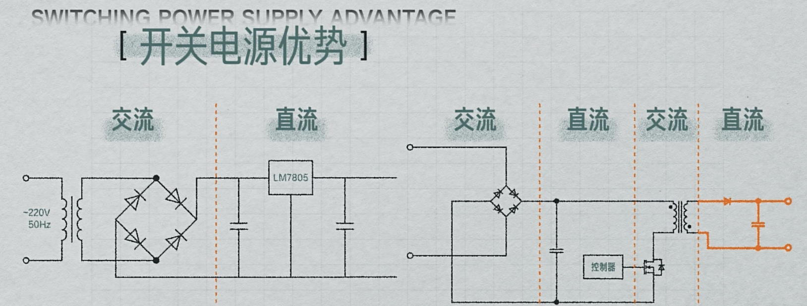
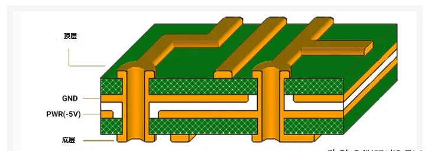

- [硬件文章合集](https://www.hw100k.com/yingshi)
- [在线查看PCB图纸](https://www.altium.com/viewer/cn/)
- [guide cover hardware and software](https://www.reddit.com/r/embedded/comments/1dwslcf/which_book_is_the_ultimate_guide_that_covers_the/)
	- The Firmware HandBook by Jack Gannsle
	- Practical Electronics for Inventors
	- Designing Embedded Hardware by Catsoulis
	- The Art of Digital Design by Winkel
	- Applied Embedded Electronics by Jerry Twomey
	- Electrical Engineeting for all Engineers by Roadstrum
	- Why Programs fail: a guide to systematic debugging
	- Making Embedded Systems by Elecia White
	- Programminfmg Embedded Systems with C and GNU tools
	- Code Craft: the practice of writing excellent code
	- Mastering Embedded Linux Programming by Frank Vasquez

# 电路原理
## 基本器件

### 电容

### MOS管

## 电源电路
### AC-DC
- [手机充电器](https://www.bilibili.com/video/BV1or4y1X7Ra)

### DC-DC
- [DC-DC](https://www.bilibili.com/video/BV1Jv411P7Qc)

# PCB工艺
-[PCB扫盲](https://www.youtube.com/watch?v=z7j8RCyxHeM)
- [PCB简介](https://www.eeworld.com.cn/circuit/view/54712)
大面积的铜板都是和电源的负极相连的。这就保证了所有的GND引脚都是共地哒。

## 电源PCB
- [PCB电源设计中的7个要点](https://www.eet-china.com/mp/a317276.html)

### 接地

# 硬件设计

# 硬件调试

## 硬件调试思路
- [几种常见硬件调试方法: debug思路](https://b23.tv/W2tvjTa)

### 0. 基本设计是否OK？

0.1. Check datasheet/reference design
	- 每个Pin的要求
	- 每个外围器件的要求

0.2. Check power/clock detail
	- Power voltage/Ripple/current
	- Clock frequence/Voltage/Jitter
	- 上电过程观测电源瞬态波形

### 1.  问题稳定复现

1.1 缩小问题范围，减少问题复现的时间，使用脚本工具加快复现概率。

1.2 简化配置：比如拿掉插卡，切断其他设备，芯片功能简化（采用简单的固件，简化芯片功能），等等

1.3 差异变量法：
- 异常和正常板卡的变量是什么？
- 和正常工作的好板子的差异点在哪 ？---最好可以比对demo板是否存在同样的问题

1.4 交叉验证：
坏的芯片换到好的板卡，好的芯片换到坏的板卡

### 2.  对比测试
排除单板或者不兼容的情况

2.1 调试VGA的时候 可以换个显示屏试试

2.2 换电源模块/PSU

2.3 换板卡

2.4 换测试方法，换测试配置，比如网口自环换成和交换机连接

### 3. 是否是平台共性问题
最好可以比对demo板是否存在同样的问题。**查看芯片Errata 勘误表**。

### 4. 是否焊接问题
4.1 直看BOM是否贴错，可以新料重焊接？
4.2 是否焊接不良导致？
4.3 是否料的批次稳定性有差异，导致功能异常？----找芯片/连接器等供应商确认物料本身在其他供应商处是否有类似问题

### 5. 信号质量是否正常

# 硬件项目

## 神经监护仪
- [逆向一块FPGA核心板](https://blog.csdn.net/little_cats/article/details/131507911)

### 信号处理（接线盒）
- 12v供电
- 485通信

### （协议转换）（信号盒）
信号盒就是485转USB，没必要整，直接转接线读出来。
12V供电，然后485转USB，然后直接在安卓开发个app，把USB数据读出来显示。
#### 485串口通信
- [485通讯读取温度传感器数据](https://blog.csdn.net/qq_43868701/article/details/130720378)
- [串口逆向](https://bbs.elecfans.com/jishu_2382693_1_1.html)
- [UART了解](https://dreamsourcelab.cn/logic-analyzer/uart/)
有个问题就是，串口通信也有可能有协议，也就是一个简单的问答机制（你要发一个怎样的数据，哪几位代表什么，才能有对应的应答）
以光纤压力传感器通信协议为例（见《嵌入式硬件.asset》中文件），向下位机(mcu)发送指定的指令才可以接收到它信息。
甚至，有可能它是基于485的UART协议，见上述链接了解。
