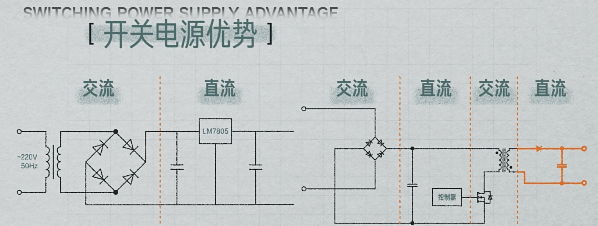
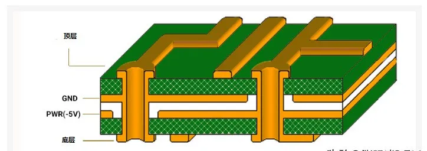

## Ref

### Books
- 《THE ART OF ELECTRONICS》
- 《Electromagnetic Compatibility Engineering》
- 《High-Speed Digital Design》

- [电气工程师十大必读参考书](https://www.keysight.com/used/tw/zh/knowledge/guides/best-electrical-engineering-books)
```text
1. The Art of Electronics《电子学艺术》 – Paul Horowitz and Winfield Hill
2. Electrical Engineering 101《电气工程101》 – Darren Ashby
3. Microwave Engineering《微波工程》 – David M. Pozar
4. Practical Electronics for Inventors《发明者的实用电子学》 – Paul Scherz
5. Fundamentals of Applied Electromagnetics《应用电磁学基础》 – Fawwaz Ulaby and Umberto Ravaioli
6. Solid State Electronic Devices《固态电子器件》 – Ben Streetman and Sanjay Kumar Banerjee
7. Modern Control Systems《现代控制系统》  – Richard Dorf and Robert Bishop
8. Engineering Circuit Analysis《工程电路分析》 – William Hayt, Jack Kemmerly, Jamie Phillips and Steven Durbin
9. Instrumentation and Measurement in Electrical Engineering《电气工程中的仪器与测量》 – Roman Malaric
10. Antenna Theory: Analysis and Design《天线理论：分析与设计》– Constantine A. Balanis
```

- [guide cover hardware and software](https://www.reddit.com/r/embedded/comments/1dwslcf/which_book_is_the_ultimate_guide_that_covers_the/)
	- The Firmware HandBook by Jack Gannsle
	- Practical Electronics for Inventors
	- Designing Embedded Hardware by Catsoulis
	- The Art of Digital Design by Winkel
	- Applied Embedded Electronics by Jerry Twomey
	- Electrical Engineeting for all Engineers by Roadstrum
	- Why Programs fail: a guide to systematic debugging
	- Making Embedded Systems by Elecia White
	- Programminfmg Embedded Systems with C and GNU tools
	- Code Craft: the practice of writing excellent code
	- Mastering Embedded Linux Programming by Frank Vasquez
### youtuber
- [eevblog ](https://www.youtube.com/eevblog)
- [RobertFeranec](https://www.youtube.com/c/RobertFeranec)
- [AltiumAcademy](https://www.youtube.com/@AltiumAcademy)

### Blogs
- [reddit embedded wiki](https://www.reddit.com/r/embedded/wiki/index/)
- [硬件文章合集](https://www.hw100k.com/yingshi)
- [在线查看PCB图纸](https://www.altium.com/viewer/cn/)

### reddit books list
#### **Basic Electronics**

- [_"Grob's Basic Electronics"_](https://www.amazon.com/dp/1260571440/) 13ed by Schultz in 2020 with 1277 pages. ([borrow*](https://archive.org/details/grobsbasicelectr0000schu/)) :: an "Experiments Manual" and "Problems Manual" is also available
- [_"Practical Electronics Handbook"_](https://www.amazon.com/dp/0750680717/) 6ed by Sinclair and Dunton in 2007 with 570 pages. ([6ed](https://archive.org/details/fe_Practical_Electronics_Handbook_6_Edition/))
- [_"Getting Started in Electronics"_](https://www.amazon.com/dp/0945053282/) 1ed by Mims in 1983 with 128 pages. ([out of print](https://web.archive.org/web/20220322184420/https://worldradiohistory.com/Archive-Company-Publications/Radio-Shack/Engineer's%20Mini-Notebook%20-%20Getting%20Started%20in%20Electronics.pdf))
- See _"ARRL Handbook"_ (amateur radio) in "Radio Communication" section for chapter about electronics basics.
- **Series**: _"Engineer's Mini-Notebook"_ by [Mims](https://en.wikipedia.org/wiki/Forrest_Mims) and Radio Shack in 1980s to 1990s. ([archive#1](https://archive.org/search.php?query=title%3A%28Forrest%20Mims%29)) ([archive#2](https://web.archive.org/web/20220322184420/https://worldradiohistory.com/Archive-Company-Publications/Radio-Shack/Radio_Shack_Mini_Notebook.htm)) ([archive#3](https://github.com/alaricmoore/MiniEngineeringNotebooks/tree/main))
- **Book Lists**: [Capacitor](https://en.wikipedia.org/wiki/Capacitor#Further_reading), [Diode](https://en.wikipedia.org/wiki/Diode#Further_reading), [Inductor](https://en.wikipedia.org/wiki/Inductor#Further_reading), [Transistor](https://en.wikipedia.org/wiki/Transistor#Further_reading).
- **Wikipedia**: [Ohms's Law](https://en.wikipedia.org/wiki/Ohm%27s_law) (printable [chart](https://en.wikipedia.org/wiki/File:Ohms_law_wheel_WVOA.svg)), [Resistor Color Code](https://en.wikipedia.org/wiki/Electronic_color_code#Color_band_system) (printable [chart](https://en.wikipedia.org/wiki/File:Resistor_Color_Code.svg)), [E-series of Preferred Values](https://en.wikipedia.org/wiki/E_series_of_preferred_numbers) for Resistors and Capacitors (printable [tables](https://en.wikipedia.org/wiki/E_series_of_preferred_numbers#External_links)).
#### **Electronics Reference**
- NOTE: AoE is **not** recommended for newbies until sometime after they learn basic electricity & basic electronics.
- [_"Art of Electronics"_](https://www.amazon.com/dp/0521809266/) 3ed by Horowitz and Hill in 2015 with 1220 pages. ([free chapter 9](http://artofelectronics.net/wp-content/uploads/2016/02/AoE3_chapter9.pdf))
- [_"Learning the Art of Electronics: A Hands-On Lab Course"_](https://www.amazon.com/dp/0521177235/) 1ed by Hayes and Horowitz in 2016 with 1150 pages. ([preview](https://www.book2look.com/vbook.aspx?id=9780521177238))
- [_"Art of Electronics: X Chapters"_](https://www.amazon.com/dp/1108499945/) 1ed by Horowitz and Hill in 2020 with 522 pages. ([free sections](https://x.artofelectronics.net/the-book/sample-chapter/))
- **Wikipedia**: [Art of Electronics](https://en.wikipedia.org/wiki/The_Art_of_Electronics).

#### **Circuit Analysis**
- [_"Electrical Circuit Theory and Technology"_](https://www.amazon.com/dp/0367672243/) 7ed by Bird in 2021 with 912 pages. ([borrow*](https://archive.org/details/electricalcircui0000bird_g0f4/))
- [_"Introductory Circuit Analysis"_](https://www.amazon.com/dp/1292098953/) 13ed by Boylestad in 2016 with 1219 pages. ([borrow*](https://archive.org/details/introductorycirc0000boyl/))
- _"Circuit Analysis and Design"_ 1ed by Ulaby, Maharbiz, Furse in 2018 with 798 pages. ([free](https://services.publishing.umich.edu/publications/ee/))
- **Series**: _"Lessons In Electric Circuits"_ by Kuphaldt in 2006 to 2010 with over 2700 pages. ([free](http://www.ibiblio.org/kuphaldt/electricCircuits/index.htm))
- **Series**: _"Electricity and Electronics Training Course"_ (historical) by U.S. Navy in 1960s with over 6000 pages. ([free](https://archive.org/details/navyelectronicselectricitytrainingseries))

#### **Analog Design**
- [_"Microelectronic Circuits"_](https://www.amazon.com/dp/0190853549/) 8ed by Sedra and Smith in 2020 with 1296 pages. ([borrow*](https://archive.org/details/microelectronicc0000sedr_f2t1/))
- [_"Electronic Devices and Circuit Theory"_](https://www.amazon.com/dp/1292025638/) 11ed by Boylestad and Nashelsky in 2013 with 923 pages. ([7ed](https://archive.org/details/ElectronicDevicesAndCircuitTheoryBOYLESTAD.R./)) ([borrow*](https://archive.org/details/electronicdevice0000boyl/))
- [_"Troubleshooting Analog Circuits"_](https://www.amazon.com/dp/0750694998/) 1ed by [Pease](https://en.wikipedia.org/wiki/Bob_Pease) (designed LM337 neg volt reg) in 1991 with 232 pages. ([borrow*](https://archive.org/details/troubleshootinga0000peas/)) ([subset](https://archive.org/details/Bob_Pease_Lab_Notes_Part_8/))
- [_"Analog Circuit Design - Art, Science, and Personalities"_](https://www.amazon.com/dp/0750691662/) (EDN) 1ed by various authors in 1991 with 389 pages. ([archive](https://archive.org/details/bitsavers_linearTechlliamsAnalogCircuitDesignArtScienceandPe_40890946/)) 
- [_"Designing Analog Chips"_](https://www.amazon.com/dp/1589397185/) 1ed by [Camenzind](https://en.wikipedia.org/wiki/Hans_Camenzind) (designed NE555 timer) in 2005 with 244 pages. ([free](http://www.designinganalogchips.com/_count/designinganalogchips.pdf))
- [_"Active Filter Cookbook"_](https://www.amazon.com/dp/075062986X/) 2ed by [Lancaster](https://en.wikipedia.org/wiki/Don_Lancaster) in 1995 with 240 pages. ([free](https://www.tinaja.com/ebooks/afcb.pdf))
- _"Practical Electronic Filters"_ 1ed by Bishop in 1991 with 188 pages. ([out of print](https://web.archive.org/web/20230131113358/https://worldradiohistory.com/UK/Bernards-And-Babani/Babani/299-Bishop-Practical%20electronic%20filters.pdf))
- [_"Small Signal Audio Design"_](https://www.amazon.com/dp/0367468956/) 3ed by Self in 2020 with 784 pages.
- [_"Low Level Measurements Handbook: Precision Measurements"_](https://www.amazon.com/dp/B000V4PKXW/) 7ed by Keithley in 2016 with 244 pages. ([free](https://download.tek.com/document/LowLevelHandbook_7Ed.pdf))
- _"Handbook of Preferred Circuits for Military Electronic Equipment"_ (historical) by National Bureau of Standards for U.S. Navy in 1955 to 1960 with 418 pages. ([free](https://archive.org/details/HandbookPreferredCircuitsNavyAeronauticalElectronicEquipment/))
- See _"ARRL Handbook"_ (amateur radio) in "Radio Communication" section for chapter about analog basics.
- **Book Lists**: [555 Timer](https://en.wikipedia.org/wiki/555_timer_IC#Further_reading), [OpAmp](https://en.wikipedia.org/wiki/Operational_amplifier#Further_reading), [LM-series Analog ICs](https://en.wikipedia.org/wiki/List_of_LM-series_integrated_circuits#Further_reading).
- **Wikipedia**: [555 Timer](https://en.wikipedia.org/wiki/555_timer_IC), [Comparator](https://en.wikipedia.org/wiki/Comparator), [Operational Amplifier](https://en.wikipedia.org/wiki/Operational_amplifier), [Differential Amplifier](https://en.wikipedia.org/wiki/Differential_amplifier), [SPICE](https://en.wikipedia.org/wiki/SPICE), [List of LM-series Linear ICs](https://en.wikipedia.org/wiki/List_of_LM-series_integrated_circuits).

#### **Power Supply Design**
- NOTE: This is a new section that I split out from the above "Analog Design" section. I need to expand this section. Check back at a future date.
- [_"Building Power Supplies - Useful Designs for Hobbyists"_](https://www.amazon.com/dp/4029312888/) 2ed by Lines and Radio Shack in 1997 with 124 pages. ([1ed](https://archive.org/details/building-power-supplies/))
- _"Linear & Switching Voltage Regulator Handbook"_ Rev4 by ON Semiconductor in 2002 with 116 pages. ([free](https://web.archive.org/web/20130803072233/http://www.onsemi.com/pub_link/Collateral/HB206-D.PDF))
- _"Voltage Regulation and Power Conversion"_ chapter 9 of _"Art of Electronics"_ 3ed book (see Reference section). ([free](http://artofelectronics.net/wp-content/uploads/2016/02/AoE3_chapter9.pdf))
- **Wikipedia**: [Voltage Regulator](https://en.wikipedia.org/wiki/Voltage_regulator), [Linear Regulator](https://en.wikipedia.org/wiki/Linear_regulator), [LDO Regulator](https://en.wikipedia.org/wiki/Low-dropout_regulator), [LM78xx](https://en.wikipedia.org/wiki/78xx), [LM317](https://en.wikipedia.org/wiki/LM317), [Switching Regulators](https://en.wikipedia.org/wiki/Switched-mode_power_supply), [Buck/Step-Down Regulator](https://en.wikipedia.org/wiki/Buck_converter).

#### **Digital Design**
- Note: newer editions of some books in this section have migrated towards hardware description languages (HDL) and FPGA design, thus some readers may find older editions more useful for discrete logic design and PLD design. If VHDL / Verilog / SystemVerilog is not in the title, then it is appended in parentheses to make it more obvious which HDL is used by each book.

**Fundamentals:**
- _"Logic Gate Building Blocks"_ by Byers in May-June 2002 Nuts & Volts magazine. (free [1of2](https://www.nutsvolts.com/magazine/article/small-logic-gates-spawn-big-dreams-part-1), [2of2](https://www.nutsvolts.com/magazine/article/small-logic-gates-spawn-big-dreams-part-2))
- _"Understanding Digital Logic ICs"_ by Marston in July-Oct 2006 Nuts & Volts magazine. (free [1of4](https://www.nutsvolts.com/magazine/article/understanding_digital_logic_ics_part_1), [2of4](https://www.nutsvolts.com/magazine/article/understanding_digital_logic_ics_part_2), [3of4](https://www.nutsvolts.com/magazine/article/understanding_digital_logic_ics_part_3), [4of4](https://www.nutsvolts.com/magazine/article/understanding_digital_logic_ics_part_4))
- _"Understanding Digital Logic IC Circuits"_ by Marston in Apr-Aug 2007 Nuts & Volts magazine. (free [1of5](https://www.nutsvolts.com/magazine/article/understanding_digital_buffer_gate_and_ic_circuits_part_1), [2of5](https://www.nutsvolts.com/magazine/article/understanding_digital_buffer_gate_and_logic_ic_circuits_part_2), [3of5](https://www.nutsvolts.com/magazine/article/understanding_digital_buffer_gate_and_logic_ic_circuits_part_3), [4of5](https://www.nutsvolts.com/magazine/article/understanding_digital_buffer_gate_and_logic_ic_circuits_part_4), [5of5](https://www.nutsvolts.com/magazine/article/understanding_digital_buffer_gate_and_logic_ic_circuits_part_5))
- [_"Lessons in Electric Circuits: Vol 4 - Digital"_](https://www.amazon.com/dp/B005EWFTS2/) 4ed by Kuphaldt in 2006 with 508 pages. ([free](http://www.ibiblio.org/kuphaldt/electricCircuits/Digital/index.html))
- [_"Engineer's Mini-Notebook: Digital Logic Circuits"_](https://www.amazon.com/dp/B00072NRHY/) 1ed by [Mims](https://en.wikipedia.org/wiki/Forrest_Mims) and Radio Shack in 1986 with 48 pages. ([out of print](https://web.archive.org/web/20220328221928/https://worldradiohistory.com/Archive-Company-Publications/Radio-Shack/Engineer's%20Mini-Notebook%20-%20Digital%20Logic%20Circuits.pdf))
- [_"CMOS Cookbook"_](https://www.amazon.com/dp/0750699434/) 4ed by [Lancaster](https://en.wikipedia.org/wiki/Don_Lancaster) in 2019 with 512 pages. ([free](https://www.tinaja.com/ebooks/cmoscb.pdf)) :: 1ed was released in 1977.
- [_"TTL Cookbook"_](https://www.amazon.com/dp/0672210355/) 1ed by Lancaster in 1974 with 335 pages. ([free](https://www.tinaja.com/ebooks/TTLCB1.pdf))
- [_"Designing with TTL ICs"_](https://www.amazon.com/dp/B000QB5C2O/) 1ed by Morris and Miller of Texas Instruments in 1971 with 322 pages. ([free](https://archive.org/details/bitsavers_tiTexasInsSeriesMorrisDesigningWithTTLIntegratedCi_11927910/))
- Other books that contain digital design chapters: _"Art of Electronics"_, _"Digital Computer Electronics"_, older editions of _"ARRL Handbook"_ (amateur radio).
- **Book Lists**: [4000-series CMOS ICs](https://en.wikipedia.org/wiki/4000-series_integrated_circuits#Further_reading), [7400-series TTL ICs](https://en.wikipedia.org/wiki/7400-series_integrated_circuits#Further_reading).
- **Wikipedia**: [Logic Gate Symbols](https://en.wikipedia.org/wiki/Logic_gate#Symbols), [List of 4000-series CMOS ICs](https://en.wikipedia.org/wiki/List_of_4000-series_integrated_circuits), [List of 7400-series TTL ICs](https://en.wikipedia.org/wiki/List_of_7400-series_integrated_circuits), [Flip-Flops](https://en.wikipedia.org/wiki/Flip-flop_\(electronics%29), [PLD](https://en.wikipedia.org/wiki/Programmable_logic_device), [Karnaugh Map](https://en.wikipedia.org/wiki/Karnaugh_map), [Timing Diagram](https://en.wikipedia.org/wiki/Digital_timing_diagram).

**Videos:**
- Note: all of these videos have a north-american english speaker.
- Introduction to Digital Electronics: [47 videos](https://www.youtube.com/watch?v=k36PZtxP76E&list=PL455C7CE29B7DCC84&index=1) (the following videos are contained in these 47 videos)
- Overview of Full 4-Bit (0 to F) Synchronous Up/Down Counter (using JK Flip Flops): [1of1](https://www.youtube.com/watch?v=WBc4-rN5phs)
- How to design a Truncated 4-Bit (0/1/2/3/4/5/6/7/8/9) Synchronous Up Counter (using JK Flip Flops): [1of1](https://www.youtube.com/watch?v=NYBxIdyWUoI)
- How to design a Truncated 3-Bit Arbitrary/Random-Sequence (7/3/1/2/5/4/6) Synchronous Counter (using JK Flip Flops): [1of3](https://www.youtube.com/watch?v=Zce6NlHuvfs), [2of3](https://www.youtube.com/watch?v=vx4PNd_Hl8U), [2of3](https://www.youtube.com/watch?v=ruxiO77HL9k).
- How to design a Truncated 3-Bit (1/2/3/4/5) Synchronous Up/Down Counter (using D Flip Flops): [1of1](https://www.youtube.com/watch?v=kdF-U8xROKI)

**College Textbooks:**
- [_"Digital Fundamentals"_](https://www.amazon.com/dp/0132737965/) (VHDL) 11ed by Floyd in 2014 with 912 pages. ([10ed*](https://archive.org/details/digitalfundament0010floy/)) ([9ed](https://archive.org/details/floyd-digital-fundamentals-9e)) ([7ed*](https://archive.org/details/digitalfundament0000floy_l5q9/)) ([5ed*](https://archive.org/details/digitalfundament0000floy_e6p6/)) ([3ed*](https://archive.org/details/digitalfundament0000floy_m1t8/))
- [_"Digital Design: Principles and Practices"_](https://www.amazon.com/dp/013446009X/) (Verilog) 5ed by Wakerly in 2018 with 912 pages. ([2ed*](https://archive.org/details/digitaldesignpri0000wake/)) ([1ed*](https://archive.org/details/digitaldesignpri00wake/))
- [_"Digital Design"_](https://www.amazon.com/dp/0134549899/) (VHDL, Verilog, SystemVerilog) 6ed by Mano and Ciletti in 2017 with 720 pages. ([2ed*](https://archive.org/details/digitaldesign00mano/))
- [_"Intro to Logic Circuits & Logic Design"_](https://www.amazon.com/dp/3031439457/) (Verilog) 3ed by LaMeres in 2024 with 527 pages.
- [_"Intro to Logic Circuits & Logic Design"_](https://www.amazon.com/dp/3031425464/) (VHDL) 3ed by LaMeres in 2024 with 539 pages.
- [_"Digital Design and Computer Architecture"_](https://www.amazon.com/dp/0128000562/) (VHDL, SystemVerilog) (ARM) 1ed by Harris and Harris in 2015 with 559 pages.
- [_"Digital Design and Computer Architecture"_](https://www.amazon.com/dp/0128200642/) (VHDL, SystemVerilog) (RISC-V) 1ed by Harris and Harris in 2022 with 564 pages.
- [_"Digital Electronics: Principles, Devices, Applications"_](https://www.amazon.com/dp/0470032146/) 1ed by Maini in 2007 with 752 pages. ([1ed](https://archive.org/details/DigitalElectronicsPrinciplesDevicesAndApplications/))
- [_"Digital Principles and Logic Design"_](https://www.amazon.com/dp/1934015032/) 1ed by Saha and Manna in 2007 with 492 pages.

**Hardware Design Languages (HDL) for FPGA Design:**
- _"FPGA for Dummies"_ 2ed by Moore & Wilson of Intel-Altera in 2017 with 44 pages. ([free](https://web.archive.org/web/20220815071753/https://www.intel.com/content/dam/support/us/en/programmable/support-resources/bulk-container/pdfs/literature/misc/fpgas-for-dummies-ebook.pdf))
- _"Introduction to Verilog"_ by Nyasulu & Knight of Carleton University in 2003 with 32 pages. ([free](https://web.archive.org/web/20220906034425/http://www.doe.carleton.ca/%7Egallan/478/pdfs/PeterVrlR.pdf))
- [_"Circuit Design with VHDL"_](https://www.amazon.com/dp/0262042649/) 3ed by Pedroni in 2020 with 608 pages. ([borrow*](https://archive.org/details/circuitdesignsim0000pedr/))
- [_"Effective Coding with VHDL: Principles and Best Practice"_](https://www.amazon.com/dp/0262034220/) 1ed by Jasinski in 2016 with 624 pages. 
- [_"Free Range VHDL"_](https://www.amazon.com/dp/B015MT2IBM/) 1ed by Mealy and Tappero in 2019 with 235 pages. ([free](https://web.archive.org/web/20210302185251/https://www.isy.liu.se/edu/kurs/TSEA83/kursmaterial/vhdl/free_range_vhdl_2019.pdf))
- _"Digital McLogic Design"_ (VHDL) v2.00 by Mealy and Mealy in 2012 with 851 pages. ([free](https://web.archive.org/web/20220407094524/http://freerangefactory.org/pdf/digital_mclogic_design.pdf)) 
- [_"FPGA Prototyping by SystemVerilog Examples"_](https://www.amazon.com/dp/1119282667/) (Xilinx Artix7) 2ed by Chu in 2018 with 656 pages.
- [_"FPGA Prototyping by Verilog Examples"_](https://www.amazon.com/dp/0470185325/) (Xilinx Spartan3) 1ed by Chu in 2008 with 488 pages.
- [_"FPGA Prototyping by VHDL Examples"_](https://www.amazon.com/dp/1119282748/) (Xilinx Artix7) 2ed by Chu in 2017 with 595 pages. ([1ed Spartan3](https://archive.org/details/ebooksclub.org__FPGA_Prototyping_by_VHDL_Examples__Xilinx_Spartan_3_Version/))
- [_"Verilog by Example"_](https://www.amazon.com/dp/0983497303/) 1ed by Readler in 2011 with 114 pages.
- [_"VHDL by Example"_](https://www.amazon.com/dp/0983497354/) 1ed by Readler in 2014 with 120 pages.
- _"High-Speed Serial I/O Made Simple"_ (Verilog) v1.0 by Athavale & Christensen of Xilinx in 2005 with 196 pages. ([free](https://web.archive.org/web/20220107115429/https://www.xilinx.com/publications/archives/books/serialio.pdf))
- [_"Zynq Book - Embedded Processing with the ARM Cortex-A9 on the Xilinx Zynq-7000"_](https://www.amazon.com/dp/099297870X/) 1ed by Crockett, Elliot, Enderwitz, Stewart in 2014 with 484 pages. ([free](http://www.zynqbook.com/download-book.php))
- **Book Lists**: [VHDL](https://en.wikipedia.org/wiki/VHDL#Further_reading), [Verilog](https://en.wikipedia.org/wiki/Verilog#References), [SystemVerilog](https://en.wikipedia.org/wiki/SystemVerilog#References).
- **Wikipedia**: [HDL](https://en.wikipedia.org/wiki/Hardware_description_language), [FPGA](https://en.wikipedia.org/wiki/Field-programmable_gate_array), [Logic Block](https://en.wikipedia.org/wiki/Logic_block), [Logic Synthesis](https://en.wikipedia.org/wiki/Logic_synthesis), [High-Level Synthesis](https://en.wikipedia.org/wiki/High-level_synthesis).

#### **Computer Design**
- NOTE: I need to expand this section. Check back at a future date.
- [_"Digital Logic and Microprocessor Design with Interfacing"_](https://www.amazon.com/dp/B01N9IIF0K/) (VHDL, Verilog) 2ed by Hwang in 2018 with 583 pages.
- [_"Digital Computer Electronics"_](https://www.amazon.com/dp/0074622358/) 3ed by Malvino and Brown in 1993 with 522 pages. ([out of print](https://archive.org/details/digital-computer-electronics-albert-paul-malvino-and-jerald-a-brown/))
- _"Computer Organization and Design"_ by Patterson and Hennessy. [1ed ARM](https://www.amazon.com/dp/0128017333/) in 2016, [2ed RISC-V](https://www.amazon.com/dp/0128203315/) in 2020, [6ed MIPS](https://www.amazon.com/dp/0128201096/) in 2020. ([5ed MIPS*](https://archive.org/details/computerorganiza0000patt_d1r6/)) ([1ed MIPS](https://archive.org/details/hennessy-patterson/))
- **Book Lists**: [6502](https://en.wikipedia.org/wiki/MOS_Technology_6502#Further_reading), [6800](https://en.wikipedia.org/wiki/Motorola_6800#Further_reading), [6809](https://en.wikipedia.org/wiki/Motorola_6809#Further_reading), [8080](https://en.wikipedia.org/wiki/Intel_8080#Further_reading), [8085](https://en.wikipedia.org/wiki/Intel_8085#Further_reading), [Z80](https://en.wikipedia.org/wiki/Zilog_Z80#Further_reading), [68000](https://en.wikipedia.org/wiki/Motorola_68000#Further_reading), [x86](https://en.wikipedia.org/wiki/X86_assembly_language#Further_reading), [MIPS](https://en.wikipedia.org/wiki/MIPS_architecture#Further_reading), [RISC-V](https://en.wikipedia.org/wiki/RISC-V#Further_reading). (Microprocessors)

#### **Computer Science**

- NOTE: I need to expand this section. Check back at a future date.
- There are numerous algorithm books. Some target specific computer languages, while others use generic concepts.
- [_"Hacker's Delight"_](https://www.amazon.com/dp/0321842685/) 2ed by Warren in 2012 with 512 pages. ([borrow*](https://archive.org/details/hackersdelight0000warr/))
- [_"Linkers & Loaders"_](https://www.amazon.com/dp/1558604960/) 1ed by Levine in 2000 with 272 pages.
- [_"TCP/IP Illustrated, Vol 1: Protocols"_](https://www.amazon.com/dp/0321336313/) 2ed by Wright and Stevens in 2011 with 1056 pages. ([borrow*](https://archive.org/details/tcpipillustrated00stev/))
- **Book Lists**: [Assembler](https://en.wikipedia.org/wiki/Assembly_language#Further_reading), [C](https://en.wikipedia.org/wiki/C_%28programming_language%29#Further_reading), [C++](https://en.wikipedia.org/wiki/C%2B%2B#Further_reading), [C#](https://en.wikipedia.org/wiki/C_Sharp_%28programming_language%29#Further_reading), [Go](https://en.wikipedia.org/wiki/Go_%28programming_language%29#Further_reading), [Java](https://en.wikipedia.org/wiki/Java_%28programming_language%29#Works_cited), [Javascript](https://en.wikipedia.org/wiki/JavaScript#Further_reading), [Python](https://en.wikipedia.org/wiki/Python_%28programming_language%29#Further_reading). (Progamming Languages)

#### **Communication Busses**
- [_"USB Complete"_](https://www.amazon.com/dp/1931448280/) 5ed by Axelson in 2015 with 524 pages. ([borrow*](https://archive.org/details/usbcompletedevel0004edaxel/))
- [_"Serial Port Complete"_](https://www.amazon.com/dp/193144806X/) 2ed by Axelson in 2007 with 380 pages. ([borrow*](https://archive.org/details/serialportcomple0000axel/)) - includes RS232 & RS485 too
- [_"Parallel Port Complete"_](https://www.amazon.com/dp/0965081915/) 1ed by Axelson in 1996 with 343 pages. ([1ed](https://archive.org/details/f15_Parallel_Port_Complete/)) - obsolete IEEE1284 printer bus on older home computers
- [_"Mastering the I2C Bus"_](https://www.amazon.com/dp/090570598X/) 1ed by Himpe in 2011 with 247 pages.
- [_"Computer Busses"_](https://www.amazon.com/dp/0340740760/) 1ed by Buchanan in 2000 with 632 pages. ([borrow*](https://archive.org/details/computerbussesde0000buch/))
- **Specification**: [I2C](https://web.archive.org/web/20210813122132/https://www.nxp.com/docs/en/user-guide/UM10204.pdf), [I3C](https://resources.mipi.org/mipi-i3c-basic-download?hsLang=en), automotive buses ([CAN](https://web.archive.org/web/20100922201217/http://www.semiconductors.bosch.de/pdf/can2spec.pdf), [CAN-FD](https://web.archive.org/web/20151211125301/http://www.bosch-semiconductors.de/media/ubk_semiconductors/pdf_1/canliteratur/can_fd_spec.pdf), CAN-XL, FlexRay, [LIN](https://web.archive.org/web/20220820021032/https://www.cs-group.de/file/de-lin-specification-package-revision-2-2a/?wpdmdl=15446&refresh=630041b0a53df1660961200&ind=0&filename=LIN_Specification_Package_2.2A.pdf), MOST, [SENT](https://www.sae.org/standards/content/j2716_201604/))
- **Wikipedia**: [I2C](https://en.wikipedia.org/wiki/I%C2%B2C), [I3C](https://en.wikipedia.org/wiki/I3C_\(bus%29), automotive buses ([CAN](https://en.wikipedia.org/wiki/CAN_bus), [CAN-FD](https://en.wikipedia.org/wiki/CAN_FD), CAN-XL, [FlexRay](https://en.wikipedia.org/wiki/FlexRay), [LIN](https://en.wikipedia.org/wiki/Local_Interconnect_Network), [MOST](https://en.wikipedia.org/wiki/MOST_Bus), [SENT](https://en.wikipedia.org/wiki/SENT_\(protocol%29)),
- **Wikipedia**: [UART](https://en.wikipedia.org/wiki/Universal_asynchronous_receiver-transmitter), [SPI](https://en.wikipedia.org/wiki/Serial_Peripheral_Interface), [1-Wire](https://en.wikipedia.org/wiki/1-Wire), [USB](https://en.wikipedia.org/wiki/USB), [RS232](https://en.wikipedia.org/wiki/RS-232), [RS485](https://en.wikipedia.org/wiki/RS-485), [MIDI](https://en.wikipedia.org/wiki/MIDI), [I2S](https://en.wikipedia.org/wiki/I%C2%B2S), [IEEE-1284 (parallel port)](https://en.wikipedia.org/wiki/IEEE_1284), [IEEE-488 (GPIB)](https://en.wikipedia.org/wiki/IEEE-488).

#### **Embedded Systems**
- [_"Making Embedded Systems"_](https://www.amazon.com//dp/1098151542/) 1ed by White in 2024 with 340 pages. ([1ed](https://archive.org/details/manualzilla-id-5912396/))
- [_"Art of Designing Embedded Systems"_](https://www.amazon.com/dp/0750686448/) 2ed by Ganssle in 2008 with 312 pages.
- [_"Embedded Systems Architecture"_](https://www.amazon.com/dp/1803239549/) 2ed by Lacamera in 2023 with 342 pages.
- [_"Test-Driven Development for Embedded C"_](https://www.amazon.com/dp/193435662X/) 1ed by Grenning in 2011 with 356 pages.
- [_"Real-Time C++"_](https://www.amazon.com/dp/366262995X/) 4ed by Kormanyos in 2021 with 551 pages. (Arduino, AVR ATmega328P)
- [_"Digital Signal Processing: Practical Guide for Engineers and Scientists"_](https://www.amazon.com/dp/075067444X/) 1ed by Smith in 2002 with 650 pages. ([free](http://www.dspguide.com/pdfbook.htm))
- [_"Embedded Systems Engineering Roadmap"_](https://github.com/m3y54m/Embedded-Engineering-Roadmap)
- **Book Lists**: Processors: [68HC11](https://en.wikipedia.org/wiki/Motorola_68HC11#Further_reading), [8051](https://en.wikipedia.org/wiki/Intel_MCS-51#Further_reading), [ARM](https://en.wikipedia.org/wiki/ARM_Cortex-M#Further_reading), [AVR](https://en.wikipedia.org/wiki/AVR_microcontrollers#Further_reading), [DSP](https://en.wikipedia.org/wiki/Digital_signal_processing#Further_reading), [PIC](https://en.wikipedia.org/wiki/PIC_microcontrollers#Further_reading), [RISC-V](https://en.wikipedia.org/wiki/RISC-V#Further_reading). O/S: [Embedded Linux](https://bootlin.com/docs/).
- **Wikipedia**: [RTOS](https://en.wikipedia.org/wiki/Real-time_operating_system), [Interrupt](https://en.wikipedia.org/wiki/Interrupt), [Interrupt Handler](https://en.wikipedia.org/wiki/Interrupt_handler).


# 电路原理

- 《The Art of Electronics》

## 基本器件

### 电容


#### 寄生电容

而寄生电容更多在这些场景特别突出：
- 高频信号完整性
- 串扰
- EMI/EMC
- 射频电路
- 高阻节点

why？

#### 电源去耦(decoupling)电容

- [芯片输入为啥要接0.1uf的电容?](https://b23.tv/UxBU6Z9)

##### 寄生电感

实际导线 / PCB 走线都同时具有寄生电阻（parasitic resistance）、寄生电感（parasitic inductance）和寄生电容（parasitic capacitance），只是不同场景下谁更显著不同。在“电源去耦”这个话题里：
- 寄生电阻 R 导致压降
- 寄生电感 L 导致瞬态供电困难和尖峰

but why？


##### 去耦电容的作用：

1. 给运放提供瞬时电流
运放内部电流会快速变化，走远处电源线来不及，这个电容起到滤波作用。

2. 降低电源线上高频噪声
把电源上的高频干扰旁路到地，避免串进运放。

3. 提高稳定性，降低振荡风险
电源线和走线都有寄生电感，没这个电容时，运放可能更容易抖动或自激。

如果某个节点允许变“慢”，并且你希望它对高频扰动更不敏感，常会并一个电容做滤波或储能。

##### 为什么接地不用加电容

地不用这样处理，而是地的稳定通常靠：
- 完整地平面（ground plane）
- 短而宽的回流路径
- 良好的布局布线

而不是“再给地脚单独并一个电容到地”。去耦电容主要是跨在有电压差、且需要抑制高频阻抗的两个节点之间。对地脚本身再接一个到地的电容，没有意义。

### MOS管（MOSFET）

MOSFET 是一种电压控制型场效应器件，常用于电子开关、功率变换和负载驱动。在功率应用中，导通电阻 $R_{DS(on)}$ 是影响损耗、温升和效率的重要参数。

#### MOSFET 对低导通电阻的要求

1. **MOSFET 常用于大电流、大功率开关场景**
2. **在此类场景中，导通损耗、开关损耗和散热能力均十分关键**
3. **因此，较低的导通电阻有助于降低损耗并减轻热设计压力**

---

#### 术语说明：限流电阻的作用

更准确的表述不是“用限流电阻降功耗”，而是“用限流电阻控流”。

限流电阻可能使系统总功耗下降，但其实现方式是：

- 在电阻上消耗部分功率
- 以效率换取简单性和可控性

因此，限流电阻并不是高效的降功耗手段，而是简单直接的控流手段。

---

#### 大功率场景中限流电阻的局限

当电流增大时，电阻损耗按下式增加：

$$
P = I^2 R
$$

例如：

- 10mA 过 300Ω，功耗是 30mW
- 1A 过 3Ω，功耗就是 3W
- 10A 过 0.1Ω，功耗也是 10W

在大电流条件下，即使串联电阻较小，也可能带来明显发热和压降。

因此，大功率设计通常追求：

- **开关器件尽量像理想开关**
- **不在串联路径上白白掉压**
- **尽量把功率交给负载，而不是交给电阻和开关本身发热**

常见实现方式包括：

- PWM 控制
- 开关电源
- 恒流驱动
- 闭环控制
- 低 R_{DS(on)} MOSFET
- 同步整流

而不是依赖串联电阻长期消耗多余能量。

---

#### 低导通电阻的工程意义

##### 小电流场景

电阻方案虽然效率较低，但损耗通常仍可接受，因此常用于简单、低成本设计。

##### 大电流场景

即使很小的串联电阻，也会造成明显压降和发热，因此低 $R_{DS(on)}$ 具有重要意义。

典型现象包括：

- LED 指示灯串电阻很常见
- CPU VRM、电机驱动、电池管理、大功率 LED 驱动不会靠串电阻长期降功率

---

#### 大功率设计中电阻的辅助作用

在大功率设计中，电阻并非完全不用，但通常不再承担持续耗能控流的主要功能，而更多用于以下目的：

- **采样电阻（current sense resistor）**    阻值很小，只为了测流，不是为了烧功率控流
- **预充电电阻（pre-charge resistor）**    给大电容上电时限制浪涌，只在启动阶段起作用
- **栅极电阻（gate resistor）**    控制开关速度、抑制振铃、改善 EMI
- **均流/平衡电阻**    某些并联或特殊拓扑里会用

因此，大功率硬件并非排斥电阻，而是通常不将电阻作为长期主功率调节手段，除非本身就是线性耗能方案。

---

#### 小结

**小电流时，限流电阻的损耗常常小到值得接受，所以广泛使用。**

**大电流时，任何串联电阻都会变成明显损耗，所以要尽量让 MOSFET 的导通电阻很低，并改用开关式方法控制功率。**

---

#### 工程判断框架

##### 低成本、低复杂度场景

可采用电阻方案，并接受一定损耗。

##### 大电流、高效率、低发热场景

宜采用低 $R_{DS(on)}$ MOSFET，并结合开关控制或闭环驱动，避免持续依赖电阻耗能。

---

进一步分析时，可区分以下三类电阻：

- **功能性电阻**
- **测量性电阻**
- **寄生性电阻**

区分这三类后，许多“某处电阻可大、某处电阻必须小”的问题会更清晰。


### 地

大地（Earth）、浮地（Floating Ground）与虚地（Virtual Ground）

在电子与电气系统中，“地”并不是单一概念。工程实践里常见的相关术语至少包括 **大地（Earth）**、**浮地（Floating Ground）** 和 **虚地（Virtual Ground）**。这三者在功能、物理意义和应用场景上均有明显区别。混淆这些概念，常常会导致原理理解错误、测量异常，甚至引发安全问题。

本文对这三类“地”作简要说明。

#### 1. 大地（Earth）

**大地**通常指与地球本身相连接的参考点，英文常写作 **Earth**。在电力系统和设备安全设计中，它往往对应保护接地（Protective Earth, PE）。
##### 主要特点
- 与真实地球相连
- 主要用于安全、防触电和泄放故障电流
- 在建筑供电系统、配电设备和工业设备中广泛存在
- 不一定等同于电子电路中的信号参考地

##### 典型作用
当设备外壳因绝缘损坏而带电时，保护接地可以为故障电流提供低阻抗通路，使断路器或漏电保护装置动作，从而降低触电风险。

##### 注意事项
在电子系统中，“接地”并不总是指接大地。很多便携式设备、隔离供电设备虽然没有连接 Earth，但仍然具有自己的电路参考地。

---

#### 2. 浮地（Floating Ground）
**浮地**是指某个电路系统的参考地节点**没有与大地或其他外部参考点建立固定电位连接**。英文为 **Floating Ground**。

##### 主要特点
- 是系统内部真实存在的参考地
- 通常是电源负端或本地 0V 节点
- 相对于外部大地，其电位可能是不确定的
- 相对于系统内部其他节点，它仍然是有效的电压参考点

##### 典型例子
电池供电的手机、笔记本电脑、便携式仪器，通常都没有直接连接 Earth。它们内部仍然有一个公共参考节点，例如电池负极或系统 GND。这个地对整机来说是真实的“地”，但对外界来说是“浮”的，因此称为浮地。

##### 工程意义
浮地系统具有以下特点：
- 可以减少某些地回路问题
- 在隔离系统中常见
- 测量时容易因仪器接地方式而引入额外通路
- 与外部系统连接时，需要关注共模电压和绝缘边界

##### 常见误区
浮地并不是“没有地”，也不是“虚构的地”。它只是**没有接到 Earth**，但仍然是该系统内部的真实参考节点。

---

#### 3. 虚地（Virtual Ground）
**虚地**是指在已有真实参考地的基础上，**人为建立的一个局部参考点**，使某部分电路可以把它当作“零电位”使用。英文为 **Virtual Ground**。

##### 主要特点
- 不是真正的系统主地
- 是人为生成的中间参考点
- 常用于单电源模拟电路
- 一般通过分压、基准源、运放缓冲或专用 rail splitter 电路产生

##### 典型例子
在单电源 5V 模拟系统中，若需要让交流小信号围绕中点摆动，常会构造一个 2.5V 节点。对局部模拟电路来说，这个 2.5V 可以被当作“地”使用。此时：

- 系统真实地仍然是 0V
- 2.5V 只是局部参考点
- 这个 2.5V 就是虚地

##### 应用场景
- 单电源运放偏置
- ADC 输入信号平移
- 音频前端和有源滤波器
- 需要“等效双电源”效果的模拟电路

##### 设计注意事项
虚地通常不能像真实地那样随意承载大电流。若仅用电阻分压生成虚地，其输出阻抗较高，负载稍大就会发生偏移。因此工程中常使用运放缓冲或专用虚地芯片提高稳定性和驱动能力。

---

#### 4. 电路地 Ground / GND

**电路地 Ground / 0V / GND 通常指系统的主参考点**，它可以是：

- **接大地的地**，如果设备与 Earth 相连
- **浮地**，如果设备没有与 Earth 固定连接

**一般不把系统主 GND 叫虚地。**

#### 5. 结论

| 概念 | 英文 | 是否连接地球 | 是否是系统主参考点 | 典型用途 |
|---|---|---:|---:|---|
| 大地 | Earth | 是 | 不一定 | 安全接地、故障泄流 |
| 浮地 | Floating Ground | 否 | 是 | 便携设备、隔离系统、本地参考地 |
| 虚地 | Virtual Ground | 否 | 否 | 单电源模拟偏置、局部参考点 |
大地、浮地和虚地虽然都带有“地”字，但其工程含义完全不同。

- **大地（Earth）**强调的是与地球相连，主要服务于安全与故障保护。
- **浮地（Floating Ground）**强调的是系统参考地未与外界固定绑定，但对系统内部仍是真实有效的主参考点。
- **虚地（Virtual Ground）**强调的是为了局部电路工作方便而人为生成的参考点，它不是系统的真实主地。

在阅读原理图、进行测量或设计模拟电路时，准确区分这三者，是理解系统行为的基础。

### 运放（Operational Amplifier）

运放（Operational Amplifier）是高增益差分放大器，通常配合负反馈工作在线性区，用于放大、缓冲和信号变换。一般不直接替代比较器（Comparator）。

#### 常见用途

- 小信号放大：反相、同相、差分、仪表放大前级
- 电压跟随器（voltage follower / buffer）：用于阻抗变换。应确认器件支持单位增益稳定，并满足输入共模范围、输出摆幅和负载要求
- 电流转电压（transimpedance amplifier）：用于光电二极管前端和微小电流检测

### 比较器（Comparator）

#### 迟滞比较器 / 施密特触发器（Hysteresis Comparator / Schmitt Trigger）

比较器（Comparator）用于比较两个电压的大小，通常工作在开环或饱和区，输出高低电平，不用于线性放大。一般不直接替代运放（Operational Amplifier）。

比较器（Comparator） + 正反馈 => 施密特触发器（Schmitt Trigger）
- 一个输入接参考
- 另一个输入接信号
- 输出通过电阻反馈到输入，形成正反馈，使上升阈值和下降阈值不同

特点：
- 阈值和迟滞宽度可由反馈网络设定
- 可抑制阈值附近的噪声抖动
- 适合门限检测、波形整形和按键信号整形
- 输出形式可能为推挽或开漏/开集，使用时应确认是否需要上拉电阻

“迟滞”指输入上升和下降时对应不同的切换阈值，并非时间延迟。

## 电源电路

### AC-DC
- [手机充电器](https://www.bilibili.com/video/BV1or4y1X7Ra)


### DC-DC
- [DC-DC](https://www.bilibili.com/video/BV1Jv411P7Qc)


## PCB工艺

-[PCB扫盲](https://www.youtube.com/watch?v=z7j8RCyxHeM)
- [PCB简介](https://www.eeworld.com.cn/circuit/view/54712)
大面积的铜板都是和电源的负极相连的。这就保证了所有的GND引脚都是共地哒。

### 电源PCB
- [PCB电源设计中的7个要点](https://www.eet-china.com/mp/a317276.html)

### 接地



# 硬件设计


## 硬件设计原则


# PCB设计

- [PCB设计原则-reddit](https://www.reddit.com/r/embedded/comments/1d97rv1/what_are_your_commandments_of_pcb_design/?tl=zh-hans)
-

安装孔、外部连接器、内部连接器，然后是其他关键部件的放置，再布线。


# 硬件调试


## 硬件调试思路
- [几种常见硬件调试方法: debug思路](https://b23.tv/W2tvjTa)

### 0. 基本设计是否OK？

0.1. Check datasheet/reference design
	- 每个Pin的要求
	- 每个外围器件的要求

0.2. Check power/clock detail
	- Power voltage/Ripple/current
	- Clock frequence/Voltage/Jitter
	- 上电过程观测电源瞬态波形

### 1.  问题稳定复现

1.1 缩小问题范围，减少问题复现的时间，使用脚本工具加快复现概率。

1.2 简化配置：比如拿掉插卡，切断其他设备，芯片功能简化（采用简单的固件，简化芯片功能），等等

1.3 差异变量法：
- 异常和正常板卡的变量是什么？
- 和正常工作的好板子的差异点在哪 ？---最好可以比对demo板是否存在同样的问题

1.4 交叉验证：
坏的芯片换到好的板卡，好的芯片换到坏的板卡

### 2.  对比测试
排除单板或者不兼容的情况

2.1 调试VGA的时候 可以换个显示屏试试

2.2 换电源模块/PSU

2.3 换板卡

2.4 换测试方法，换测试配置，比如网口自环换成和交换机连接

### 3. 是否是平台共性问题
最好可以比对demo板是否存在同样的问题。**查看芯片Errata 勘误表**。

### 4. 是否焊接问题
4.1 直看BOM是否贴错，可以新料重焊接？
4.2 是否焊接不良导致？
4.3 是否料的批次稳定性有差异，导致功能异常？----找芯片/连接器等供应商确认物料本身在其他供应商处是否有类似问题

### 5. 信号质量是否正常


# 硬件LLM分析


大模型最容易理解的电路原理图格式是什么? 我现在有一个网表文件和一个boom文件，大模型能较好的理解这个原理图的连接关系，和分析硬件设计框架和细节吗？深入思考给出答案，如果哪里有问题，搜索相关的优质参考链接，获取大模型对于硬件设计和分析的最优解。


真正的硬件原理图也是模块化的，各模块之间几个接口相连接，但是模块是作为一个比较独立的功能实现，比如供电、模拟前端、数字电路、MCU等等，网表和boom有这些信息吗？现有工具有将原理图转换为结构化json或者其他数据结构的吗？


# 硬件项目

## 神经监护仪
- [逆向一块FPGA核心板](https://blog.csdn.net/little_cats/article/details/131507911)

### 信号处理（接线盒）
- 12v供电
- 485通信


### （协议转换）（信号盒）
信号盒就是485转USB，没必要整，直接转接线读出来。
12V供电，然后485转USB，然后直接在安卓开发个app，把USB数据读出来显示。
#### 485串口通信
- [485通讯读取温度传感器数据](https://blog.csdn.net/qq_43868701/article/details/130720378)
- [串口逆向](https://bbs.elecfans.com/jishu_2382693_1_1.html)
- [UART了解](https://dreamsourcelab.cn/logic-analyzer/uart/)
有个问题就是，串口通信也有可能有协议，也就是一个简单的问答机制（你要发一个怎样的数据，哪几位代表什么，才能有对应的应答）
以光纤压力传感器通信协议为例（见《嵌入式硬件.asset》中文件），向下位机(mcu)发送指定的指令才可以接收到它信息。
甚至，有可能它是基于485的UART协议，见上述链接了解。
