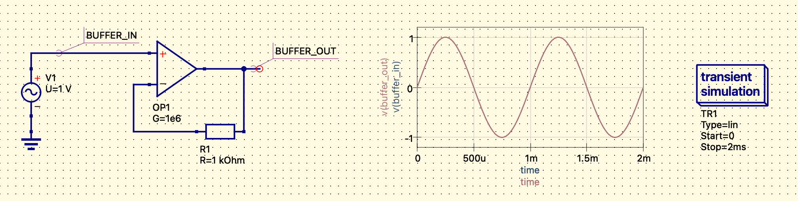
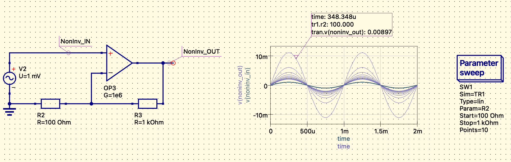
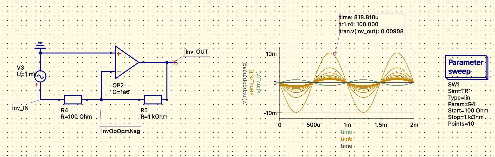

## 运放简介

运放（Operational Amplifier）是高增益差分放大器，通常配合负反馈工作在线性区，用于放大、缓冲和信号变换。一般不直接替代比较器（Comparator）。

### 常见用途

- 小信号放大：反相、同相、差分、仪表放大前级
- 电压跟随器（voltage follower / buffer）：用于阻抗变换。应确认器件支持单位增益稳定，并满足输入共模范围、输出摆幅和负载要求
- 电流转电压（transimpedance amplifier）：用于光电二极管前端和微小电流检测

### 比较器（Comparator）

### 迟滞比较器 / 施密特触发器（Hysteresis Comparator / Schmitt Trigger）

比较器（Comparator）用于比较两个电压的大小，通常工作在开环或饱和区，输出高低电平，不用于线性放大。一般不直接替代运放（Operational Amplifier）。

比较器（Comparator） + 正反馈 => 施密特触发器（Schmitt Trigger）

- 一个输入接参考
- 另一个输入接信号
- 输出通过电阻反馈到输入，形成正反馈，使上升阈值和下降阈值不同

特点：

- 阈值和迟滞宽度可由反馈网络设定
- 可抑制阈值附近的噪声抖动
- 适合门限检测、波形整形和按键信号整形
- 输出形式可能为推挽或开漏/开集，使用时应确认是否需要上拉电阻

“迟滞”指输入上升和下降时对应不同的切换阈值，并非时间延迟。

## 负反馈运放

### 从运放的基本特性说起

理解所有运放电路的钥匙，只有两条基本特性：

**① 开环增益极高（Aol）**
理想运放的开环增益趋近于无穷大（实际芯片通常在 100dB 以上，即 10 万倍以上）。这意味着只要同相端（+）和反相端（−）之间存在哪怕 µV 级的电压差，输出就会被推到电源轨。

**② 输入阻抗极高**
流入两个输入端的电流趋近于零（理想情况下为 0）。

负反馈的本质是：**将输出的一部分"喂回"到反相输入端，使两个输入端之间的差值自动趋近于零。** 这个自动归零的过程，派生出了所有稳定的线性运放电路。

由此可以得出分析负反馈运放的两条黄金法则（虚短、虚断）：

- **虚短**：V₊ ≈ V₋（两输入端电位相等）
- **虚断**：流入输入端的电流 ≈ 0

以下所有电路的分析都从这里出发。

### 1. 电压跟随器（电压缓冲器）

#### 电路结构

输出端直接用导线连接到反相输入端（−），信号接同相输入端（+）。(下图R1不是必要的)

**为什么输出等于输入？**

设输入为 Vin，输出为 Vout。

由于输出直接连到 V₋：

$$
V_- = V_{out}
$$

由虚短：

$$
V_+ = V_- \Rightarrow V_{in} = V_{out}
$$

增益恒为 1，输出完全跟随输入，故名"跟随器"。

**为什么这样做有意义？**

虽然增益为 1 看似毫无用处，但电压跟随器的核心价值在于**阻抗变换**：

- 输入阻抗：极高（GΩ 量级），几乎不从信号源取电流
- 输出阻抗：极低（mΩ 量级），可以驱动低阻抗负载

#### 实际应用场景

- 传感器信号缓冲：高内阻传感器（热电偶、pH 电极）直接接后级会分压失真，加跟随器后隔离阻抗
- ADC 前端驱动：ADC 采样时输入阻抗会瞬时变化，跟随器防止影响信号源
- DCS 模拟量输入模块：AI 卡前端通常有跟随器，防止多路复用开关的阻抗变化影响采样精度

### 2. 同相放大器

#### 电路结构

输出端通过电阻 R3 连回反相输入端（−），反相端再通过 R2 接地；信号接同相端（+）。下图 NonInv_IN 是 $V_{in}$， NonInv_OUT 是 $V_{out}$。

**推导增益**

由虚断，流入 V₋ 的电流为 0，所以流过 R2 和 R3 的电流相等，设为 I：

$$
V_- = I \cdot R_2
$$

$$
V_{out} = I \cdot (R_2 + R_3)
$$

由虚短：$V_+ = V_- = V_{in}$，所以：

$$
\frac{V_{out}}{V_{in}} = \frac{R_2 + R_3}{R_2} = 1 + \frac{R_3}{R_2}
$$

增益 ≥ 1，且始终为正（同相）。

电压跟随器是同相放大器 $R_3 = 0$，$R_2 = \infty$ 的特殊情况。

#### 实际应用场景

- 4-20mA 信号转换后的电压放大：将 1~5V 的初级转换结果放大到 ADC 满量程
- 仪表信号调理：增益精确可调，噪声小，输入阻抗高

### 3. 反相放大器

#### 电路结构

信号通过 R4 接到反相输入端（−），同相端（+）接地，R5 跨接在输出和反相端之间。下图 Inv_IN 是 $V_{in}$， Inv_OUT 是 $V_{out}$。

**推导增益**

V₊ = 0（接地），由虚短得 V₋ = 0（虚地）。

流入节点（−）的电流之和为零（虚断）：

$$
\frac{V_{in} - 0}{R_{4}} + \frac{V_{out} - 0}{R_5} = 0
$$

$$
\frac{V_{out}}{V_{in}} = -\frac{R_5}{R_{4}}
$$

增益为负，输出与输入**反相**，大小由电阻比决定。

**"虚地"概念**

反相输入端电位始终被运放的负反馈钳位在 0V（与 V₊ 相同），但它并没有实际连接到地——电流不从这里流走，而是通过 Rf 流向输出端。这就是"虚地"，是反相放大器最重要的特性。

#### 实际应用场景

- **求和放大器**：多路信号各接一个输入电阻到虚地，输出是各路信号的加权求和，利用虚地的隔离特性，各输入之间互不影响
- **I/V 转换器**：$R_{4}$ 用电流源替代，输出电压正比于输入电流，光电二极管、电流型传感器的标准前端
- **DAC 输出级**：R-2R 梯形网络输出接到虚地，精确完成电流求和到电压的转换

### 4. 差分放大器

#### 电路结构

两路输入分别经过电阻接到同相端和反相端，利用虚短实现对两路信号之差的放大。

当四个电阻满足 $R_f / R_1 = R_3 / R_2$ 时：

$$
V_{out} = \frac{R_f}{R_1}(V_2 - V_1)
$$

#### 实际应用场景

- **共模噪声抑制**：工业现场两线之间的干扰以共模形式叠加，差分放大器能有效抑制（CMRR 指标）
- **桥式传感器读出**：应变片、压力传感器输出差分小信号，标准读出电路
- 仪表放大器（INA）本质上是三运放差分结构，CMRR 可达 120dB+

### 5. 积分器

#### 电路结构

反相放大器中将 Rf 替换为电容 C：

**为什么输出是积分？**

虚地节点的电流平衡：

$$
i_{in} = \frac{V_{in}}{R_{in}} = i_C = C \frac{d V_{out}}{dt}
$$

解出：

$$
V_{out}(t) = -\frac{1}{R_{in} C} \int V_{in}\, dt
$$

输出是输入的时间积分（带负号）。

#### 实际应用场景

- **PID 控制器的 I 项**：积分消除稳态误差，DCS 中纯模拟 PID 调节器核心电路
- **波形变换**：方波积分得三角波
- **ADC 中的 Sigma-Delta 调制器**：积分器是其核心组成部分

**注意**：理想积分器会因直流偏置而饱和，实际电路需要在电容旁并联大电阻（加入 Rf），变成有限增益的低通滤波器。

### 6. 微分器

#### 电路结构

将积分器的 R 和 C 对调：

$$
V_{out}(t) = -R_f C \frac{d V_{in}}{dt}
$$

输出正比于输入的变化率。

#### 实际应用场景

- **边沿检测**：脉冲信号过微分器后得到尖脉冲，用于触发定时逻辑
- **PID 控制器的 D 项**：理想微分对高频噪声极度敏感，实际使用时需串联输入电阻限带

## 正反馈运放

### 正反馈的本质

与负反馈相反，正反馈是将输出的一部分送回**同相输入端（+）**。运放不再趋向平衡，而是趋向**极端**——输出被推到正电源轨或负电源轨，或者在两者之间持续振荡。

正反馈电路不再满足虚短条件，V₊ ≠ V₋，分析方法根本改变。

### 1. 比较器（开环运放）

严格意义上不是正反馈，但是理解正反馈的起点。

#### 电路结构

运放完全开环（无任何反馈），同相端接信号，反相端接参考电压 Vref。

**工作原理**

$$
V_{out} = \begin{cases} +V_{sat} & V_{in} > V_{ref} \\ -V_{sat} & V_{in} < V_{ref} \end{cases}
$$

开环增益极高，任何微小的差值都被放大到饱和。输出是数字量（高/低），但输入是模拟量，运放充当了 1-bit ADC。

**问题**

当输入信号在 Vref 附近缓慢变化或叠加有噪声时，输出会在高低之间高频抖动（振荡），这在数字逻辑后端会造成误触发。

### 2. 施密特触发器（迟滞比较器）

#### 电路结构

在比较器基础上，将输出通过电阻分压后正反馈到同相端（+），同相端不再是固定参考电压，而是会随输出状态变化。

**为什么有两个阈值？**

设输出当前为 +Vsat，正反馈使 V₊ 被抬高到上阈值 $V_{TH}$：

$$
V_{TH} = V_{ref} + \frac{R_2}{R_1 + R_2}(+V_{sat} - V_{ref})
$$

只有 Vin 超过 $V_{TH}$ 时，输出才翻转到 $-V_{sat}$；翻转后 V₊ 立刻被拉低到下阈值 $V_{TL}$：

$$
V_{TL} = V_{ref} + \frac{R_2}{R_1 + R_2}(-V_{sat} - V_{ref})
$$

此后 Vin 必须降到 $V_{TL}$ 以下，输出才再次翻转。$V_{TH}$ 和 $V_{TL}$ 之间的区域就是**迟滞区（Hysteresis）**：

$$
\Delta V = V_{TH} - V_{TL} = \frac{R_2}{R_1 + R_2} \cdot 2V_{sat}
$$

翻转后阈值立即跳变，这正是正反馈"推向极端"的特性被有意利用。

#### 实际应用场景

- **按键消抖**：机械触点弹跳产生的多次电平变化落在迟滞区内，输出不翻转
- **慢变信号数字化**：温度、压力等缓变信号过比较器时，迟滞防止输出抖动
- **电源欠压检测**：DCS 电源模块中判断供电是否跌落到阈值，迟滞防止临界时反复告警

### 3. 方波振荡器（张弛振荡器）

#### 电路结构

施密特触发器加上 RC 延时网络构成自激振荡：

**振荡原理**

1. 设输出为 +Vsat，V₊ 被分压到上阈值 $V_{TH}$
2. 输出通过 Rf 对电容 C 充电，V₋ 指数上升
3. 当 V₋ 超过 $V_{TH}$，输出翻转为 $-V_{sat}$，同时 V₊ 跳变到 $V_{TL}$
4. 输出通过 Rf 对电容反向放电，V₋ 指数下降
5. 当 V₋ 低于 $V_{TL}$，输出翻转回 +Vsat
6. 循环往复，永不停止

振荡频率由 RC 时间常数和正反馈分压比共同决定：

$$
f \approx \frac{1}{2 R_f C \ln\left(1 + \frac{2R_2}{R_1}\right)}
$$

#### 实际应用场景

- 简单的时钟信号发生器
- PWM 载波生成（三角波振荡器变种）
- 看门狗定时器的振荡源

### 4. 文氏桥振荡器（正弦波振荡）

方波振荡器产生的是富含谐波的方波，若需要低失真正弦波，使用文氏桥振荡器：RC 选频网络提供特定频率的正反馈，同时用负反馈控制增益恰好为 3，使系统处于临界振荡状态，输出纯净正弦波。

$$
f_0 = \frac{1}{2\pi RC}
$$

#### 实际应用场景

- 音频信号源
- 传感器激励信号（电感式、电容式位移传感器）
- 锁相环（PLL）的参考信号

### 负反馈 vs 正反馈 对比总结

| 对比项   | 负反馈               | 正反馈                   |
| -------- | -------------------- | ------------------------ |
| 反馈到   | 反相端（−）         | 同相端（+）              |
| 系统状态 | 趋向平衡（线性）     | 趋向极端（非线性/振荡）  |
| 虚短成立 | ✅                   | ❌                       |
| 典型功能 | 放大、滤波、运算     | 比较、整形、振荡         |
| 输出特征 | 模拟量               | 数字量或周期波形         |
| 稳定性   | 高（受相位裕度影响） | 本质不稳定（被刻意利用） |
