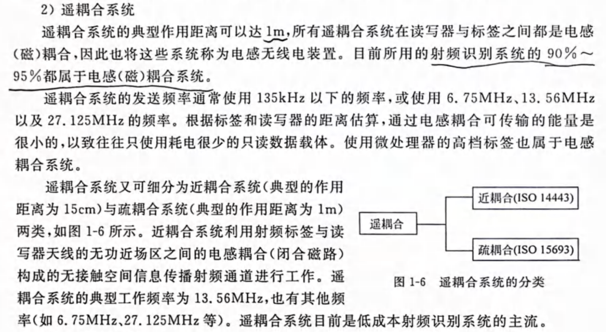

- [通讯系列教程-博客](https://iot-book.github.io/6_数字调制与解调/S1_调制解调介绍/)
- [豆瓣书单](https://www.douban.com/doulist/143561479/?start=0&sort=time&playable=0&sub_type=)
电路设计参考《RF Circuit Design Theory and Applications By Reinhold Ludwig, Pavel Bretchko》。
软件技术方案参考《》。
现在对于无线载波都是数字调制/解调，而起搏器这种方案属于模拟电路调制/解调。优点就是功耗低，缺点就是很难处理同频干扰、难以加密等问题，上述观点参考《无线通信（Wireless Communications） (Andrea Goldsmith)》。

# 技术方案简介
- 高频电磁波
- 

几乎所有书籍都是讲的高频电磁波的（他们所谓的低频也是MHz级别），而不是KHz级别的电磁线圈耦合技术，但是这属于RFID技术，NFC也是在这之上发展而来的。
## RFID&NFC
我们生活在一个日益无线化的世界，无现金支付或访问控制已经成为常态化。细心的读者可能早已注意到，一些商店的收银台也开始出现“无人化”趋势，比如优衣库、迪卡侬这些大家时常光顾的商店，均已采用自助式结账。

在迪卡侬，消费者只需将商品放到“收款台”，几秒钟全部费用即可结清。这些功能的实现主要仰仗在我们生活无处不在的无线电技术，说具体点就是NFC、RFID。为什么这么说呢？接下来我们就一起看看NFC、RFID从何而来，它们又有哪些神奇之处。

RFID（射频识别）技术是在20世纪80年代发明的，此后经过不断的技术演进，逐渐成为主流的无线、非接触通信技术。RFID主要通过无线信号识别特定目标，可单向读取数据，其标签（Tag）通常包含一个天线以及存储数据的存储芯片。

从工程角度看，RFID不是一种单一的无线技术，而且技术频率也有所不同，主要有三种，即低频 (LF)，使用125至135kHz频段；高频（HF），工作在13.56MHz；以及超高频 (UHF)，主要使用865至955MHz频段，有些UHF中也可包含2.4GHz频段。概述了三个主要RFID频段的应用和读取范围。当RFID读写器读写标签数据信息时，其作用距离与读写器功率、天线增益以及天线尺寸等密切相关，功率越大，覆盖的距离越大。

### RFID频段及其应用

| **距离与耦合技术**           | **频率**                   | **应用**                                                                                     | **读取范围**                 |
| --------------------- | ------------------------ | ------------------------------------------------------------------------------------------ | ------------------------ |
| 低频 (LF)   感应耦合     | 125至145 kHz              | 动物识别   工业生产   自动化   车辆防盗系统   访问控制                                              | 几厘米到一米                   |
| 高频 (HF)   感应耦合     | 13.56 MHz                | 票务   访问控制   添加了NFC安全功能   政府（ePassports）   资产跟踪   项目级跟踪   图书馆管理   药品管理 | 几厘米到1.7米                 |
| 超高频 (UHF)   后向散射偶合 | 890至960 MHz   2.4 GHz | 托盘标识   盒子标识   项目级别标记（服装）   工业生产控制                                                 | 最大6米（无源）   最大100米（有源） |

### RFID是如何工作的？

如前所述，RFID标签通常包含一个天线和存储芯片。标签嵌入到相关资产中并存储相关数据，便于读卡器检索这些数据。RFID标签的种类分为有源标签和无源标签两种。有源标签可以自己供电，无源标签则必须通过读卡器为其馈电。现在的读卡器硬件还是比较贵的，有的价格甚至高达数千美元。工作中，RFID读卡器将收到的无线电波转换为可用的数据形式。然后，从标签收集的信息就会通过通信接口传输到主机系统，在该系统中数据可以存储在数据库中，并在稍后进行分析。

当然，RFID标签不一定非要在读卡器的可视范围内读取信息，二者最大可以相距近百米的距离。不过，有源标签和无源标签的读取距离还是有很大差别的，通常有源标签的读取范围会更大些。

虽然RFID标签可以存储大量的数据，但在大多数情况下只是存储简单的标识信息，比如用来取代现有的条形码。与条形码相比较，RFID的优势在于：条形码需要一个接一个的近距离扫描，而RFID允许同时扫描多个标签，且可以扫描远距离标签。对于那些用在仓库、物流、机场行李处理甚至动物识别中的资产和库存跟踪应用来说，RFID标签是非常方便的。因此，RFID标签的市场增长非常迅速，并且有加速发展的趋势。据IDTechEx预测，无源RFID标签的数量将从2011年的不到30亿个增加到2021年的约2500亿个。

### NFC代表什么？

NFC同样属于近距离、非接触式无线通信技术，实际上它是RFID技术的一个子集，发明于2002年。与RFID一样，NFC也使用标签存储数据，可以双向工作。由于NFC在13.56MHz的高频RFID频谱中工作，因此它只能读取10厘米以内的标签，整个过程简单、快速且安全性高。

当然，NFC强大的安全性并不仅仅是因为它不到10厘米的工作距离，还在于它可通过SIM芯片和加密技术提升数据的安全性。在这里多说一句，虽然NFC数据是在短距离内提取，但目标也可以在视线之外。

从2011年开始，NFC在智能手机中的应用为许多新应用打开了大门，让一度热门的蓝牙手动配对成为过去。NFC还可以作为WiFi路由器和其他计算机外围设备之间连接的桥梁，它能轻松地将设置信息从设备传到路由器。根据IMS的研究，NFC的应用正在迅速增长，支持NFC的智能手机数量在2012年至2017年间增长10倍，达到12亿部。

现在，NFC已成为基于RFID消费类应用的标准，并得到越来越多的设备和软件应用的支持。市场机构预估，已有超过20亿消费者和企业正在使用NFC兼容设备。如今市场上大多数Android以及Windows Phone智能手机都会装配NFC芯片。苹果手机虽然出于安全和自身生态的考虑，为其搭载的NFC功能加了不少限制，但是从iOS 13开始已经对以往的策略进行了大幅调整，为开发者提供了更大的发挥空间。目前，主要的信用卡公司基本都支持使用NFC，配备NFC的平板电脑、游戏机、智能手表和其他可穿戴技术也是司空见惯。除了上述移动访问控制和支付等应用，NFC的使用范围开始拓展至AI聊天机器人等领域。

### NFC是如何工作的？
NFC使用RFID应用程序中常见的标准。NFC读写器与无源设备的相互作用受ISO/IEC 18092和21481管辖，并支持ISO/IEC 14443 A和B以及FeliCa。NFC标签应该可以被任何ISO14443兼容的阅读器读取，但是NFC应用程序也需要实现NFC论坛（标准机构）定义的额外标准。这些标准涵盖了数据交换格式、标签类型、记录类型定义以及协议等。由于NFC采用的是一套成熟的标准，应用范围不断扩大，并得到全球电信运营商和信用卡公司的支持。

#### NFC支持三种通信模式
- Reader/Write模式（R/W），即读写模式
- Peer-to-Peer模式（P2P），点对点模式
- NFC Card Emulation模式（CE），即卡模拟模式

在此三种模式下，都仅需简单点击便可启动传输。

_**图1：**非接触式读卡器架构_（图源：NXP）

NFC的工作模式分为有源通信方案和无源通信方案两种：

1. **有源通信方案**  
    发起设备生成13.56 MHz载波场，当目标设备被引入场中时，便可取得电源。发起设备通过直接调制RF场来传输数据，而目标设备则以负载调制场的方式传输数据。
2. **无源通信方案**发起设备和目标设备都会生成RF场。每一方都以振幅键控（ASK）调制来调整自己的RF场以传输数据。为防冲突，只有发送设备发射电磁场，接收设备将关闭自己的场以便接收。发送或接收的角色可因需要而互换。

#### RFID和NFC有哪些不同？
这也是让不少人困惑的一个问题。概括来讲，二者的不同点主要在以下几个方面：

1. **对应关系**：RFID中的读写器和标签可以是一对多的关系（低频和高频的ISO14443是一对一），NFC则是一对一的关系。
2. **频率差异**：在频率上，RFID具有低频、高频、超高频等多种工作频率，NFC只工作在13.56Hz单一高频频谱中。
3. **通信距离**：通信距离也有很大差别，NFC要比RFID短很多，RFID能够达到几十米，而NFC仅在10厘米之内。
4. **单双向通信**：RFID通常只能进行单向通信（从标签到读取器），NFC可以进行双向通信。另外，NFC一次只能扫描一个标签，而RFID则可以一次扫描多个标签。这一点应该是RFID和NFC之间最显著的一个区别。
5. **数据读写**：在数据读写方面，有了专门的设备，RFID可以将数据写入标签。一般来说，NFC数据既能从标签中读写，也可以锁定为只读。从RFID标签中提取数据通常需要昂贵的读卡器，而NFC的数据读取相对要简单且便宜多了，现在大多数智能手机都配备了NFC读取功能。
6. **应用范围**：在应用上，NFC常常被用在支付、门禁等场合，RFID主要用于物流跟踪、资产防损（例如百货公司衣服上的标签）等。当通过供应链跟踪库存，尤其是在人员难以到达的地方去收集资产信息时，RFID是最好的选择。非接触式支付应该是NFC目前最典型的应用，在体育、娱乐和旅游门票、校园内的学生身份识别以及与智能物联网设备的交互等领域也已有了NFC的身影。

综合来看，RFID的优势在于它能实现一次扫描多个标签，并且是远距离在视线之外读取数据，因此可以部署在各种环境中。NFC的长处是安全性高。此外，NFC不仅能在标签上读写数据，还可以用于存储比RFID更复杂的数据，且读取数据时不需要昂贵的额外硬件。随着芯片技术的发展以及RFID和NFC的大规模应用，目前这两种产品的成本都大幅降低，如果是大批量采购，标签的价格甚至都能低到0.1美元。

### 热门产品和解决方案

#### NXP解决方案 - 新增NFC功能

[恩智浦（NXP）](https://www.mouser.cn/manufacturer/nxp-semiconductors/?utm_source=cn-blog&utm_medium=social)是NFC技术的主要发起人，在许多方面，人们甚至认为恩智浦就是NFC。在恩智浦的宣传资料上我们看到这样一个数据：市面上90%以上内置NFC功能的智能手机，以及80%的POS终端都使用了恩智浦技术。这种领导地位也让NXP在拓展NFC市场过程中起到了关键性作用。现在，恩智浦的NFC方案已经广泛应用在移动支付、预付费计量表、门禁管理、付费电视接触式智能卡、智能家居、IoT、智能制造等多个领域。

在智能门锁方案中，恩智浦为门锁增加了NFC功能，业主可以用具备NFC功能的智能手机配置门锁，给予特定的个人或团体临时访问权限。NXP PR601方案结合了CLRC633 NFC芯片与先进的LPC1227微控制器，设计非常轻巧，且由于恩智浦采用最强健、经大规模测试的NFC技术，最大限度地减少了门或走道上金属带来的磁场干扰。融入恩智浦独家功能——低功耗检卡，读卡器终端在轮询读卡阶段即可进入休眠模式，确保节能运行。

_**图2：**用于门禁管理的NFC_（图源：NXP）

#### TI 解决方案 - RFID和NFC技术优势

自20世纪80年代后期以来，[TI](https://www.mouser.cn/manufacturer/texas-instruments/?utm_source=cn-blog&utm_medium=social)一直是无线技术的创新者，同时也是RFID和NFC技术的领跑者。该公司的TRF7970A收发器IC是一款用于13.56MHz RFID/NFC的集成式模拟前端（AFE）和多协议数据组帧器件。内置编程选项使得该器件适合于广泛的NFC、接近和邻近识别系统的应用。它能够执行以下三种模式中的任一模式：读/写器模式、对等模式和卡仿真模式。设计人员通过在控制寄存器内选择所需的协议可对TRF7970A进行配置。通过对所有控制寄存器进行直接存取，还能根据需要对不同的读取器参数进行微调。

# 技术细节
## RFID
### 近场

#### 电感耦合与电磁耦合？
电路领域的耦合一般指的是两个独立电路相互影响，当然有时需要会产生噪声，要避免；有时要利用，比如无线充电和变压器，就是用它来传递能量，NFC和多数RFID设备比如身份证等用它来传递信息。
大多数耦合都指的是电感耦合（有时称之为电磁耦合），当然也有部分是电容耦合。查到更多资料求证后再细讲。
#### 问题：为何电磁耦合通信频率低却距离短？
换句话说：这种形式不也是电磁波吗？不是利用电磁波？有何区别，要具体到技术实现设备的细节上。
首先，导线中有交流电就一定会有电磁波产生。但是电磁波能较好的被“释放”出去是需要一定条件的，这也在射频天线的设计中体现出来，比如天线的长度要是电磁波波长的倍数（具体原因还没有学到）。所以电磁线圈更多的是通过场源本身的互相感应（电磁感应现象）来传递信息或者能量的。而其材料、长度、形状需要被设计才能更好的发射和接收电磁波，而那就成了射频天线了。

# 天线
- [天线设计该如何入门](https://www.mwrf.net/tech/antenna/2022/29347.html)
- [天线外形种类](https://www.ansys.com/zh-cn/blog/common-antenna-designs)
上文中也简单解释了射频天线（发射和接收电磁波）和线圈（电磁耦合）的区别。而比如RFID通信大多数都是电磁耦合（一般指电感耦合），也就是两个线圈，利用感应电动势，相互“影响”，而也有RFID的射频通信，其“天线”也就是常规的射频天线设计。当然，要注意的是，有时候也会把线圈称为天线，或者称其为线圈天线等。
关于叫法，我的建议是最好不要像上文这样，虽然这部分线圈的功能是用来通信，但是其原理和结构都和变压器无异，还是将能发射和接收电磁波的装置称为天线比较好。但是为了充分比较，我将这两部分的讲解都放在这一章，以射频天线和线圈来加以区分。

## 射频天线

## 电感与线圈
- [电感元件wiki](https://zh.wikipedia.org/zh-sg/电感元件)

# 调制与解调
信号的调制和解调要分别从硬件和软件方面将，软件主要是信号的处理，硬件主要是感应(包括天线的原理)、滤波、放大等。
## 硬件
这部分主要参考《射频电路设计》（RF circuit design）。
### RLC电路
- [RLC电路wiki](https://zh.wikipedia.org/wiki/RLC电路)
