- [x86assembly guide](https://www.cs.virginia.edu/~evans/cs216/guides/x86.html)
- [通讯系列教程-博客](https://iot-book.github.io/6_数字调制与解调/S1_调制解调介绍/)

# 硬件

## MSP430单片机
- [TI官方教学视频](https://www.ti.com/video/library.html)
- [TI官方设计开发文档合集](https://software-dl.ti.com/ccs/esd/documents/ccs_documentation-overview.html)
- 


下面引文大多来自书籍《MSP430单片机应用系统开发典型实例》，大多数图例来自datasheet。

首先要结合硬件图的datasheet搞清楚引脚含义：
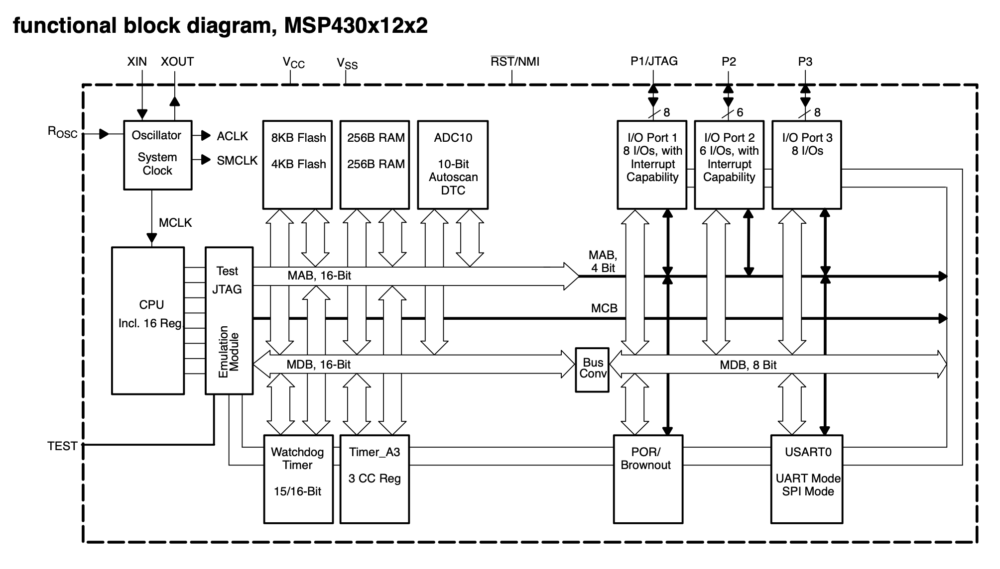
- Rosc是晶振
- XIN和XOUT是晶振电源
- Vcc和Vss是芯片电源
- 

msp430引脚定义:
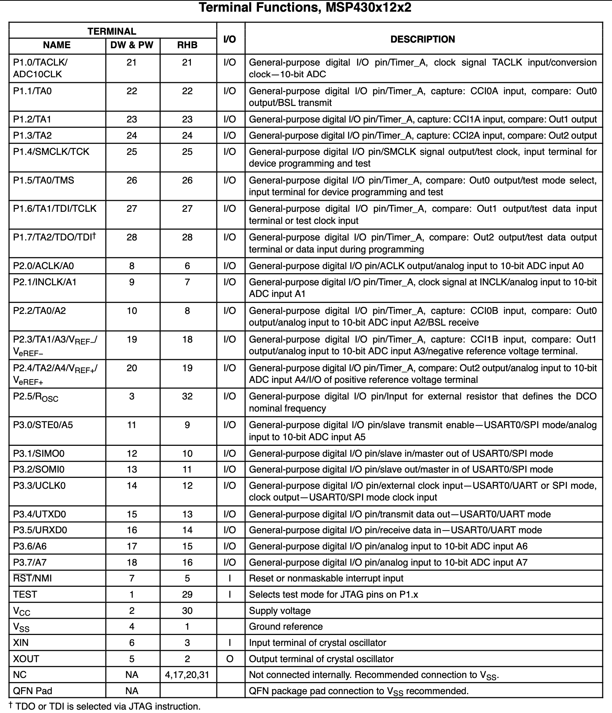

### RAM&ROM segment
由于 MSP430系列单片机采用的是“冯-诺依曼”结构，因此它的 ROM 和RAM 都在同一地址空间，虽然不同型号的单片机具有不同容量的存储器，但是它们都分配在0000H～FFFFH范围内，存储器是接线性方式组织的。在0000H~FFFFH 范围内从低到高分别是：特珠功能寄存器、外围模块寄存器、数据存储器、程序存储器和中断向量表。
它包括一个16 位的算术逻辑单元（ALU）、16 个寄存器和一个指令控制单元。16个寄存器中有4个特殊的功能寄存器和通用寄存器。4个特的功能寄存器分别是：程序计数器（PC）、堆栈指针（SP）、状态寄存器和常数发生器。程序计数器是用来表示下—条即将执行指令的地址，也就是说程序执行的地方，采用C语言写程序的时候可以不必关心该寄存器。堆栈指针主要用在系统调用子程序或者进入中断服务程序的时候对程序计数器的保护，就是保护程序的现场情况，采用C语言写程序时不必关心该寄存器。常数发生器上要用米产生常数，采用C语言写程序时也不必关心该寄存器。状态寄存器用来设置某些位来控制CPU 的行为或者通过某些位来反映CPU 的状态，在写C语言或者汇编语言时都需要用户设置适当的位或者读取出适当的位，从而控制CPU的运行行为，因此该寄存器非常重要，图2-1给出该寄存器的结构。


为了有一个直观的认识，下面给出儿种单片机的存储器组织图。下图来自文件《msp430f1132data_sheet》，具体架构和详细内存分配等看该文件（于msp_refs文件夹）
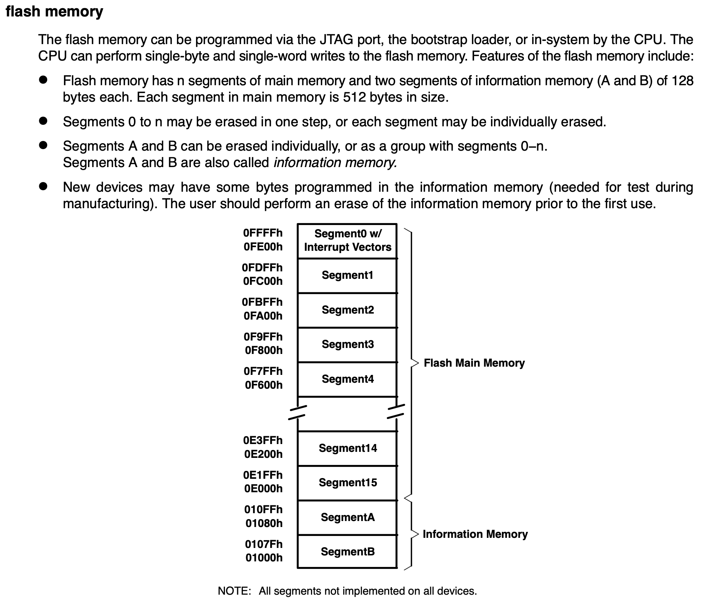
```
通过上图可以看出，00H~0FH为特殊功能寄存器，主要包括4个特殊功能寄存器和通用寄存器。10H~FFH为宽为8位的寄存器，这些寄存器是8位外围模块使用的寄存器。100H~1FFH为宽为16位的寄存器，这些寄存器是16位外围模块使用的寄存器。从 200H到C00H这一地址范围是 RAM存储器，不同型号的单片机具有不同的 RAM空间，像 MSP430F110的 RAM 空间为：200H~27FH，而MSP430F112的RAM 空间为：200H~2FFH。COOH~FFFH 这一地址范围内为片内 ROM 存储器。FFEOH~FFFFH这一地址范围为中断向量表的空间，每一种单片机都有相同的中断向量表的位置。其他空间是单片机的程序空间，像 MSP430F110的程序空间为：1080H~10FFH和FCOOH~FFDFH这两段，而MSP430F112的程序空间为：1000H~10FFHI 和 FOO0H~FFDFH这两段，片内程序存储器根据不同型号的单片机有不同的程序空间，也有不同的开始地址。
```
### P1/P2端口设定及对应寄存器

P2是类似的。
```
P1 口的每个管脚都可以设置成输入或者输入方向，并且可以实现任意的输入输出的组合。P1 口具有中断功能，每个管脚都可以单独设置中断方式，中断的触发可以设置成上升沿触发，也可以设置成下降沿触发。P1口的功能设置是主要设置 PIDIR、PIIE、PIIES、PIIFG、PIIN、PIOUT 和PISEL共7个寄存器。下面详细介绍各个寄存器。

P1DIR 寄存器：该寄存器控制P1口各个管脚的方向。设置相应的位为1，则相应的管脚为输出，如果设置相应的位为0，则相应的管脚为输入。可以看出，该寄存器的每个位可以单独设置，从而实现对每个管脚的输入输出方向的控制。

P1IE 寄存器：该寄存器控制 P1 口各个管脚的中断使能。设置相应的位为1，则相应的管脚具有中断功能，如果设置相应的位为O，则相应的管脚没有中断功能。该寄存器的每个位可以单独设置，从而实现对每个管脚的中断功能的控制。

P1IES 寄存器：P1口的中断触发沿选择寄存器。设置相应的位为1，选择下降沿触发方式，如果设置相应的位为0，选择上降沿触发方式。该寄存器的每个位可以单独设置，从而实现对每个管脚中断功能触发方式的选择。

P1IFG 寄存器：P1 口的中断标志寄存器。如果 P1 口的某个管脚设置成中断管脚，当该有中断触发时，相应的位为1，如果没有中断触发，则相应的位为0。该寄存器的每个位可以单独读取，从而判断相应的管脚上是否有中断产生。


P1IN 寄存器：PI口的输入寄存器。在输入的模式下，读取该寄存器的相应位来获得相应管脚上的数据。该寄存器的每个位可以单独读取，从而获得相应管脚上的输入数据或者管脚的状态。

P1OUT 寄存器：P1 L的输出寄存器。在输出模式下，如果该寄存器的相应位设置为1时，则相应的管脚输出高电平，如果设置该寄存器的相应的位为0时，则相应的管脚输出低电平。该寄存器的每个位可以单独设置，从而在相应的管脚输出低电平或高电平。

P1SEL 寄存器：P1口的功能选择寄存器。该寄存器主要是控制P1 口的I/O管脚作为：I/O口还是外围模块的功能端口。当该寄器的相应位设置为1时，则相应的管脚为外围模块的功能管脚，当该寄器的相应位设置为0时，则相应的管脚为一般I/O管脚。该寄存器的每个位可以单独没置，从而对相应的管脚进行一般I/O口还是外围模块功能管脚的选择。
```

### CCR (Capture/compare register)
- 大略见笔记：《chatGPT tells》
- 详细见文档《MSP430_TIMERS_CCR》


### INTERRUPT VECTORS & RESET

#### 中断
```
一、MSP430的中断种类
MSP430的中断分为3种：

1、系统复位
系统复位的中断向量为0xFFFE。

2、不可屏蔽中断
不可屏蔽中断的中断向量为0xFFFC。响应不可屏蔽中断时，硬件自动将OFIE、NMIE、ACCVIE复位。软件首先判断中断源并复位中断标志，接着执行用户代码。退出中断之前需要置位OFIE、NMIE、ACCVIE，以便能够再次响应中断。
需要特别注意点：置位OFIE、NMIE、ACCVIE后，必须立即退出中断相应程序，否则会再次触发中断，导致中断嵌套，从而导致堆栈溢出，致使程序执行结果的无法预料。

3、可屏蔽中断
可屏蔽中断的中断来源于具有中断能力的外围模块，包括看门狗定时器工作在定时器模式时溢出产生的中断。每一个中断都可以被自己的中断控制位屏蔽，也可以由全局中断控制位屏蔽。
多个中断请求发生时，响应最高优先级中断。响应中断时，MSP430会将不可屏蔽中断控制位SR.GIE复位。因此，一旦响应了中断，即使有优先级更高的可屏蔽中断出现，也不会中断当前正在响应的中断，去响应另外的中断。但SR.GIE复位不影响不可屏蔽中断，所以仍可以接受不可屏蔽中断的中断请求。

二、中断的响应及返回过程

1、中断响应的过程
1）如果CPU处于活动状态，则完成当前指令；
2）若CPU处于低功耗状态，则退出低功耗状态；
3）将下一条指令的PC值压入堆栈；
4）将状态寄存器SR压入堆栈；
5）若有多个中断请求，响应最高优先级中断；
6）单中断源的中断请求标志位自动复位，多中断源的标志位不变，等待软件复位；
7）总中断允许位SR.GIE复位。SR状态寄存器中的CPUOFF、OSCOFF、SCG1、V、N、Z、C位复位；
8）相应的中断向量值装入PC寄存器，程序从此地址开始执行。

2、中断返回的过程
1）从堆栈中恢复PC值，若响应中断前CPU处于低功耗模式，则可屏蔽中断仍然恢复低功耗模式；
2）从堆栈中恢复PC值，若响应中断前CPU不处于低功耗模式，则从此地址继续执行程序。

三、MSP430单片机中断的注意事项
不要使用中断嵌套。同时，为了使用C语言来编写MSP430的高质量代码需要注意，微处理器一般用于特定环境和特定用途，出于成本、功耗和体积的考虑，一般都要求尽量节省使用资源，并且，由于微处理器硬件一般都不支持有符号数、浮点数的运算，且运算位有限，因此，分配变量时必须仔细。另外要说明的是，速度和存储器的消耗经常是2个不可兼顾的目标，在多数情况下，编程者必须根据实际情况作出权衡和取舍。需要注意的事项如下：

1、通常在满足运算需求的前提下，尽量选择为变量定义字节少的数据类型。比如最常用的int和char，int是16位的，char是8位的，如果没有必要，不要使用int，而且使用char也最好使用unsignedchar。运行时，可以在变量窗口看到，使用类型为unsignedchar的变量是16进制的格式，而使用int的是十进制格式，如果char没有定义为unsigned，会出现负号，如果没有必要的话，在430中是不需要负数的。

2、尽量不用过长的数据类型，如long、longlong和double。

3、MSP430的C编译器不支持位寻址，所以运算中尽量减少位操作，对于只有“是”和“否”的变量，如果RAM容量允许，则可分配为unsignedchar类型，可提高运算速度。如果分配为某字节的某个位，可以减少存储器的消耗，但是会降低运算速度。

4、避免使用浮点数，尽量使用定点数进行小数运算。如果必须使用浮点数，则尽量用32位的float，而不是64位的double。

5、尽量将变量分配为无符号数据类型。

6、对于指针变量，如果声明后其值不再改变，则声明为const类型，这样编译器编译时能更好的优化生成的代码。

7、尽可能的使用局部变量而非全局变量或者静态变量(static)。这样有利于编译器编译时更好的优化生成的代码。

8、避免对局部变量使用&取地址符。因为这样会使编译器无法把此变量放在CPU的寄存器中，而是放在RAM中，从而失去了优化的机会。

9、仅在模块内使用的变量声明为static，有利于优化代码。

10、如果堆栈空间有限，尽量减少函数调用的层次和递归调用。

11、如果传送参数过多，可将参数组成一个数组或者结构体，然后用指针传递。

12、某些变量在中断程序和普通级别程序中都会被用到，所以必须加以保护。将变量声明为volatile类型，编译器优化时就不会移动它，对它的访问不会被延迟。为保证对volatile的变量不被打断，为此，可以在访问它的部分(即访问它的函数)前面加上__moniter的声明。
```

#### 修改中断向量表？
- [汇编_修改中断向量表_自定义中断](https://blog.csdn.net/qq_45931661/article/details/120576061)

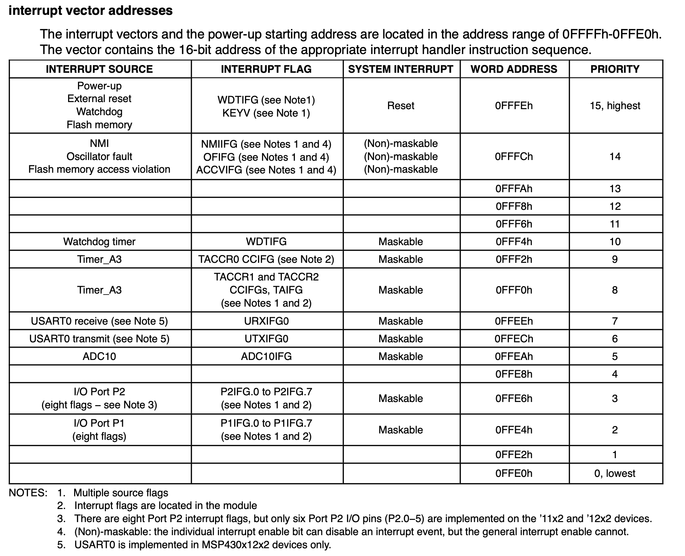
##### [[关于msp430中断]]
一个不错的博客见相关笔记。

#### 复位
```

二、MSP430复位电路介绍

1、POR是上电复位信号，它只在以下两个事件发生时产生：
1）芯片上电。
2）RST/NMI设置成复位模式，在RST/NMI引脚上出现低电平信号。

2、PUC信号是上电清除信号，POR信号的产生总会产生PUC信号，但PUC信号的发生不会产生POR信号。产生它的事件为：
1）发生POR信号。
2）处于看门狗模式下，看门狗定时时间到。
3）看门狗定时器写入错误的安全键值。
4）RST/NMI设置成NMI模式，在RST/NMI引脚上出现低电平信号，
5）FLASH存储器写入错误的安全键值。

3、当因为POR或PUC信号引起设备复位后，系统的初始状态如下：
1）I/O引脚切换成输入模式
2）I/O标志位清除。
3）其它外围模块及寄存器实现初始化，
4）状态寄存器复位。
5）PC装入0FFFE处的地址值，CPU从这一地址开始执行。
MSP430单片机复位电路可以生产输出两个复位信号，分别是POR和PUC。而这个信号所生的条件和作用都有所不同的。

4、POR生产主要由两个条件产生的：
1）外部产生的条件：芯片上电和NMI引脚低电平生产。
2）内部信号产生的条件：内部信号产生的、内部POR生产、内FLASH写入错误和NMI产生低电平。

总的来说，POR与PUC这两个信号的产生将会导至内部部分寄存器不同的复位情况。无论是POR信号还是PUC信号触发的复位，都会使MSP430从地址0xFFFE处读取复位中断向量，程序从中断向量所指的地址处开始执行。触发PUC信号的条件中，除了POR产生触发PUC信号外，其他的豆科一通过读取相应的中断向量来判断是何种原因引起的PUC信号，以便作出相应的处理。
```
 

## 外围电路
芯片外围会有一些必要的电路，了解一下。各种器件其datasheet见《msp430_refs》中的《外围电路器件》
### 供电电路
- VCC：C=circuit 表示电路的意思, 即接入电路的电压
- VDD：D=device 表示器件的意思, 即器件内部的工作电压;
- VSS：S=series 表示公共连接的意思，通常指电路公共接地端电压

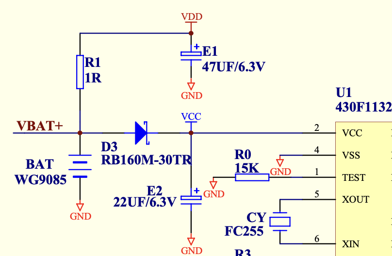
• **BAT WG9085**：电池，用于提供电源。
• **R1 (1Ω)**：电阻，用于限流?
• **D3 (RB160M-30TR)**：二极管，用于防止电流反向流动，保护电路。
• **E1 (47µF/6.3V)** 和 **E2 (22µF/6.3V)**：电容器，用于平滑电源电压，减少电源噪声?见下面视频。
- [芯片供电为什么要接入电容？](https://www.bilibili.com/video/BV1LE421u7gK)具体见笔记《嵌入式硬件》

#### AC-DC
- [手机充电器](https://www.bilibili.com/video/BV1or4y1X7Ra)
具体见笔记《嵌入式硬件》

#### DC-DC


### 电池电压测量
-  [Measure Lithium ion battery voltage](https://electronics.stackexchange.com/questions/39412/measure-lithium-ion-battery-voltage-thus-remaining-capacity)
- [Measuring battery voltage using a microcontroller](https://microchip.my.site.com/s/article/Measuring-battery-voltage-using-a-microcontroller)
- [单片机怎么实现电池充放电时的电压检测](https://bbs.21ic.com/icview-2634564-1-1.html)


### 晶振
上图中CY FC255就是晶振源。
#### ACLK（Auxiliary Clock）
ACLK是辅助时钟源，通常是一个低频的时钟信号。

- **频率低**：通常使用32.768 kHz的外部晶振（常用于实时钟RTC）。
- **低功耗**：由于频率低，功耗也低，适用于需要长时间运行且功耗敏感的应用。
- **独立运行**：即使在低功耗模式下（如LPM3），ACLK依然可以运行，为系统提供实时计时功能。

用途：
- **实时时钟（RTC）**：用于定时或计时功能。
- **低功耗操作**：适合在低功耗模式下使用，因为它可以保持运行而不需要高频的时钟源。

#### MCLK（Main Clock）
MCLK是主时钟源，是MSP430微控制器的主要操作时钟。

- **高频**：MCLK的频率可以很高，以满足高性能需求。
- **灵活性**：MCLK可以由多种时钟源选择（如DCO、XT2、LFXT1等），并且频率可以调整。
- **控制系统速度**：所有核心操作和大部分外设操作都依赖于MCLK的频率。

用途：
- **CPU操作**：驱动微控制器核心，执行指令。
- **外设驱动**：许多外设模块（如SPI、UART、ADC等）依赖于MCLK提供的时钟信号进行操作。
### 通信电路
#### 有线(串口)
- [简单了解UART、RS232、I2C和SPI？](https://www.bilibili.com/video/BV1im411Q73m)

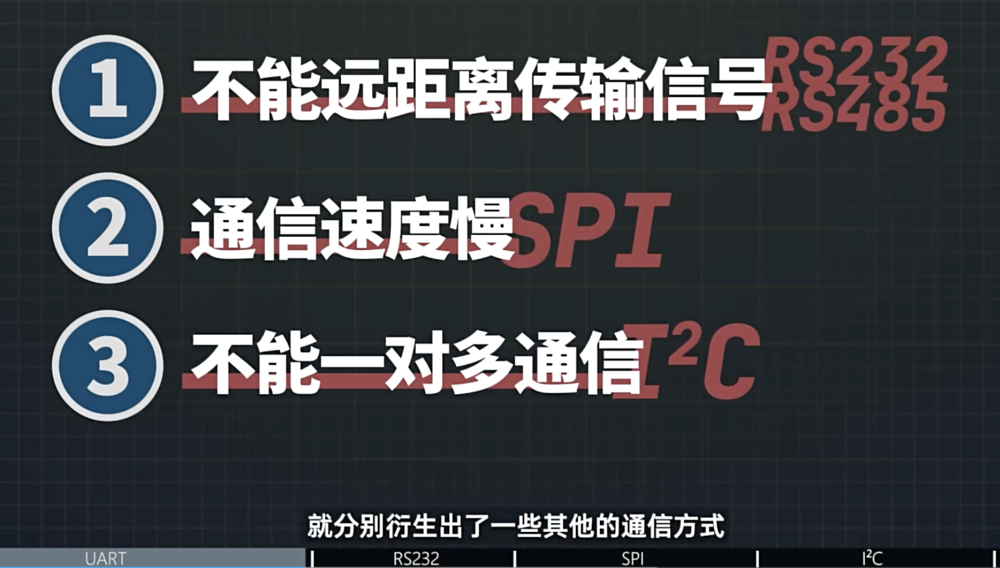

1. UART


2. RS485

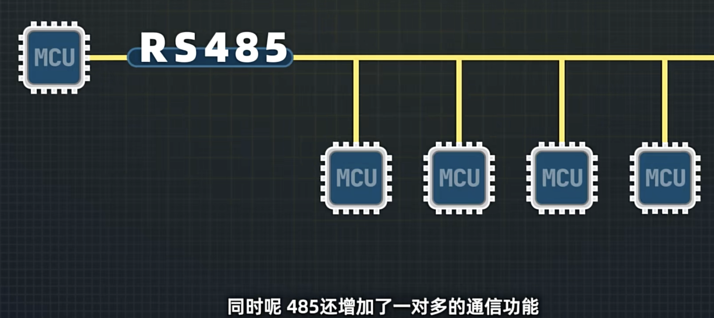

3. SPI

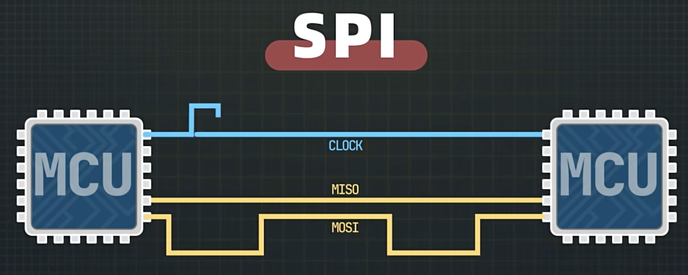

4. I2C

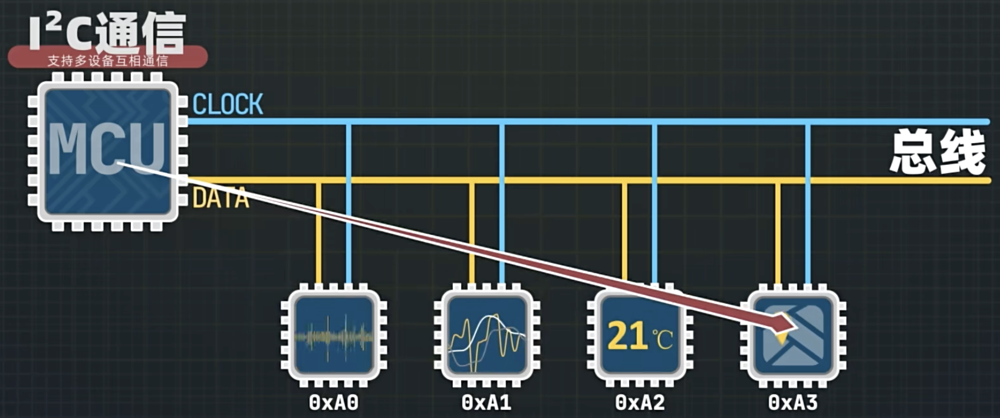

#### 无线(射频)

关于通信技术细节看笔记《[[无线通信]]》。
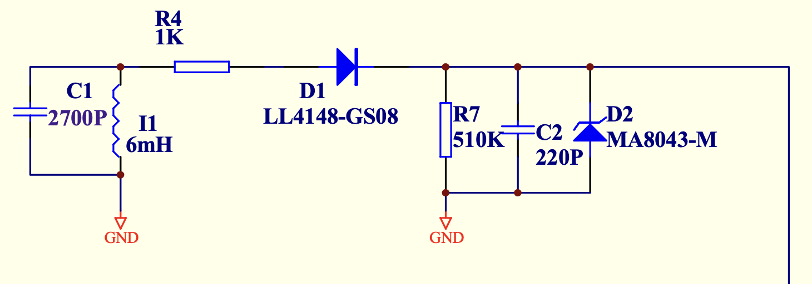
这个电路常见于简单的无线接收机中，是一个射频（RF）滤波器和检波电路，其作用主要是从射频信号中提取出低频信号，或者用于某种射频调制的解调。下面逐一解释各个元件及其作用：

1. **C1（2700pF）和L1（6mH）**：这是一个并联谐振电路，它的作用是对特定频率的射频信号进行选择性滤波。其共振频率由C1和L1的值决定。
2. **R4（1KΩ）**：这个电阻用于限制电流或作为负载电阻。
3. **D1（LL4148-GS08）**：这是一个小信号二极管，通常用于高频检波？它的作用是将射频信号整流为直流信号或低频信号？
4. **R7（510KΩ）和C2（220pF）**：这两个元件构成一个RC滤波器，用于滤除整流后的高频成分，提取出有用的低频信号。
5. **D2（MA8043-M）**：这是一个稳压二极管？
#### 通讯时序图


#### 通讯示例代码


###  电极端
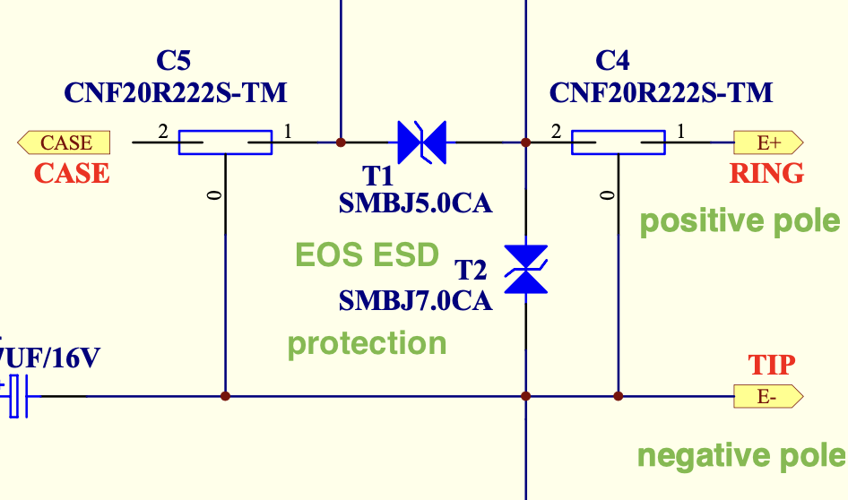

#### TIP & RING 
```wiki
https://baike.baidu.com/item/Tip%20and%20Ring/7770108
 Tip and Ring即正极线和负极线（Tip and Ring），表示组成电话配线电路的两条电线。Tip 是正极线的别称；Ring 是负极电线的别称。TIP线电压为正电压，RING为负电压，之间的一般是48V。
 这里我认为作者代指正负电极。
```
#### CASE
外壳接地？

#### 瞬态电压保护
SMBJ5.0CA
```
SMBJxxCA 可以保护灵敏电子器件免受由于电气过载 (EOS)、闪电、电缆放电事件 (CDE) 和静电放电 (ESD) 造成的损害或闩锁效应。它们的特点是具有较大截面积的结，可传导高瞬态电流。这些器件拥有电路板保护的理想特性，包括快速响应时间、低工作电压和钳位电压，且器件性能不会劣化。
```


### 模数转换
LTC1662

### 开关
ADG788BCP

### 感知电路
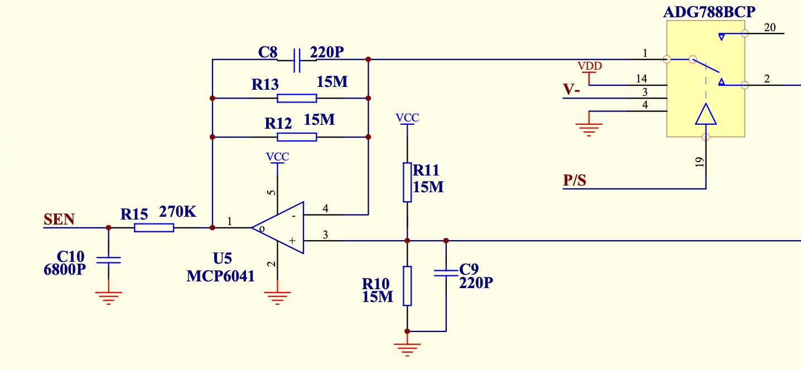
SEN是输出到单片机的信号；2和3是输入信号；
#### 运算放大器
MCP6041
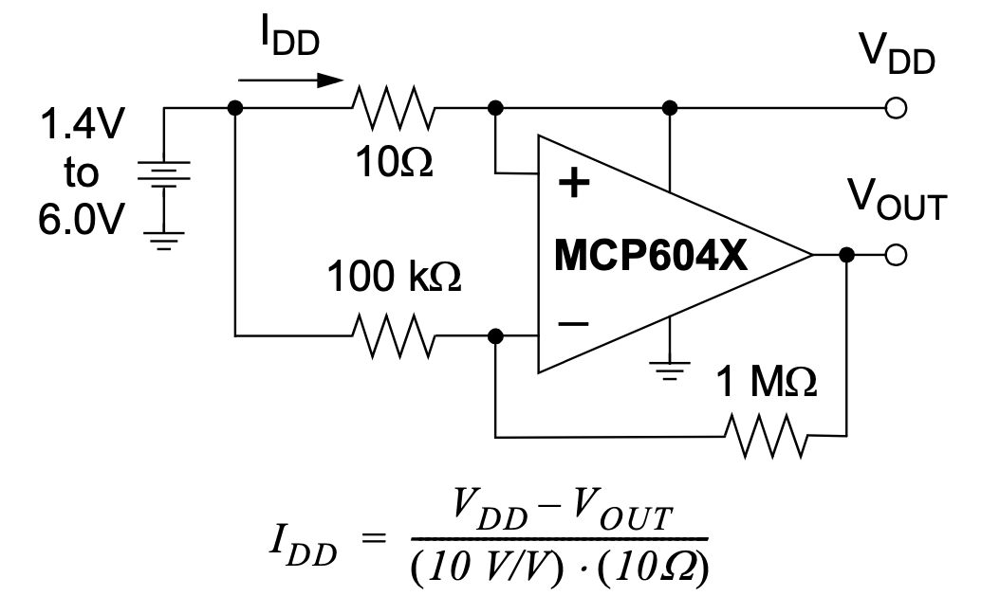
datasheet的典型实例，和上图中的应用不同，不清楚上图放大是如何进行的。

### 磁簧开关(Reed Switch)

在电子产品设计、研发过程中，我们会运用到不同的开关，开关种类有霍尔开关、模拟开关、机械开关等，所谓的开关就是使电路开通或者断路，所以除了之前用过的机械式、继电器、电晶体等等，还有一种叫做干簧管，也称之为[磁簧开关](http://www.reedswitchcn.com/product/chkg.html)(Magnetic Reed Switch)。这些不起眼的开关在电路中担任着重要的作用。


**1、什么是磁簧开关？** 
簧片开关诞生于1936年。它于1936年由贝尔电话实验室的沃尔特.埃尔伍德（Walter B. Ellwood）发明并于1941年获得了专利。磁簧开关是一个通过所施加的磁场操作的电开关，它的一个重要特性就是灵敏度，灵敏度决定需要多大的磁场可以驱动工作。

**2、磁簧开关原理**  
磁簧开关的工作原理非常简单，两片端点处重迭的可磁化的簧片(通常由铁和镍这两种金属所组成的)密封于一玻璃管中，两簧片呈交迭状且间隔有一小段空隙(仅约几个微米)，这两片簧片上的触点上镀有层很硬的金属，通常都是铑和钌，这层硬金属大大提升了切换次数及产品寿命。玻璃管中装填有高纯度的惰性气体(如氮气)，部份干簧开关为了提升其高压性能，更会把内部做成真空状态。  
它的作用相当于一个磁通导体，在尚未操作时，两片簧片并未接触；在通过永久磁铁或电磁线圈产生的磁场时，外加的磁场使两片簧片端点位置附近产生不同的极性, 当磁力超过簧片本身的弹力时，这两片簧片会吸合导通电路；当磁场减弱或消失后，干簧片由于本身的弹性而释放，触面就会分开从而打开电路。  
**3、磁簧开关的优点**  
（1）触点与惰性气体一起密封在玻璃管内，不会受到外部气氛的影响；
（2）动作回答速度迅速；
（3）动作系统和电路都位于相同的轴上，适宜使用于高频率传输的应用产品。
（4）小型，重量轻；
（5）触点具有优越的耐蚀性和耐磨损性，使用寿命长，可获得稳定的开关动作；
（6）与永久磁铁组合，就能经济简易地构成非接触式开关。

**4、磁簧开关的应用领域**
磁簧开关应用最多的地方之一是防盗警报器，例如带磁铁的门窗报警器，在窗口打开的情况下（或有人剪断电线），将发出警报。 
簧片开关具有优于固态开关的电气隔离，并且由于闭合触点而面临的电阻较小。此外，磁簧开关可以在各种电压，负载和频率下工作，因为该开关仅用作已连接或已断开的电线。具有机械开关的极高的可靠性，并且可进行数十亿次循环开启而不发生故障。

# 软件
## 汇编基本语法
- [汇编基本语法](https://www.cainiaoya.com/assemblylanguage/assembly-language-syntax.html)
- 
### 常量与变量
- [常量](https://www.cainiaoya.com/assemblylanguage/assembly-language-const.html)
NASM提供了几个定义常量的指令。在前面的章节中，我们已经使用过EQU指令。我们将特别讨论三个指令-
- **EQU**
- **%assign**
- **%define**
以下示例说明了EQU指令的使用:
```nasm
SYS_EXIT  equ 1
SYS_WRITE equ 4
STDIN     equ 0
STDOUT    equ 1
section  .text
   global _start    ;must be declared for using gcc

_start:             ;tell linker entry point
   mov eax, SYS_WRITE         
   mov ebx, STDOUT         
   mov ecx, msg1         
   mov edx, len1 
   int 0x80                

   mov eax, SYS_WRITE         
   mov ebx, STDOUT         
   mov ecx, msg2         
   mov edx, len2 
   int 0x80 

   mov eax, SYS_WRITE         
   mov ebx, STDOUT         
   mov ecx, msg3         
   mov edx, len3 
   int 0x80

   mov eax,SYS_EXIT    ;system call number (sys_exit)
   int 0x80            ;call kernel

section  .data
msg1 db 'Hello, programmers!',0xA,0xD   
len1 equ $ - msg1                       

msg2 db 'Welcome to the world of,', 0xA,0xD 
len2 equ $ - msg2 

msg3 db 'Linux assembly programming! '
len3 equ $- msg3
```

编译并执行上述代码后，将产生以下结果:
```bash
Hello, programmers!
Welcome to the world of,
Linux assembly programming!
```

### 基本指令
#### mov
传送字节、字、双字分为三种指令：movb、movw、movl


- 
