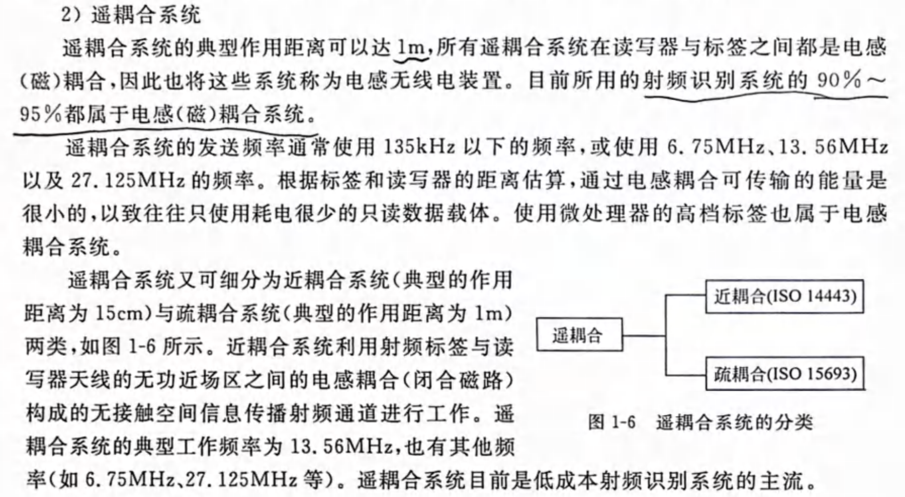

- [通讯系列教程-博客](https://iot-book.github.io/6_数字调制与解调/S1_调制解调介绍/)
- [豆瓣书单](https://www.douban.com/doulist/143561479/?start=0&sort=time&playable=0&sub_type=)
电路设计参考《RF Circuit Design Theory and Applications By Reinhold Ludwig, Pavel Bretchko》。
软件技术方案参考《》。
现在对于无线载波都是数字调制/解调，而起搏器这种方案属于模拟电路调制/解调。优点就是功耗低，缺点就是很难处理同频干扰、难以加密等问题，上述观点参考《无线通信（Wireless Communications） (Andrea Goldsmith)》。

# 技术方案简介
- 高频电磁波
- 近场耦合

几乎所有书籍都是讲的高频电磁波的（他们所谓的低频也是MHz级别），而不是KHz级别的电磁线圈耦合技术，但是这属于RFID技术，NFC也是在这之上发展而来的。

## 电磁波通信和近场耦合通信
电磁波确实是通过交变电压或交变电流产生的，但电磁波的有效发射依赖于特定的条件和机制。这些条件决定了为什么远场电磁波可以高效传播，而近场条件下的非均匀场（如交变磁场或电场）不能直接用于通信。以下从物理学角度详细解释电磁波的发射机制以及其与近场的区别

1. 电磁波的发射机制
电磁波的发射由加速的电荷或交变的电流产生，符合麦克斯韦方程组的基本理论：

- 天线的作用：
- 交变电流在天线中流动会产生交变的电场和磁场。
- 当电场 和磁场 以相位同步方式相互垂直，且垂直于传播方向时，形成远场电磁波。

天线的必要条件
1. 电流分布满足共振条件：
- 天线的物理长度必须与波长相关（通常为波长的 1/2 或 1/4）。
- 只有满足共振条件，交变电流在天线上形成驻波，从而有效辐射能量。

2. 远场波阻抗匹配：
- 电磁波的波阻抗为 ，在远场条件下，天线会自然匹配这一阻抗，从而保证能量有效传播。

3. 空间传播特性：
- 在远场区域（距离大于波长的 ），电磁波以平面波形式传播，电场和磁场呈相位同步，能量传输高效。

2. 为什么近场条件下传播效率低？
（1）近场主要以非辐射场为主
- 非辐射场的特点：
- 在近场区域（小于波长的 ），电磁场的能量主要存储在源附近，而不是以电磁波形式向外辐射。
- 近场以静电场或静磁场为主，且电场与磁场不满足远场传播条件。
- 能量集中在源附近：
- 近场中，磁场和电场的能量密度与距离呈 快速衰减，大部分能量局限于发射源和接收端之间。

（2）近场波阻抗不均匀
- 在近场，电场 和磁场 不符合电磁波传播的波阻抗关系 。
- 电磁波的形成需要电场和磁场以特定比例同步变化，而近场中的电场和磁场分布不满足这一条件，导致不能高效传播。

（3）天线尺寸的限制
- 如果发射装置的尺寸远小于波长，就不能有效产生电磁波。
- 在近场通信（如 NFC 和无线充电）中，发射线圈的尺寸通常小于波长，因此无法形成远场电磁波。

3. 为什么远场电磁波传播效率高？
远场电磁波的高效传播得益于以下物理特性：
（1）均匀的电磁场分布
- 在远场区域，电场和磁场是均匀分布的，满足相位同步关系：
- 电场和磁场的能量以波的形式向外传播，衰减速度为 ，相比近场的 更慢。

（2）能量以辐射形式传播
- 远场中，电磁波的能量不再局限于发射源，而是通过空间以波动形式传递，可以覆盖较大的范围。

（3）天线设计增强传播效率
- 共振效应：
- 天线长度与波长匹配时，交变电流在天线中形成驻波，增强电磁波辐射。

- 定向发射：
- 使用定向天线（如抛物面天线）可以将能量集中在特定方向，提高远场传播效率。

4. 应用场景对效率的影响

近场（非辐射场）应用
近场通信通常使用磁场耦合，因为：
- 能量集中在发射源和接收端之间，不需要通过空间辐射。
- 磁场能够穿透大多数非导电材料，不受反射和衍射干扰。
- 近场的局部性保证了通信的安全性和高效性。

远场（电磁波）应用
远场通信主要依赖电磁波传播，因为：
- 能量能够以辐射形式传播到较远的距离。
- 适合覆盖大范围（如广播、卫星通信、Wi-Fi 等）。
- 利用天线的方向性可以控制能量的传播方向，提高效率。

5. 总结

- 近场通信：
- 主要依赖交变磁场或电场，能量集中在发射源和接收端之间，不依赖远场电磁波传播。
- 非辐射场特性使其适合短距离、高效率的通信场景。

- 远场通信：
- 通过共振天线将交变电流的能量高效转化为远场电磁波，传播范围大。
- 天线设计和电磁波的平面波特性保证了远场通信的高效性。

物理学上，电磁波的高效传播依赖于电场和磁场的相位同步、波阻抗匹配以及天线的设计，而这些条件在近场中通常不具备，因此近场更适合利用磁场或电场耦合，而非电磁波。

### 耦合通信与阻抗
1. 理想电感的阻抗是否为 0

- 理想电感的阻抗：

- 理想电感并非阻抗为 0，而是仅表现出电感性阻抗。电感的阻抗为：

- 为虚数单位，表示电感导致的相位偏移。

- 是角频率， 是电感值。

- 阻抗 的大小与频率成正比。

- 在理想情况下，电感不会有电阻成分（即不会有能量损耗），但实际中并非如此。

- 实际电感的阻抗：

- 实际线圈不仅有电感阻抗 ，还包含以下损耗因素：

1. 线圈电阻（直流电阻 ）：线圈导线的电阻会导致功率损耗。

2. 涡流损耗：磁芯或周围导体中的感应电流产生的能量损耗。

3. 铁损（磁芯损耗）：磁滞和磁芯材料的损耗。

4. 寄生电容：高频下，线圈间寄生电容会引入额外的电流路径，改变阻抗特性。

实际阻抗表达为：

2. 实际线圈阻抗高是否影响耦合系数

实际线圈的阻抗过高会显著影响耦合系数 和系统性能。影响主要体现在以下几个方面：

（1）降低耦合效率

- 高阻抗会导致线圈的等效电感降低，使得感应电压 减小，从而降低互感 ，最终降低耦合系数：
- 阻抗的电阻成分 会导致能量损耗，降低接收端获取的能量或信号。

（2）改变谐振条件
- 在谐振系统中，线圈阻抗过高会导致谐振回路的品质因数 下降：

- 值低会导致能量的集中性和传输效率下降。
- 谐振频率偏离设计值，也会降低磁场耦合效率。

（3）增加功率损耗
- 高阻抗中的电阻部分 会导致更多的能量以热的形式损耗，减少有效耦合功率。

（4）信号幅度衰减
- 实际阻抗增加会使接收信号衰减，降低信噪比，影响通信或能量传输的稳定性

3. 如何解决实际线圈阻抗高的问题

（1）降低线圈的电阻

1. 使用低电阻材料：
- 选择导电率更高的材料（如铜、银）制造线圈。
- 使用粗导线或多股线降低导线的直流电阻。

2. 优化线圈结构：
- 减少线圈的长度或增加横截面积，以降低导线的电阻。
- 合理设计线圈匝数，避免不必要的导线长度。

3. 降低工作频率：
- 在高频下，集肤效应会导致导线的有效导电截面减小，从而增加电阻。可以通过降低频率或使用镀银线来缓解集肤效应。

  

（2）降低磁芯损耗
1. 选择合适的磁芯材料：
- 高频应用中可使用铁氧体材料，因其涡流损耗较低。
- 低频应用中可使用硅钢片或纳米晶材料，因其磁导率高且铁损低。

2. 优化磁芯设计：
- 减少磁通密度，避免磁芯进入饱和状态。
- 采用分布式气隙设计，降低涡流效应。

（3）提高品质因数

1. 优化谐振回路：
- 减少寄生电阻 ，提高Q=wL/R 。
- 使用高质量电容，与线圈构成高品质因数的 LC 谐振回路。

2. 增加工作频率：
- 在适当范围内提高工作频率，可以提升电感性阻抗 ，相对降低 对系统的影响。

（4）屏蔽寄生效应
1. 减少寄生电容：
- 优化线圈的绕制方法，增加匝间的绝缘距离，降低匝间寄生电容。
- 使用屏蔽措施避免外界干扰引入额外的寄生效应。

2. 避免干扰：
- 在线圈周围添加电磁屏蔽材料，减少外界噪声或涡流效应对线圈的影响。

（5）提高信号匹配
1. 阻抗匹配：
- 在发送端和接收端加入匹配电路，确保线圈阻抗与系统负载阻抗匹配，提高能量传输效率。

2. 优化耦合距离和方向：
- 减少线圈之间的距离，调整线圈的相对位置，使得磁场分布集中，耦合效率更高

4. 总结
- 理想电感的阻抗是纯感性 ，但实际电感具有电阻成分，可能显著影响耦合系数和系统性能。

- 实际阻抗过高的影响：
- 降低耦合效率。
- 改变谐振条件。
- 增加功率损耗。
- 衰减信号幅度。

- 解决方法：
- 优化线圈材料和设计（降低电阻、选择优质磁芯）。
- 提高品质因数 。
- 减少寄生效应并进行阻抗匹配。

通过以上方法，可以有效降低线圈阻抗对耦合系数的负面影响，提升耦合效率和系统性能。

### 耦合线圈品质因数优化
提高品质因数 是优化电感或谐振电路性能的关键，尤其在无线能量传输、通信和滤波等应用中。品质因数表示电感储能与能量损耗的比值，公式为：

其中：
- ：角频率。
- ：电感值。
- ：电感的等效串联电阻（包含直流电阻和交流损耗）。

品质因数越高，电感的能量损耗越小，性能越好。以下是提高品质因数的方法及其物理解释：

1. 降低电感的电阻

(1) 使用高导电率材料
- 材料选择：
- 使用高导电率的材料，如铜或银。
- 高导电率材料可以显著降低线圈的直流电阻。

- 镀银导线：
- 高频应用中，采用镀银导线可以减小表面电阻，特别在存在集肤效应的情况下。

(2) 增加线圈的导线截面积
- 物理规律：
- 导线电阻与截面积 成反比：

其中：
- ：材料的电阻率。
- ：导线长度。
- ：导线截面积。

- 方法：
- 使用更粗的导线可以有效降低电阻。
- 在高频应用中，可以使用多股绞线（如 Litz 线），以降低集肤效应引起的等效电阻。

(3) 减少线圈长度
- 线圈的长度 与电阻成正比，过多匝数或不必要的绕线会增加电阻。
- 在不影响电感值 的情况下，优化线圈设计以减少绕线长度。

2. 提高电感值

(1) 增加匝数
- 电感与匝数平方成正比：
- 方法：
- 在导线电阻增加幅度不大的情况下，可以适当增加匝数来提高电感值。

- 注意：
- 增加匝数也会增加导线长度和电阻，需平衡匝数与电阻的关系。

(2) 使用高磁导率的磁芯
- 公式：

其中：
- ：磁芯的磁导率（包括真空磁导率 和相对磁导率 ）。
- ：磁芯的横截面积。
- ：磁路长度。

- 方法：
- 使用高磁导率的磁芯材料（如铁氧体或纳米晶）。
- 减少磁芯的气隙，优化磁路设计。

- 注意：
- 磁芯的工作点应远离磁饱和区，以避免非线性效应。

3. 减少损耗
(1) 减小集肤效应
- 在高频下，电流集中在导线表面，等效电阻增大，品质因数下降。

- 解决方法：
- 使用 Litz 线（多股绞线），每根细导线均匀分布电流，降低高频损耗。
- 选择导线直径小于集肤深度 ：

其中 是导线电阻率， 是导线磁导率。

(2) 减小涡流损耗
- 磁芯中的涡流损耗会降低品质因数，尤其在高频下。

- 解决方法：
- 使用铁氧体磁芯，因其涡流损耗小，适合高频应用。
- 减少磁芯的横截面积或采用分布式气隙设计。

(3) 减少寄生电容
- 寄生电容会导致谐振频率漂移，降低品质因数。

- 解决方法：
- 优化线圈结构，增加匝间绝缘，降低匝间寄生电容。
- 尽量减小线圈的相邻匝数之间的电位差。

4. 工作频率的优化
- 品质因数与频率相关：
提高工作频率 可以直接提高品质因数。

- 注意事项：
- 过高频率会增加导线的集肤效应和涡流损耗，需平衡频率选择与损耗。

5. 优化外部电路
(1) 阻抗匹配
- 确保电感与外部电路（如负载、电源）阻抗匹配，减少能量反射，提高能量利用率。

(2) 调谐谐振频率
- 在谐振电路中，调节电容 和电感 的值，使电路工作在最佳谐振频率：

总结
提高品质因数的方法可以从以下几个方面入手：
1. 降低电阻 ：
- 使用高导电率材料、增加导线截面积、减小线圈长度。

2. 提高电感 ：
- 增加匝数、使用高磁导率磁芯。

3. 减少损耗：
- 减小集肤效应、涡流损耗、寄生电容。

4. 优化工作频率和外部电路：
- 提高频率、进行阻抗匹配和谐振调节。

通过综合优化，可以显著提高电感或谐振回路的品质因数 ，提升系统性能。

## RFID&NFC
我们生活在一个日益无线化的世界，无现金支付或访问控制已经成为常态化。细心的读者可能早已注意到，一些商店的收银台也开始出现“无人化”趋势，比如优衣库、迪卡侬这些大家时常光顾的商店，均已采用自助式结账。

在迪卡侬，消费者只需将商品放到“收款台”，几秒钟全部费用即可结清。这些功能的实现主要仰仗在我们生活无处不在的无线电技术，说具体点就是NFC、RFID。为什么这么说呢？接下来我们就一起看看NFC、RFID从何而来，它们又有哪些神奇之处。

RFID（射频识别）技术是在20世纪80年代发明的，此后经过不断的技术演进，逐渐成为主流的无线、非接触通信技术。RFID主要通过无线信号识别特定目标，可单向读取数据，其标签（Tag）通常包含一个天线以及存储数据的存储芯片。

从工程角度看，RFID不是一种单一的无线技术，而且技术频率也有所不同，主要有三种，即低频 (LF)，使用125至135kHz频段；高频（HF），工作在13.56MHz；以及超高频 (UHF)，主要使用865至955MHz频段，有些UHF中也可包含2.4GHz频段。概述了三个主要RFID频段的应用和读取范围。当RFID读写器读写标签数据信息时，其作用距离与读写器功率、天线增益以及天线尺寸等密切相关，功率越大，覆盖的距离越大。

### RFID频段及其应用

| **距离与耦合技术**           | **频率**                   | **应用**                                                                                     | **读取范围**                 |
| --------------------- | ------------------------ | ------------------------------------------------------------------------------------------ | ------------------------ |
| 低频 (LF)   感应耦合     | 125至145 kHz              | 动物识别   工业生产   自动化   车辆防盗系统   访问控制                                              | 几厘米到一米                   |
| 高频 (HF)   感应耦合     | 13.56 MHz                | 票务   访问控制   添加了NFC安全功能   政府（ePassports）   资产跟踪   项目级跟踪   图书馆管理   药品管理 | 几厘米到1.7米                 |
| 超高频 (UHF)   后向散射偶合 | 890至960 MHz   2.4 GHz | 托盘标识   盒子标识   项目级别标记（服装）   工业生产控制                                                 | 最大6米（无源）   最大100米（有源） |

### RFID是如何工作的？

如前所述，RFID标签通常包含一个天线和存储芯片。标签嵌入到相关资产中并存储相关数据，便于读卡器检索这些数据。RFID标签的种类分为有源标签和无源标签两种。有源标签可以自己供电，无源标签则必须通过读卡器为其馈电。现在的读卡器硬件还是比较贵的，有的价格甚至高达数千美元。工作中，RFID读卡器将收到的无线电波转换为可用的数据形式。然后，从标签收集的信息就会通过通信接口传输到主机系统，在该系统中数据可以存储在数据库中，并在稍后进行分析。

当然，RFID标签不一定非要在读卡器的可视范围内读取信息，二者最大可以相距近百米的距离。不过，有源标签和无源标签的读取距离还是有很大差别的，通常有源标签的读取范围会更大些。

虽然RFID标签可以存储大量的数据，但在大多数情况下只是存储简单的标识信息，比如用来取代现有的条形码。与条形码相比较，RFID的优势在于：条形码需要一个接一个的近距离扫描，而RFID允许同时扫描多个标签，且可以扫描远距离标签。对于那些用在仓库、物流、机场行李处理甚至动物识别中的资产和库存跟踪应用来说，RFID标签是非常方便的。因此，RFID标签的市场增长非常迅速，并且有加速发展的趋势。据IDTechEx预测，无源RFID标签的数量将从2011年的不到30亿个增加到2021年的约2500亿个。

### NFC代表什么？

NFC同样属于近距离、非接触式无线通信技术，实际上它是RFID技术的一个子集，发明于2002年。与RFID一样，NFC也使用标签存储数据，可以双向工作。由于NFC在13.56MHz的高频RFID频谱中工作，因此它只能读取10厘米以内的标签，整个过程简单、快速且安全性高。

当然，NFC强大的安全性并不仅仅是因为它不到10厘米的工作距离，还在于它可通过SIM芯片和加密技术提升数据的安全性。在这里多说一句，虽然NFC数据是在短距离内提取，但目标也可以在视线之外。

从2011年开始，NFC在智能手机中的应用为许多新应用打开了大门，让一度热门的蓝牙手动配对成为过去。NFC还可以作为WiFi路由器和其他计算机外围设备之间连接的桥梁，它能轻松地将设置信息从设备传到路由器。根据IMS的研究，NFC的应用正在迅速增长，支持NFC的智能手机数量在2012年至2017年间增长10倍，达到12亿部。

现在，NFC已成为基于RFID消费类应用的标准，并得到越来越多的设备和软件应用的支持。市场机构预估，已有超过20亿消费者和企业正在使用NFC兼容设备。如今市场上大多数Android以及Windows Phone智能手机都会装配NFC芯片。苹果手机虽然出于安全和自身生态的考虑，为其搭载的NFC功能加了不少限制，但是从iOS 13开始已经对以往的策略进行了大幅调整，为开发者提供了更大的发挥空间。目前，主要的信用卡公司基本都支持使用NFC，配备NFC的平板电脑、游戏机、智能手表和其他可穿戴技术也是司空见惯。除了上述移动访问控制和支付等应用，NFC的使用范围开始拓展至AI聊天机器人等领域。

### NFC是如何工作的？
NFC使用RFID应用程序中常见的标准。NFC读写器与无源设备的相互作用受ISO/IEC 18092和21481管辖，并支持ISO/IEC 14443 A和B以及FeliCa。NFC标签应该可以被任何ISO14443兼容的阅读器读取，但是NFC应用程序也需要实现NFC论坛（标准机构）定义的额外标准。这些标准涵盖了数据交换格式、标签类型、记录类型定义以及协议等。由于NFC采用的是一套成熟的标准，应用范围不断扩大，并得到全球电信运营商和信用卡公司的支持。

#### NFC支持三种通信模式
- Reader/Write模式（R/W），即读写模式
- Peer-to-Peer模式（P2P），点对点模式
- NFC Card Emulation模式（CE），即卡模拟模式

在此三种模式下，都仅需简单点击便可启动传输。

_**图1：**非接触式读卡器架构_（图源：NXP）

NFC的工作模式分为有源通信方案和无源通信方案两种：

1. **有源通信方案**  
    发起设备生成13.56 MHz载波场，当目标设备被引入场中时，便可取得电源。发起设备通过直接调制RF场来传输数据，而目标设备则以负载调制场的方式传输数据。
2. **无源通信方案**发起设备和目标设备都会生成RF场。每一方都以振幅键控（ASK）调制来调整自己的RF场以传输数据。为防冲突，只有发送设备发射电磁场，接收设备将关闭自己的场以便接收。发送或接收的角色可因需要而互换。

#### RFID和NFC有哪些不同？
这也是让不少人困惑的一个问题。概括来讲，二者的不同点主要在以下几个方面：

1. **对应关系**：RFID中的读写器和标签可以是一对多的关系（低频和高频的ISO14443是一对一），NFC则是一对一的关系。
2. **频率差异**：在频率上，RFID具有低频、高频、超高频等多种工作频率，NFC只工作在13.56Hz单一高频频谱中。
3. **通信距离**：通信距离也有很大差别，NFC要比RFID短很多，RFID能够达到几十米，而NFC仅在10厘米之内。
4. **单双向通信**：RFID通常只能进行单向通信（从标签到读取器），NFC可以进行双向通信。另外，NFC一次只能扫描一个标签，而RFID则可以一次扫描多个标签。这一点应该是RFID和NFC之间最显著的一个区别。
5. **数据读写**：在数据读写方面，有了专门的设备，RFID可以将数据写入标签。一般来说，NFC数据既能从标签中读写，也可以锁定为只读。从RFID标签中提取数据通常需要昂贵的读卡器，而NFC的数据读取相对要简单且便宜多了，现在大多数智能手机都配备了NFC读取功能。
6. **应用范围**：在应用上，NFC常常被用在支付、门禁等场合，RFID主要用于物流跟踪、资产防损（例如百货公司衣服上的标签）等。当通过供应链跟踪库存，尤其是在人员难以到达的地方去收集资产信息时，RFID是最好的选择。非接触式支付应该是NFC目前最典型的应用，在体育、娱乐和旅游门票、校园内的学生身份识别以及与智能物联网设备的交互等领域也已有了NFC的身影。

综合来看，RFID的优势在于它能实现一次扫描多个标签，并且是远距离在视线之外读取数据，因此可以部署在各种环境中。NFC的长处是安全性高。此外，NFC不仅能在标签上读写数据，还可以用于存储比RFID更复杂的数据，且读取数据时不需要昂贵的额外硬件。随着芯片技术的发展以及RFID和NFC的大规模应用，目前这两种产品的成本都大幅降低，如果是大批量采购，标签的价格甚至都能低到0.1美元。

### 热门产品和解决方案

#### NXP解决方案 - 新增NFC功能

[恩智浦（NXP）](https://www.mouser.cn/manufacturer/nxp-semiconductors/?utm_source=cn-blog&utm_medium=social)是NFC技术的主要发起人，在许多方面，人们甚至认为恩智浦就是NFC。在恩智浦的宣传资料上我们看到这样一个数据：市面上90%以上内置NFC功能的智能手机，以及80%的POS终端都使用了恩智浦技术。这种领导地位也让NXP在拓展NFC市场过程中起到了关键性作用。现在，恩智浦的NFC方案已经广泛应用在移动支付、预付费计量表、门禁管理、付费电视接触式智能卡、智能家居、IoT、智能制造等多个领域。

在智能门锁方案中，恩智浦为门锁增加了NFC功能，业主可以用具备NFC功能的智能手机配置门锁，给予特定的个人或团体临时访问权限。NXP PR601方案结合了CLRC633 NFC芯片与先进的LPC1227微控制器，设计非常轻巧，且由于恩智浦采用最强健、经大规模测试的NFC技术，最大限度地减少了门或走道上金属带来的磁场干扰。融入恩智浦独家功能——低功耗检卡，读卡器终端在轮询读卡阶段即可进入休眠模式，确保节能运行。

_**图2：**用于门禁管理的NFC_（图源：NXP）

#### TI 解决方案 - RFID和NFC技术优势

自20世纪80年代后期以来，[TI](https://www.mouser.cn/manufacturer/texas-instruments/?utm_source=cn-blog&utm_medium=social)一直是无线技术的创新者，同时也是RFID和NFC技术的领跑者。该公司的TRF7970A收发器IC是一款用于13.56MHz RFID/NFC的集成式模拟前端（AFE）和多协议数据组帧器件。内置编程选项使得该器件适合于广泛的NFC、接近和邻近识别系统的应用。它能够执行以下三种模式中的任一模式：读/写器模式、对等模式和卡仿真模式。设计人员通过在控制寄存器内选择所需的协议可对TRF7970A进行配置。通过对所有控制寄存器进行直接存取，还能根据需要对不同的读取器参数进行微调。

# 技术细节
## RFID
### 近场

#### 电感耦合与电磁耦合？
电路领域的耦合一般指的是两个独立电路相互影响，当然有时需要会产生噪声，要避免；有时要利用，比如无线充电和变压器，就是用它来传递能量，NFC和多数RFID设备比如身份证等用它来传递信息。
大多数耦合都指的是电感耦合（有时称之为电磁耦合），当然也有部分是电容耦合。查到更多资料求证后再细讲。
#### 问题：为何电磁耦合通信频率低却距离短？
换句话说：这种形式不也是电磁波吗？不是利用电磁波？有何区别，要具体到技术实现设备的细节上。
首先，导线中有交流电就一定会有电磁波产生。但是电磁波能较好的被“释放”出去是需要一定条件的，这也在射频天线的设计中体现出来，比如天线的长度要是电磁波波长的倍数（具体原因还没有学到）。所以电磁线圈更多的是通过场源本身的互相感应（电磁感应现象）来传递信息或者能量的。而其材料、长度、形状需要被设计才能更好的发射和接收电磁波，而那就成了射频天线了。

# 天线
- [天线设计该如何入门](https://www.mwrf.net/tech/antenna/2022/29347.html)
- [天线外形种类](https://www.ansys.com/zh-cn/blog/common-antenna-designs)
上文中也简单解释了射频天线（发射和接收电磁波）和线圈（电磁耦合）的区别。而比如RFID通信大多数都是电磁耦合（一般指电感耦合），也就是两个线圈，利用感应电动势，相互“影响”，而也有RFID的射频通信，其“天线”也就是常规的射频天线设计。当然，要注意的是，有时候也会把线圈称为天线，或者称其为线圈天线等。
关于叫法，我的建议是最好不要像上文这样，虽然这部分线圈的功能是用来通信，但是其原理和结构都和变压器无异，还是将能发射和接收电磁波的装置称为天线比较好。但是为了充分比较，我将这两部分的讲解都放在这一章，以射频天线和线圈来加以区分。

## 射频天线

## 电感与线圈
- [电感元件wiki](https://zh.wikipedia.org/zh-sg/电感元件)

# 调制与解调

见独立笔记 《调制与解调》