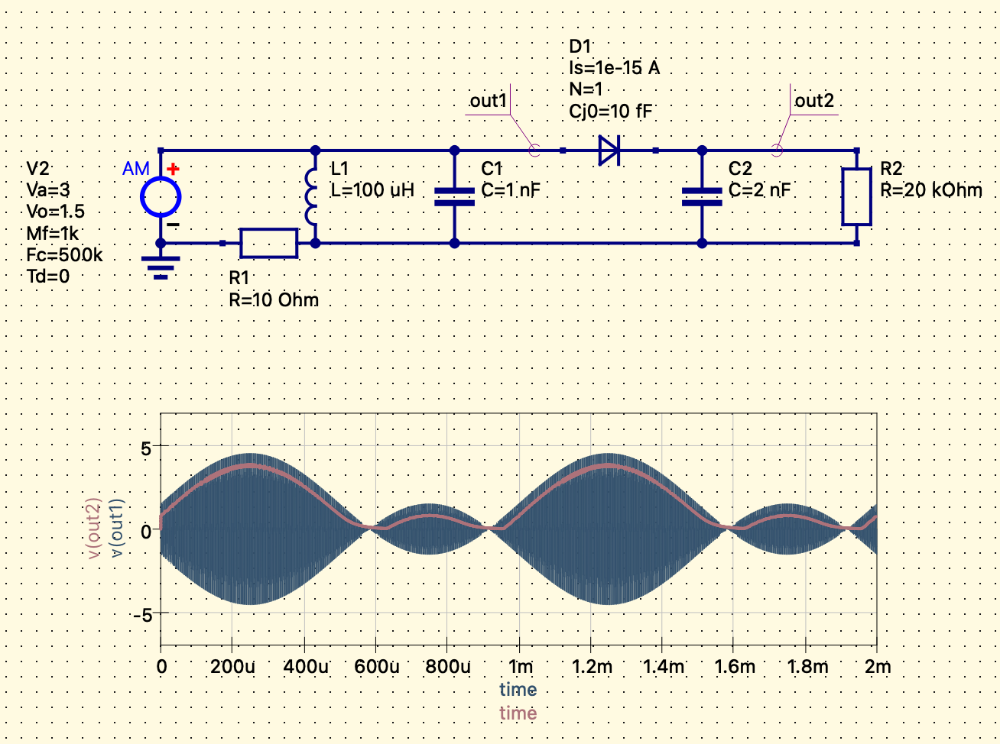

## 1. 前言

通信的本质，是把信息从一个地方搬到另一个地方。但信息本身（比如串口的 0/1 脉冲）往往不能直接"上路"——就像货物不能直接扔在高速公路上，必须装箱、装车，才能高效运输。

**调制（Modulation）**，就是这个"装箱"的过程：把原始信息（基带信号）加载到一个适合传输的高频载波上；**解调（Demodulation）**，则是到达目的地后的"拆箱"——从载波中恢复出原始信息。

---

## 2 为什么需要调制？

### 2.1 线圈的物理限制

以最简单的场景为例：把 UART（串口）的脉冲信号，通过两个电感线圈耦合传输（就像变压器的原理）。

电感的阻抗公式为：

$$Z = \omega L = 2\pi f L$$

频率 $f$ 越低，阻抗 $Z$ 越小，线圈趋近于**短路**，信号几乎无法耦合过去。

电磁感应的本质是**变化的磁场**产生感应电压。低频信号磁场变化缓慢，次级线圈感应到的电压极小，无法驱动后级电路。

### 2.2 串口信号本身的问题

| 问题 | 说明 |
|---|---|
| 频率太低 | 9600 bps 对应约 4.8 kHz，115200 bps 也仅约 57.6 kHz，线圈无法有效传输 |
| 非平衡电平 | CMOS 电平（0V / 3.3V），含有直流分量，变压器耦合会直接截断 |
| 信号失真 | 线圈的寄生电容、非线性会使方波边沿变形，数据无法可靠恢复 |

### 2.3 线圈自身的带宽限制

每个线圈都存在**自谐振频率**（Self-Resonant Frequency），高于该频率时，寄生电容占主导，线圈的电感特性彻底失效。同时，线圈的品质因数 Q 值决定带宽：

$$BW = \frac{f_0}{Q}$$

Q 值越高，频率选择性越好，但可用带宽越窄——这是一对根本矛盾。

### 2.4 调制的解决方案

调制通过以下方式解决上述所有问题：

1. **提升频率**：将低频基带信号搬移到线圈能高效传输的频段（如 200 kHz、2.4 GHz）
2. **去除直流分量**：高频载波天然没有直流，可通过变压器或电容耦合传输
3. **集中频谱能量**：调制后的信号频谱集中，便于滤波和抗干扰

---

## 3 调制方式的技术演进

调制技术的发展史，本质上是人类在**频谱效率、硬件复杂度、抗噪声能力、功耗**之间不断寻找最优解的历史。

### 3.1 幅度调制（AM，Amplitude Modulation）

**原理**：用基带信号去控制高频载波的**幅度**，信息藏在幅度的变化里。

```
载波：     ～～～～～～～～～～～
基带信号：  ___/‾‾‾\___/‾‾‾\___
AM 信号：  小振幅～大振幅～小振幅
```

**优点**：
- 解调极简单，一个包络检波器（二极管 + 电容）即可完成
- 硬件成本极低，1920 年代就能大规模商用

**缺点**：
- 幅度最容易受到噪声和衰落干扰（雷雨天中波广播质量变差，正是 AM 的硬伤）
- 带宽利用率低：传输带宽 = 2 × 基带信号带宽（上下两个边带都占用）
- 功率效率低：载波本身携带大量功率，但不携带任何信息

**典型应用**：中波/短波广播（AM 收音机）、航空 VHF 语音通信

---

### 3.2 频率调制（FM，Frequency Modulation）

**原理**：保持载波幅度不变，用基带信号去控制载波的**瞬时频率**，信息藏在频率的偏移里。

```
基带信号低：  载波频率 = f₀
基带信号高：  载波频率 = f₀ + Δf
```

**优点**：
- 恒包络（幅度不变），对幅度噪声天然免疫
- 音质远好于 AM，这正是"调频"广播取代"调幅"广播高质量场景的原因
- 抗多径干扰能力强于 AM

**缺点**：
- 占用带宽比 AM **更宽**（Carson 定律：$BW \approx 2(\Delta f + f_{max})$）
- 解调需要鉴频器，硬件复杂度高于 AM
- 频谱效率仍然较低

> **第一个技术博弈**：AM → FM 是用**更宽的带宽**换取**更好的抗噪声性能**。这是一笔合算的买卖——频谱资源在广播时代相对充裕，而音质提升对用户体验至关重要。

**典型应用**：FM 广播（87.5–108 MHz）、模拟对讲机

---

### 3.3 频移键控（FSK / GFSK，Frequency Shift Keying）

**原理**：FM 的数字版本。用有限个离散频率代表不同的数字符号。

```
比特 0 → 频率 f₁（如 2.4000 GHz）
比特 1 → 频率 f₂（如 2.4005 GHz）
```

**GFSK（高斯频移键控）**：在跳频之前，先用高斯滤波器对信号做平滑，减少频率突变产生的带外辐射，是蓝牙 BLE 采用的具体方案。

**优点**：
- 恒包络，功放可工作在饱和区，**功率效率极高**
- 解调简单，对硬件要求低
- 对信噪比要求低，抗噪声能力强
- 非常适合电池供电的低功耗设备

**缺点**：
- 每个符号只能携带 1~2 bit 信息（2-FSK = 1 bit，4-FSK = 2 bit）
- 频谱效率约为 1 bit/s/Hz，极低
- 要增加速率只能扩展带宽，效率没有本质提升

**典型应用**：蓝牙 BLE（1–2 Mbps）、ZigBee、工业遥控、LoRa（一种扩频 FSK 变体）

---

### 3.4 正交幅度调制（QAM，Quadrature Amplitude Modulation）

**原理**：同时利用载波的**幅度**和**相位**两个正交维度来编码信息，在复平面上形成"星座图"。

以 16-QAM 为例，星座图上有 16 个点，每个点代表一个唯一的 4-bit 符号：

```
    Q
    │
 ●  ●  ●  ●
 ●  ●  ●  ●  ──── I
 ●  ●  ●  ●
 ●  ●  ●  ●
```

| 调制阶数 | 星座点数 | 每符号 bit 数 | 代表技术 |
|---|---|---|---|
| QPSK | 4 | 2 | 卫星通信、GPS |
| 16-QAM | 16 | 4 | 4G LTE 基础 |
| 64-QAM | 64 | 6 | 4G LTE 高级 |
| 256-QAM | 256 | 8 | 5G NR、Wi-Fi 5 |
| 1024-QAM | 1024 | 10 | Wi-Fi 6/6E |
| 4096-QAM | 4096 | 12 | Wi-Fi 7 |

**优点**：
- 频谱效率极高，同样带宽可传输成倍的数据
- 阶数越高，频谱效率越接近 Shannon 极限

**缺点**：
- 星座点越多，点间距越小，**对噪声、相位抖动、幅度失真极度敏感**
- 发射机需要线性功放（不能像 FSK 那样饱和工作），**功耗和成本更高**
- 必须搭配信道均衡，因为多径效应会同时破坏信号的幅度和相位

> **关键矛盾**：高阶 QAM 单独使用时，无线信道的多径效应会把星座图彻底"打散"，导致误码率不可接受。这正是 OFDM 存在的意义。

---

### 3.5 正交频分复用（OFDM，Orthogonal Frequency Division Multiplexing）

OFDM 本身不是一种调制方式，而是一种**多载波传输框架**，专门为高阶 QAM 在无线信道中的可靠传输而生。

**核心思想**：把一个宽信道切分成大量极窄的正交子载波，每个子载波独立进行 QAM 调制。

```
总带宽 20 MHz
  │
  ├─ 子载波 1（312.5 kHz）── QAM 调制
  ├─ 子载波 2（312.5 kHz）── QAM 调制
  ├─ 子载波 3（312.5 kHz）── QAM 调制
  ├─ ...（共 64 个子载波）
  └─ 子载波 64（312.5 kHz）── QAM 调制
```

每个子载波足够窄，在其频率范围内信道近似"平坦"（无频率选择性衰落），QAM 调制的幅度和相位不会被多径破坏。最终在接收端用 **IFFT/FFT** 高效实现调制与解调。

**优点**：
- 彻底解决多径问题，让高阶 QAM 在无线信道中成为可能
- 频谱效率极高（子载波之间正交，频谱可以重叠而不干扰）
- 自适应调制：信道质量好的子载波用 1024-QAM，差的用 QPSK，整体最优

**缺点**：
- 对频率偏移和相位噪声敏感（子载波正交性依赖精确的频率同步）
- 峰均功率比（PAPR）高，对功放线性度要求严苛，**功耗和成本高**
- 实现需要 FFT 等复杂数字信号处理，早期硬件难以实现

**典型应用**：Wi-Fi 4/5/6/7、4G LTE、5G NR、DAB 数字广播、DVB-T 数字电视

---

## 4 为什么"高带宽"通信技术从调频改到调幅？

这是一个容易产生困惑的地方，需要厘清两个不同维度的"带宽"：

| 术语 | 含义 |
|---|---|
| **占用带宽** | 信号在频谱上占据的宽度（Hz） |
| **数据带宽** | 单位时间内传输的数据量（bps） |

### 4.1 AM → FM：用占用带宽换音质

AM 占用带宽窄（约 10 kHz），FM 占用带宽宽（约 200 kHz）。  
FM 牺牲了**20倍**的频谱空间，换来了恒包络带来的抗噪声优势。  
在频谱资源相对充裕、追求音质的广播场景下，这是合理的取舍。

### 4.2 GFSK（蓝牙）vs OFDM+QAM（Wi-Fi/5G）

表面上看，GFSK 占用带宽窄，OFDM+QAM 占用带宽宽——和 AM/FM 的关系类似。  
但结果却反过来了：OFDM+QAM 的**数据带宽**反而远大于 GFSK。

原因在于**频谱效率**发生了质的飞跃：

```
同样 20 MHz 占用带宽：

GFSK（如果强行用）：
  20 MHz × 1 bit/s/Hz ≈ 20 Mbps

OFDM + 1024-QAM（Wi-Fi 6）：
  20 MHz × 10 bit/s/Hz × MIMO 系数 ≈ 数百 Mbps
```

OFDM+QAM 用了**相似甚至更宽的占用带宽**，但从中榨取出了**数十倍**的数据量。这不是在浪费带宽，而是在极致利用带宽。

### 4.3 为什么蓝牙不直接用 OFDM+QAM？

这正是工程设计的核心取舍，没有"更好"，只有"更合适"：

| 维度 | GFSK（蓝牙 BLE） | OFDM + QAM（Wi-Fi 6） |
|---|---|---|
| 芯片成本 | 极低（<$0.5） | 较高（$5–$20+） |
| 功耗 | μW 级，纽扣电池可用数年 | mW~W 级，需要持续供电或大电池 |
| 吞吐量需求 | 1–2 Mbps（心率、温度等传感数据足够） | 数百 Mbps ~ Gbps（视频流、文件传输） |
| 实现复杂度 | 简单，小面积 SoC | 需要 FFT 单元、复杂基带处理 |
| 适用设备 | 耳机、手环、传感器 | 手机、路由器、基站 |

蓝牙耳机用 OFDM+QAM，就像用卡车运一个信封——技术上可行，但荒谬地过度设计。

### 4.4 技术演进的完整脉络

```
时代         调制方式         核心矛盾与取舍
─────────────────────────────────────────────────────
1920s  AM广播     简单可行，但噪声严重
                   ↓  牺牲带宽换质量
1930s  FM广播     抗噪好，但占频谱多
                   ↓  进入数字时代，频谱效率成关键
1990s  FSK/GFSK   简单低功耗，但频谱效率极低
                   ↓  多径问题阻碍QAM直接应用
2000s  OFDM+QAM  解决多径，频谱效率质变式提升
                   ↓  子载波自适应、MIMO、波束成形
2020s  大规模MIMO 空间维度成为新的自由度
       + OFDM+QAM  在空间上叠加多路 OFDM+QAM
```

每一次演进，都是在**新的约束条件**下，对香农极限（Shannon Limit）的进一步逼近：

$$C = B \log_2(1 + \text{SNR})$$

AM/FM 时代，人们还在想"怎么让信号传得更远更清晰"；  
GFSK 时代，人们在想"怎么让设备更省电更便宜"；  
OFDM+QAM 时代，人们在想"怎么在有限频谱里塞进更多数据"；  
大规模 MIMO 时代，人们在想"怎么在空间中复用同一频谱资源"。

**不是后者淘汰前者，而是每种方案都在自己的战场上是最优解。**

---

## 5 调制方式总结

| 调制方式       | 频谱效率 | 抗噪能力   | 硬件复杂度 | 功耗  | 适用场景          |
| ---------- | ---- | ------ | ----- | --- | ------------- |
| AM         | 低    | 差      | 极低    | 低   | 中波广播、航空语音     |
| FM         | 低    | 好      | 低     | 低   | FM 广播、模拟对讲    |
| FSK/GFSK   | 极低   | 好      | 低     | 极低  | 蓝牙 BLE、ZigBee |
| QAM（单载波）   | 高    | 差（多径下） | 中     | 中   | 有线电视 DOCSIS   |
| OFDM + QAM | 极高   | 极好     | 高     | 高   | Wi-Fi、4G/5G   |

> 调制技术的演进，是人类在**频谱效率、硬件复杂度、功耗、可靠性**之间永恒博弈的缩影。没有最好的调制方式，只有最适合当前约束条件的工程决策。从 AM 收音机到 Wi-Fi 7，本质上都是同一件事：**在物理定律允许的边界内，把有限的频谱资源最大化地利用起来**。


## 6. 如何设计调制解调电路


### 调幅信号处理实验电路

- [调幅信号处理实验电路](https://oshwhub.com/123123123ASDASD/xiao-xin-hao-fang-tai-shuai-jian-qi)


#### 1.可控小信号放大器

通过两个TQP3M9008和PE4302实现对小信号的可控放大，两片TQP3M9008提供100倍的固定增益，在通过PE4302可控衰减器，调节增益。

#### 2.混频器

通过AD831混频器对信号进行变频处理，将信号的中心频率及各分量频谱搬移至新的频段，再采用陶瓷滤波来滤掉混频后的高频噪声。

#### 3. 中频放大器

ERA-8sm+ 和OPA695级联的固定增益放大器，增益为20dB，实现对中频信号的放大。

#### 4. 均值检波器

通过AD8361对中频放大后的信号进行均值检波，并输出一个电压值给MCU，然后MCU根据这个电压值控制射频前段的程控衰减器，使中频放大器输出信号幅值能稳定在200mV±1dB内。

#### 5. 电压跟随器

将反向输入端和输出端相连，实现电压跟随器的作用，接在中频放大和均值检波器之间，用于隔离前后级间的影响。

#### 6. 包络检波器

先让调幅波经过检波器晶体二极管，从而得到依调幅波包络变化的脉动电流，再通过一个低通滤波器滤去高频成分，就得到反映调幅波包络的调制信号。RC 的时间常数应大于载波的周期小于调制信号的周期。



#### 7. 带通滤波器

用两个双运算放大器NE5532，采用8阶有源带通滤波器，实现300Hz-5kHz的带通滤波器，滤除带外信号。

#### 8. 基带AGC

采用两级 AD603 级联，用 AD8307 对数检波和 NE5532 构成反馈电路实现自动增益控制。

#### 9. 本振源

采用 AD4351 芯片，可达到高达 4.4Ghz 的本振信号。ADF4351 部分包括一个 10位的 RFR 计数器、一个 16 位 RFN 计数器、一个 12 位 FRAC 计数器和一个 12 位魔术计数器。数据在 CLK 的每一个上升沿逐个输入到 32 位寄存器中。数据输入方式为MSB 有限。在 LE 上升沿使数据从移位寄存器传输到 6 个锁存器之一。目标锁存器由移位寄存器中的 3 个控制位状态决定。单片机通过 SPI 协议进行控制。

### OOK&PPM

要实现通过线圈耦合传输串口数据，需要在串口和线圈之间添加调制和解调电路。以下详细描述所需的电路和原理。

1. 发送端电路设计
功能：将串口的数字信号调制到高频载波上，通过线圈发送。

主要组成部分：
- 调制器：将串口信号调制到载波上。
- 载波发生器：产生高频载波信号（如 200kHz）。
- 驱动电路：放大调制后的信号，驱动原边线圈。

具体实现：
a. 载波发生器
- 晶体振荡器或定时器：
- 使用 STM32 内部的定时器或外部晶振，产生 200kHz 的方波载波信号。

- 信号稳定性：
- 载波频率需要稳定，避免频率漂移。

b. 调制器
- 方式一：幅移键控（ASK）调制

- 调制原理：
- 当串口信号为“1”时，发送载波信号。
- 当串口信号为“0”时，停止发送载波。

- 电路实现：
- 使用逻辑与门（AND 门）或晶体管控制载波的通断。

- 逻辑与门方式：
- 将串口信号和载波信号输入 AND 门，输出连接驱动电路。

- 晶体管开关方式：
- 使用 N-MOSFET 或 NPN 晶体管，由串口信号控制，其导通与否决定载波是否通过。

- 方式二：频移键控（FSK）调制
- 调制原理：
- 将串口信号的“0”和“1”分别对应两个不同的载波频率（如 190kHz 和 210kHz）。

- 电路实现：
- 使用两个频率的振荡器，串口信号控制频率的选择。

- STM32 实现：
- 利用 STM32 的定时器 PWM 输出，改变 PWM 的频率。
- 通过 DMA 或中断，在串口信号变化时切换频率。

c. 驱动电路

- 放大器：
- 使用功率放大器（如运算放大器、推挽放大器）放大调制信号。
- 确保驱动电流足以使线圈产生足够的磁场。

- 匹配网络：
- 在线圈和驱动电路之间添加匹配电路（如电容、电阻），优化传输特性。

- 滤波器：
- 滤除高次谐波，保证信号的纯净度。

电路示意图：

```
[串口信号]──[调制器]──[驱动电路]──[原边线圈]
                             ↑
                      [载波发生器]
```

2. 接收端电路设计

功能：接收耦合的高频信号，解调出原始的串口数字信号。

主要组成部分：
- 次级线圈：接收传输的高频信号。
- 放大器：放大接收到的微弱信号。
- 解调器：将高频信号解调为数字信号。
- 信号恢复电路：整形和滤波，恢复串口信号。

具体实现：

a. 放大器
- 低噪声放大器（LNA）：
- 使用高增益、低噪声的放大器（如运算放大器、射频放大器）放大次级线圈接收到的信号。
- 增益设置：
- 适当的增益，避免信号过饱和或噪声放大。

b. 解调器
- 方式一：ASK 解调
- 检波器：
- 使用二极管（如肖特基二极管）构成包络检波器，提取载波的包络。
- 滤波器：
- 使用 RC 滤波器，平滑检波后的信号。

- 比较器：
- 使用施密特触发器，将模拟信号转换为数字信号。

- 方式二：FSK 解调
- 频率检测器：
- 使用带通滤波器，针对不同频率进行滤波
- 或使用锁相环（PLL）检测频率变化。
- 数字信号处理：
- 将频率变化转换为数字信号。
  
c. 信号恢复电路
- 整形电路：
- 使用逻辑门或触发器，对解调后的信号进行整形，得到稳定的数字信号。
- 同步电路：
- 确保恢复的串口信号与发送端同步，避免位移错误。

电路示意图：

  
```
[次级线圈]──[放大器]──[解调器]──[整形电路]──[串口接收]
``` 

#### 具体电路设计示例

1. 发送端示例（ASK 调制）
a. 使用 AND 门调制

- 元件选择：
- 逻辑与门：如 74HC08。
- 载波信号：由 STM32 的定时器输出，200kHz 方波。
- 串口信号：STM32 的 UART_TX 引脚。

- 连接方式：
- 将 UART_TX 信号和载波信号分别连接到 AND 门的两个输入端。
- AND 门的输出连接到驱动电路。

b. 驱动电路
- 推挽放大器：
- 使用一对互补的 MOSFET（如 N-MOSFET 和 P-MOSFET）组成推挽放大器。

- 连接线圈：
- 将线圈连接在推挽放大器的输出端和电源地之间。

c. STM32 配置
- 定时器输出载波：
- 配置定时器产生 200kHz 的 PWM 信号。
- 串口配置：
- 正常配置 UART，波特率根据需要设定。

2. 接收端示例（ASK 解调）

a. 放大器

- 运算放大器：
- 选择带宽和增益足够的运放，如 TL082。

- 配置：
- 放大倍数设置为 100~1000 倍，根据接收信号强度调整

b. 包络检波器
- 肖特基二极管：
- 使用 BAT54 等高速二极管，降低正向压降。

- RC 滤波器：
- 电阻和电容的值需要根据载波频率选择，确保能平滑包络。

  

c. 施密特触发器
- 逻辑器件：
- 使用 74HC14，对模拟信号进行整形。

d. 串口接收
- STM32 配置：
- 将整形后的数字信号接入 STM32 的 UART_RX 引脚

##### 实际设计中的考虑

1. 线圈设计
- 匝数和尺寸：
- 线圈的匝数、直径和线径需要根据工作频率和传输距离设计。

- Q 值：
- 适当的品质因数，平衡带宽和效率。
- 屏蔽和耦合：
- 线圈之间的相对位置和距离影响耦合效率，需优化设计。

2. 匹配电路

- 阻抗匹配：
- 在驱动电路和线圈之间添加匹配网络，最大化功率传输。

- 谐振电路：
- 通过在线圈两端并联电容，形成 LC 谐振回路，增强特定频率的信号。

3. 滤波器设计

- 带通滤波器：
- 在接收端使用带通滤波器，滤除干扰和噪声。

- 阻带衰减：
- 确保滤波器对非载波频率的信号有足够的衰减。

4. 干扰和噪声
- 环境干扰：
- 高频信号易受环境中其他电磁信号的影响，需要屏蔽和滤波。

- 信号隔离：
- 避免发送端和接收端之间的电气干扰，保持良好的信号完整性。

##### 总结
直接将串口的低频脉冲信号通过电感线圈耦合传输，因线圈的频率响应特性和耦合效率等物理限制，难以实现有效的通信。通过调制，将串口信号转换为高频载波信号，可以克服这些限制，实现可靠的通信。

在实现过程中，需要在串口和线圈之间添加调制和解调电路，包括：
- 发送端：载波发生器、调制器、驱动电路。
- 接收端：放大器、解调器、信号恢复电路。

通过合理的电路设计和元器件选择，可以有效地将串口信号通过线圈耦合传输。

建议
- 实验验证：
- 在理论设计的基础上，进行实验测试，验证电路的性能。

- 仿真工具：
- 使用仿真软件（如 Proteus、Multisim）模拟电路行为，优化参数。

- 学习参考：
- 查阅相关的通信和电子电路教材，深入理解调制解调原理。

#### PPM 和 OOK 调制

在无线通信中，调制方式的选择对通信系统的性能和应用场景有着重要影响。两种常见的数字调制方式是 OOK（开关键控）和 PPM（脉冲位置调制）。本文将详细介绍它们的区别，并解释为什么在某些情况下选择使用 PPM 而不是 OOK。

##### OOK（开关键控）
1. 什么是 OOK
OOK（On-Off Keying，开关键控）是一种最简单的数字调制方式，是幅移键控（ASK）的一种特例。其基本原理是：

- 数字“1”：发送载波信号。

- 数字“0”：不发送载波信号（载波关闭）。


2. OOK 的优点
- 实现简单：硬件实现成本低，电路设计简单。
- 带宽效率高：占用的频谱带宽较窄，适合窄带通信。

3. OOK 的缺点
- 抗干扰能力弱：对噪声和干扰非常敏感，容易引起误码。
- 功率效率低：需要在发送“1”时持续发送载波，耗电量大。
- 不利于保密通信：持续的载波发送容易被检测到。

##### PPM（脉冲位置调制）

1. 什么是 PPM
PPM（Pulse Position Modulation，脉冲位置调制）是一种数字调制方式，其原理是：
- 固定长度的时间帧被划分为多个时间槽。
- 数字信息通过脉冲在时间槽中的位置来表示。
例如，在一个时间帧中，如果脉冲出现在第一个时间槽，表示数字“00”；出现在第二个时间槽，表示“01”；以此类推。

2. PPM 的优点
- 功率效率高：只有在发送脉冲时才消耗能量，其余时间功耗极低。
- 抗干扰能力强：信息由脉冲的位置决定，对幅度噪声和干扰不敏感。
- 隐蔽性好：信号大部分时间处于静默状态，不易被检测到。

3. PPM 的缺点
- 实现复杂：需要精确的时间同步，硬件设计相对复杂。
- 带宽占用大：窄脉冲的使用导致频谱扩展，占用较宽的带宽。

四、OOK 与 PPM 的比较
1. 功率效率
- OOK：发送“1”时需要持续发送载波，整体功耗较高。
- PPM：仅在发送脉冲时消耗能量，平均功耗低，适合电池供电设备。

2. 抗干扰能力
- OOK：对噪声和干扰敏感，可靠性较低。
- PPM：对幅度噪声不敏感，抗干扰能力强，可靠性高。

3. 实现复杂度
- OOK：电路简单，易于实现。
- PPM：需要精确的时钟同步，电路复杂度高。

4. 带宽需求
- OOK：带宽需求低，适用于窄带通信。
- PPM：带宽需求高，因脉冲窄而频谱宽


##### 为什么选择使用 PPM 而不是 OOK

1. 低功耗需求

在对能耗敏感的应用中，如无线传感器网络、遥控器、物联网设备，降低功耗是关键。PPM 的高功率效率使其成为理想选择。

2. 高可靠性要求
在噪声环境或需要高可靠性的通信中，PPM 的抗干扰能力有助于减少误码，提高通信质量。

3. 隐蔽通信
对于需要保密或隐蔽性的通信，PPM 的信号在大部分时间内处于静默状态，不易被截获或干扰。

4. 多径和衰落环境
在多径效应明显的无线环境中，PPM 能够更好地抵抗信号衰落，提高通信的稳定性。

5. 带宽资源充足
当带宽资源不是主要限制因素时，可以接受 PPM 较大的带宽占用，以换取其他性能优势。

##### 结论
选择 PPM 而不是 OOK 主要基于以下考虑：
- 功耗：PPM 更适合低功耗应用。
- 抗干扰能力：PPM 提供更高的可靠性。
- 应用场景：在对带宽要求不高且需要高性能的应用中，PPM 更具优势。

然而，需要注意的是，PPM 的实现复杂度和带宽需求较高，设计时需要在性能和资源之间进行权衡。

希望以上解释能帮助您理解 PPM 和 OOK 的区别，以及为什么在某些情况下选择使用 PPM 而不是 OOK。如有其他问题，欢迎继续提问！

#### 硬件

这部分主要参考《射频电路设计》（RF circuit design）。
##### RLC电路
- [RLC电路wiki](https://zh.wikipedia.org/wiki/RLC电路)
